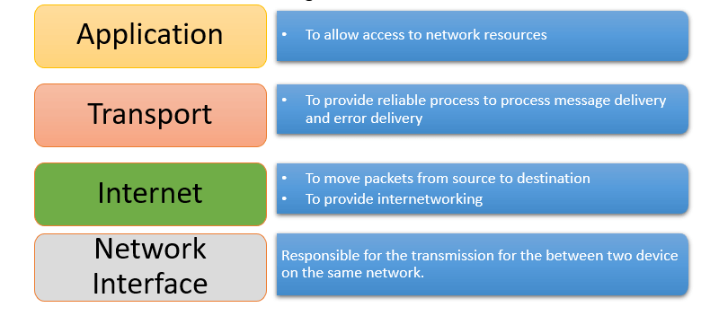
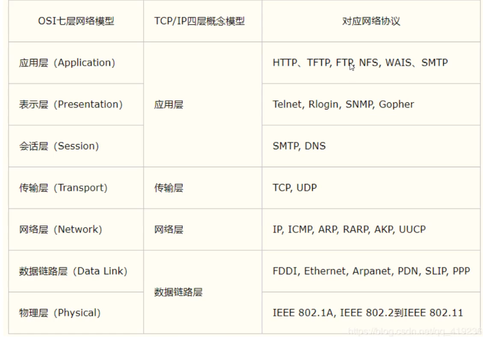
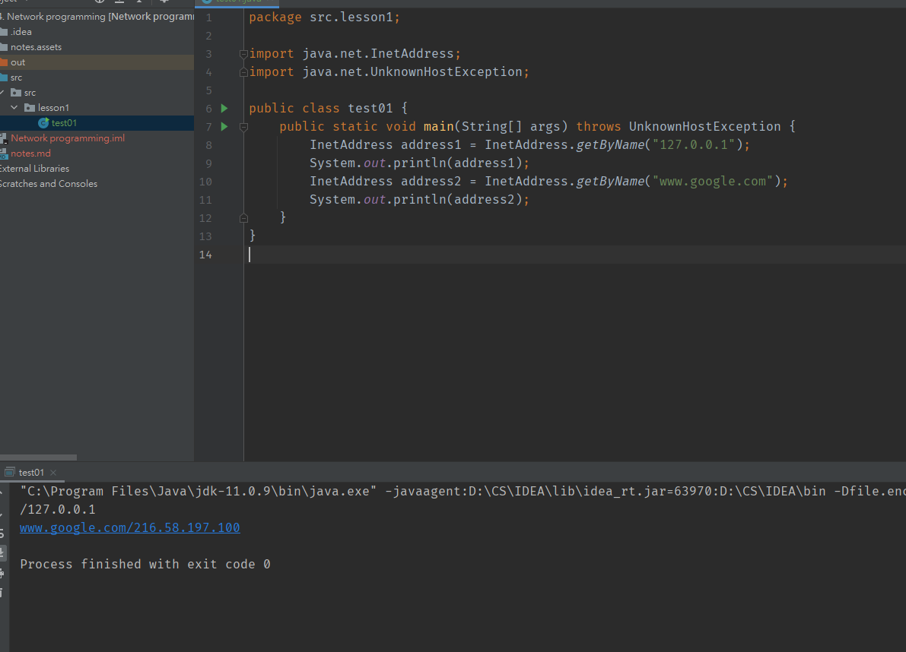
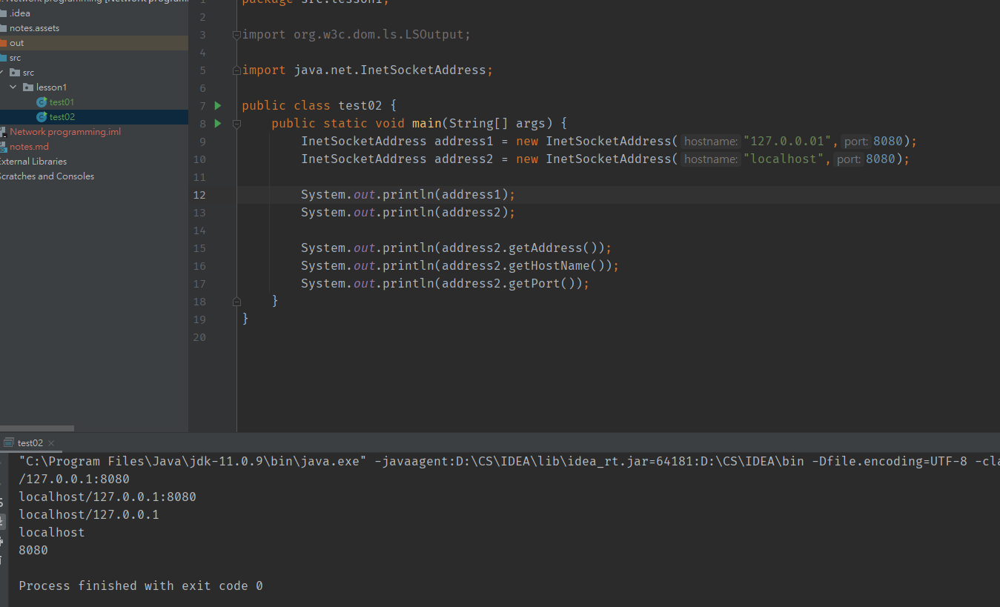

# 1. 網絡通訊概述

## 1.1 TCP/IP 4 layer model





> **重點就係TCP、UDP**
>
> **網絡通訊需要 -> IP 及 port number**


# 2. 通訊

## 2.1 獲取IP



留意InetAddress係唔可以用new 嚟創建，要用佢嘅static method嚟創建，呢個method會return有一個InetAddress嘅object


## 2.1 Port number

> 每一個port number代表電腦上一個process
>
> 由 0 - 65535
>
> 公有port number:	0 - 1023，常用嘅有以下例子
>
> 	1. HTTP : 80
> 	2. HTTPS : 443
> 	3. FTP : 21
> 	4. Telnet : 23
>
> 程序註冊port number: 1024 - 49151，分配俾user或者program
>
> 	1. MySQL : 3306
> 	2. Oracle : 1521
>
> 動態，私有port number: 49152 - 65535 

```
常用cmd指令
netstat - ano //查看電腦上所有port number
netstat -ano | findstr ""      // ""入面打個port number就可以查果個port number嘅情況
```



第二個要知嘅class 係 InetSocketAddress，呢個class可以new


## 3. TCP VS UDP

1. 連接
TCP 是面向連接的傳輸層協議，傳輸數據前先要建立連接 (用HTTP)。
UDP 是不需要連接，即刻傳輸數據。

2. 服務對象
TCP 是一對一的兩點服務，即一條連接只有兩個端點。
UDP 支持一對一、一對多、多對多的交互通信

3. 可靠性
TCP 是可靠交付數據的，數據可以無差錯、不丟失、不重複、按需到達。
UDP 是盡最大努力交付，不保證可靠交付數據。

4. 擁塞控制、流量控制
TCP 有擁塞控制和流量控制機制，保證數據傳輸的安全性。
UDP 則沒有，即使網絡非常擁堵了，也不會影響 UDP 的發送速率。

5. 頭部開銷
TCP 首部長度較長，會有一定的開銷，首部在沒有使用「選項」字段時是 20 個字節，如果使用了「選項」字段則會變長的。
UDP 首部只有 8 個字節，並且是固定不變的，開銷較小。

6. 傳輸方式
TCP 是流式傳輸，沒有邊界，但保證順序和可靠。
UDP 是一個包一個包的發送，是有邊界的，但可能會丟包和亂序。


# 3. TCP client及server 通訊例子

> TCP server

```java
package src.lesson1;

import java.io.ByteArrayOutputStream;
import java.io.IOException;
import java.io.InputStream;
import java.net.ServerSocket;
import java.net.Socket;

public class tcpServerDemo {
    public static void main(String[] args) {
        ServerSocket serverSocket = null;
        Socket socket = null;
        InputStream is = null;
        ByteArrayOutputStream baos = null; // 接收信息用，轉化

        try {
            // 1. 創建一個
            serverSocket = new ServerSocket(9999);

            while(true){
                // 2. 等client 連接,監聽
                socket = serverSocket.accept();
                // 3. 讀client信息
                is = socket.getInputStream();

                baos = new ByteArrayOutputStream(); // 唔直接用InputStream讀，用ByteArrayOutputStream 包裝一下
                byte[] buffer = new byte[1024];
                int len;
                while((len=is.read(buffer)) != -1){
                    baos.write(buffer,0,len);
                }
                System.out.println(baos.toString());
            }


        } catch (IOException e) {
            e.printStackTrace();
        } finally{ // close
            if(baos != null){
                try {
                    baos.close();
                } catch (IOException e) {
                    e.printStackTrace();
                }
            }
            if(is != null){
                try {
                    is.close();
                } catch (IOException e) {
                    e.printStackTrace();
                }
            }
            if(socket != null){
                try {
                    socket.close();
                } catch (IOException e) {
                    e.printStackTrace();
                }
            }
            if(serverSocket != null){
                try {
                    serverSocket.close();
                } catch (IOException e) {
                    e.printStackTrace();
                }
            }
        }
    }
}
```

> TCP client

```java
package src.lesson1;

import java.io.IOException;
import java.io.OutputStream;
import java.net.InetAddress;
import java.net.Socket;
import java.net.UnknownHostException;

public class tcpClientDemo {
    public static void main(String[] args) {
        Socket socket = null;
        OutputStream os = null;

        try {
            // 1. 設定server嘅IP， port number
            InetAddress serverIP = InetAddress.getByName("127.0.0.1"); // create InetAddress object
            int port = 9999; // 因為server果邊set左9999，呢度連翻去9999

            // 2. create socket
            socket = new Socket(serverIP, port);

            // 3. 用IO stream sd msg
            os = socket.getOutputStream(); // create OutputStream object
            os.write("hello from client~".getBytes()); // 傳嘅係byte[]，唔係String，呢個method return byte[]

        } catch (UnknownHostException e) {
            e.printStackTrace();
        } catch (IOException e) {
            e.printStackTrace();
        } finally {
            if(os != null){
                try {
                    os.close();
                } catch (IOException e) {
                    e.printStackTrace();
                }
            }
            if(socket != null){
                try {
                    socket.close();
                } catch (IOException e) {
                    e.printStackTrace();
                }
            }
        }
    }
}
```