# 1. 什麼是CSS

> Cascading style sheet
>
> -> **美化網頁**，字體，顏色，邊距，高度，背景等等


# 2. css三種導入方法

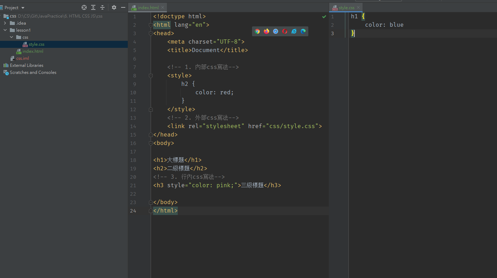

> 留意如果有多於一種style作用係一樣野上，係會用比較近果個，因為會覆蓋


# 3. 選擇器 selector

## 3.1 basic seletor

> 1. label selector
> 2. class selector
> 3. id selector
>
> 留意呢度唔係就近原則，而係有priority
>
> id > class > label，例如label同id都作用係同一個野，id會贏

```html
<!DOCTYPE html>
<html>
<head>
	<title>selector</title>
	<style type="text/css">
		/* 1. label selector，會選擇所有該label*/
		h1 {
			color: red;
		}
		/* 2. class selector，只會選擇該class name，可以重複用同一class name，*/
		.class1{
			color: blue;
		}
		/* 3. id selector，用# ，只會選擇該id，id只能有一個*/
		#id1{
			color: pink;
		}
	</style>
</head>
<body>
	<h1>h1 title 1</h1>
	<h1 class="class1">h1 title 2</h1>
	<h1 id="id1">h1 title 3</h1>

</body>
</html>
```


## 3.2 layer selector

> 1. descendant selector
> 2. child(ren) selector
> 3. little brother selector  
> 4. all little brother selector

```html
<!DOCTYPE html>
<html>
<head>
	<title>layer selector</title>

	<style type="text/css">
		/*1. descendant selector
			元素下面所有該項label全被選中
			例如呢度係揀曬所有p (p1-p6)
		*/
		body p{
			color: red;
		}
		/*2. child(ren) selector
			只選一代，只選一代，只選一代
			例如呢度係只選p1-p3
		*/
		body>p{
			color: pink;
		}

		/*3. little brother selector
			只睇下面一個兄弟，如果符合條件就揀佢 ******上面係唔睇
			例如呢度揀嘅係p2下面嘅兄弟，所以係p3，p1唔關事
		*/
		.class1 + p{
			background-color: yellow;
		}

		/*4. all little brother selector
			選擇同級樓下所有兄弟，留意係同級
			例如呢度會揀p3,p7,p8
		*/
		.class~p{
			background-color: red;
		}

	</style>
</head>
<body>
	<p>p1</p>
	<p class="class1">p2</p>
	<p>p3</p>
	<ul>
		<li>
			<p>p4</p>
		</li>
		<li>
			<p>p5</p>
		</li>
		<li>
			<p>p6</p>
		</li>
	</ul>
	<p>p7</p>
	<p>p8</p>
</body>
</html>
```

## 3.3 Pseudo-classes selector

> 1. first-child
> 2. last-child
> 3. n-th child
> 4. n-th of type

```html
<!DOCTYPE html>
<html lang="en">
<head>
    <meta charset="UTF-8">
    <title>Title</title>

    <style>
        /*
        first child
        unordered list的第一個元素*/
        ul li:first-child{
            background: black;
        }

        /*
        last child
        unordered list的最後一個元素*/
        ul li:last-child{
            background: hotpink;
        }

        /*
        n-th child
        先定位到父級元素，選擇父級元素的第n個
        留意該元素必須同自己一樣先生效，例如以下例子必須是p
        如果係p:nth-child(1)，不生效，因為選中嘅係h1，唔係p
        而p:nth-child(2)生效，因為選中嘅係p1 ，係一個p
        */
        p:nth-child(2){
            background: aquamarine;
        }

        /*
        定位至父級元素，選擇父級元素嘅第一個子元素
        留意只會選擇同自己一樣嘅元素 (選中第一個p，即p1)
        */
        p:nth-of-type(1){
            background: crimson;
        }


    </style>
</head>
<body>
    <h1>h1 title</h1>
    <p>p1</p>
    <p>p2</p>
    <p>p3</p>
<ul>
    <li>li1</li>
    <li>li2</li>
    <li>li3</li>
</ul>
</body>
</html>
```

> 第二個例子係常用鼠標pseudo-class selector
>
> 1. :hover 鼠標懸停時
> 2. :visited 點擊後

```html
    <style>
        a{
            text-decoration: none;
            color: black;
        }
        a:hover{
            color:dodgerblue;
        }
        a:visited{
            color: red;
        }

    </style>
```

## 3.4 attribute selectors (重要)

>=link   選擇只有link的元素
>
>*=link 選擇包含link的元素
>
>^=link 選擇以link作開頭的元素
>
>$=link 選擇以link作結尾的元素

```html
<!DOCTYPE html>
<html lang="en">
<head>
    <meta charset="UTF-8">
    <title>Title</title>

    <style>
        .test a{
            float: left;
            display: block;
            height: 50px;
            width: 50px;
            border-radius: 15px;         /*圓邊框*/
            background: cornflowerblue;
            text-align: center;          /*將文字居中係block度*/
            color: crimson;
            text-decoration: none;       /* 取消a label下面嘅刪除線*/
            font : bold 20px/50px Arial; /*字體調整 大小/行高 字體選擇*/
            margin-right: 10px;
        }

        /*
        選擇存在id嘅元素
        因此選中1及4
        */
        a[id]{
            background: yellow;
        }
        /*
        選擇id = first嘅元素 (完全等於)
        因此選中1
        */
        a[id=first]{
            background: pink;
        }

        /*
        選擇class有link嘅元素 (有就ok)
        因此選中1,2,6,8
        */
        a[class*=link]{
            background: darkcyan;
        }

        /*
        選擇class以secondlink開頭的元素
        因此選中6
        */
        a[class^=secondlink]{
            background: dodgerblue;
        }

        /*
        選擇class以thirdlink結尾的元素
        因此選中8
        */
        a[class$=thirdlink]{
            background: orange;
        }

    </style>

</head>
<body>
    <p class="test">
        <a href="https://www.google.com" class="link item first" id="first">1</a>
        <a href="adfasdf.png" class="link item" target="_blank">2</a>
        <a href="qweqzxc123.jpg">3</a>
        <a href="abc.pdf"   id="second">4</a>
        <a href="13123.mp3">5</a>
        <a href="asdf.doc" class="secondlink link ">6</a>
        <a href="test.txt">7</a>
        <a href="test02.txt" class="link secondlink thirdlink">8</a>
    </p>
</body>
</html>
```


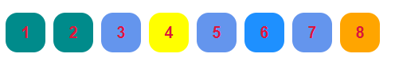


# 4. 美化

## 4.1 字體

> font及span
>
> font可拆開寫，但一般直接用font: 字體風格	字體樣式	大小	字體選擇
>
> span將特定內容框起，以方便美化

```html
<!DOCTYPE html>
<html lang="en">
<head>
    <meta charset="UTF-8">
    <title>span and font</title>
    <style>
        body {
            font-family: Arial;
            font-size: 50px;
            font-weight: bold;
            color: slategrey;
        }

        .css {
            color: red;
            font: oblique bolder 12px Arial;
        }
    </style>
</head>
<body>
<span class="css">Cascading Style Sheets</span> is a style sheet language used for describing
the presentation of a document written in a markup language such as HTML.
CSS is a cornerstone technology of the World Wide Web, alongside HTML and JavaScript.
</body>
</html>
```


## 4.2 文本

> 1. 顏色 color rbg rgba
> 2. 文本對齊 text-align=center
> 3. 首行縮進 text-indent: 2em
> 4. 行高 (line height = block height，文字會顯示在block中間)
> 5. 裝飾 text-decoration (刪除線等等)
> 6. 圖片文字對齊 vertical-align: middle (需要一個參照物，姐係圖片，文字都要同時set呢個)

```html
<!DOCTYPE html>
<html lang="en">
<head>
    <meta charset="UTF-8">
    <title>test02</title>
    <style>
        .css {
            /*red green blue 透明度(0-1,0為完全透明)*/
            color: rgba(0,255,255,0.8);
        }

        h1 {
            /*居中顯示*/
            text-align: center;
        }
        p{
            /*em係一個中文字嘅大小，下面語句係寫p呢個段落會首行縮進2個字*/
            text-indent: 2em;
            /*line height 行高*/
            line-height: 20px;
        }
		
        img, .nexttocloth{
            /*留意需要參照物，2個一齊寫*/
            vertical-align: middle;
        }

    </style>
</head>
<body>

<h1>title</h1>
<p>
<span class="css">Cascading Style Sheets</span> is a style sheet language used for describing
the presentation of a document written in a markup language such as HTML.
CSS is a cornerstone technology of the World Wide Web, alongside HTML and JavaScript.
</p>


<span class="nexttocloth">asdasdasdasdasdasdasda</span>
</body>
</html>
```

## 4.3 陰影

> text-shadow: 水平陰影位置  垂直陰影位置  blur(模糊距離)  顏色

```html
<!DOCTYPE html>
<html lang="en">
<head>
    <meta charset="UTF-8">
    <title>Title</title>

    <style>
        a{
            text-decoration: none;
            color: black;
        }
        a:hover{
            color:dodgerblue;
        }
        a:visited{
            color: red;
        }
       	/*水平陰影位置  垂直陰影位置  blur(模糊距離)  顏色*/
        p{
            text-shadow: 2px 2px 1px pink;
        }
    </style>
</head>
<body>

<p>a T shirt</p>
<p>$ 100</p>
<a href="#">click to buy</a>
</body>
</html>
```

## 4.4 表格

```html
<!DOCTYPE html>
<html lang="en">
<head>
    <meta charset="UTF-8">
    <title>table</title>

    <style>
        .title{
            font-size: 18px;
            font-weight: bold;
            text-indent: 2em;
            line-height: 25px;
        }

        ul li{
            line-height: 20px;
            list-style: none; /*取消unordered list嘅圓點*/
            text-indent: 1em;
        }
    </style>
</head>
<body>
<h2 class="title">All things</h2>
<ul>
    <li><a href="#">11111</a></li>
    <li><a href="#">22222</a></li>
    <li><a href="#">33333</a></li>
    <li><a href="#">44444</a></li>
    <li><a href="#">55555</a></li>
    <li><a href="#">66666</a></li>
</ul>
</body>
</html>
```

## 4.5 背景


```html
<!DOCTYPE html>
<html lang="en">
<head>
    <meta charset="UTF-8">
    <title>Title</title>

    <style>
        div{
            width: 1000px;
            height: 700px;
            border: 1px solid red;
            background-image: url("clothes.jpg");
        }
        /*只鋪第一行*/
        .div1{
            background-repeat: repeat-x;
        }
        /*只鋪第一列*/
        .div2{
            background-repeat: repeat-y;
        }
        /*不平鋪，只顯示一張jpg*/
        .div3{
            background-repeat: no-repeat;
        }
    </style>
</head>
<body>
<div class="div1"></div>
<div class="div2"></div>
<div class="div3"></div>

</body>
</html>
```

> 亦可以用
>
> background: 顏色	圖片	圖片	x-coordiante	y-coordinate	方式  |||||   例子如下

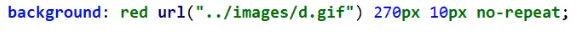

## 4.6 漸變

> https://www.grabient.com/
>
> 可以去呢個網站直接copy，copy完例子如下

```css
background-color: #4158D0;
background-image: linear-gradient(245deg, #4158D0 0%, #C850C0 46%, #FFCC70 100%);
```


# 5. box model

## 5.1 邊框

> **所有box，例如div，都有預設嘅padding同margin**
>
> **通常為左方便，css一開始會寫以下幾句將所有預設margin,border,padding 設為0**
>
> ```css
> *{
>     padding:0;
>     margin:0;
> }
> ```
>
> 

>margin 外邊距, border 邊框, padding 內邊距

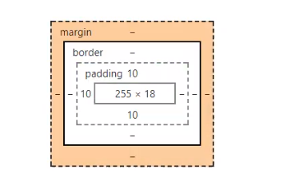


```html
<!DOCTYPE html>
<html lang="en">
<head>
    <meta charset="UTF-8">
    <title>login</title>

    <style>
        #box{
            width: 300px;
            border: 2px solid red;
            /*padding: 上 下 右 左*/
            padding: 20px 0 30px 0;

            /*亦可分開寫*/
            /*padding-top: xxxx;*/
            /*padding-right: xxxx;*/

            /*margin: 0 0 0 0;*/
            /*只有2個參數，第一個係上下，第二個係左右*/
            /*呢度左右自動對齊，所以會置中*/
            margin: 0 auto;
        }

        #box div{
            margin: 10px auto;
        }

        span{
            font-size: 20px;
        }

    </style>
</head>
<body>
<form action="#">
    <div id="box">
        <h2>Login</h2>
        <div class="div1">
            <span>Username: </span>
            <input type="text">
        </div>
        <div class="div2">
            <span>Password: </span>
            <input type="password">
        </div>
        <input type="submit">
        <input type="reset">
    </div>
</form>
</body>
</html>
```

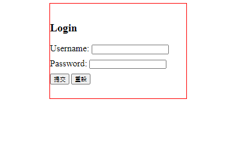

## 5.2 圓角邊框

```html
<!DOCTYPE html>
<html lang="en">
<head>
    <meta charset="UTF-8">
    <title>Title</title>

    <style>
        div{
            border: 2px solid red;
            width: 100px;
            height: 100px;
            /*左上 右上 右下 坐下 (順時針)*/
            /*左上右下  右上坐下  (對角)*/
            /*只寫一個           (全選)*/

            border-radius: 50px;
        }
    </style>
</head>
<body>
<div></div>
</body>
</html>
```

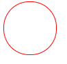


## 5.3 陰影

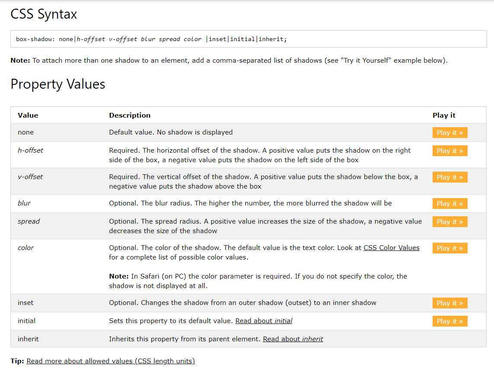

```html
<!DOCTYPE html>
<html lang="en">
<head>
    <meta charset="UTF-8">
    <title>Title</title>
    <style>
        div{
            width: 100px;
            height: 100px;
            border: 2px solid black;
            border-radius: 50px;
            margin: 500px auto;

            box-shadow: 10px 10px 0 yellow;
        }
    </style>
</head>
<body>
<div></div>
</body>
</html>
```

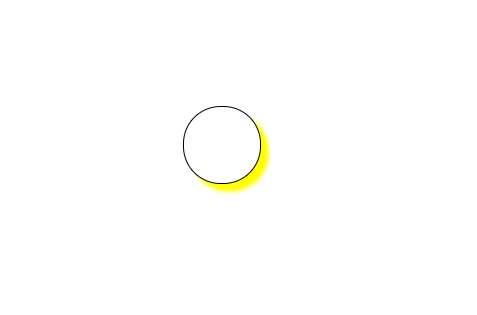


# 6. floating

> block element (獨佔一行)
>
> h1-h6	p	div	list等等

> inline element (不獨佔一行)
>
> span	a	img	strong等等

**inline element可以被包含在block element中，反之就唔得**

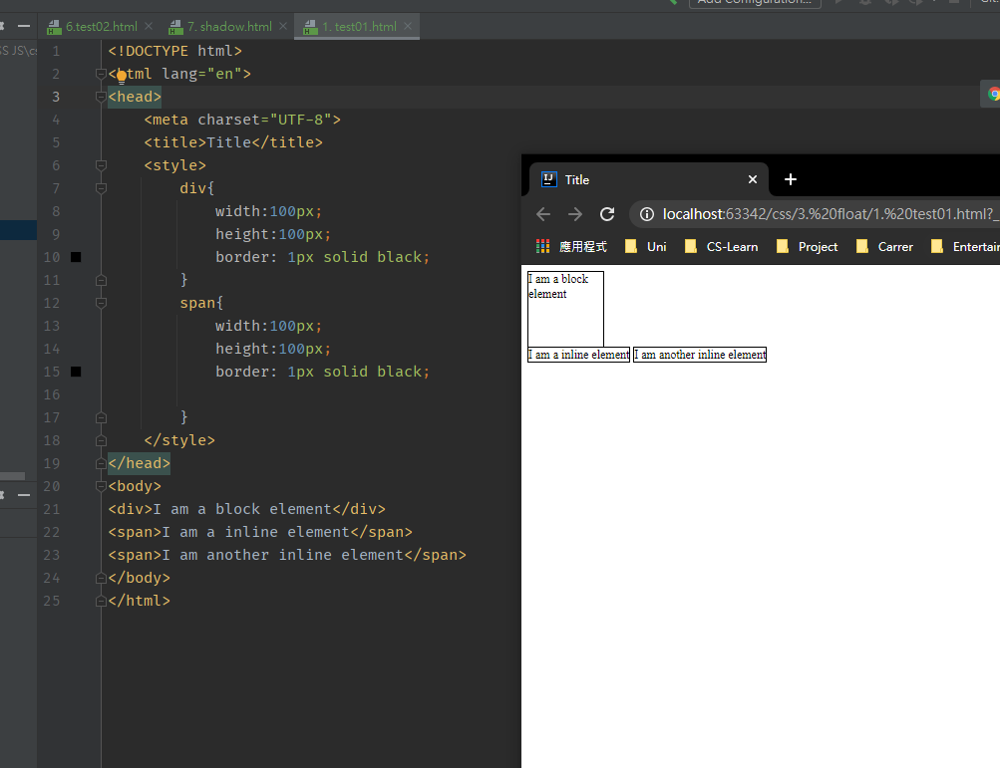

> 例子：可以見到block element div獨佔一行，而2個span都係同一行

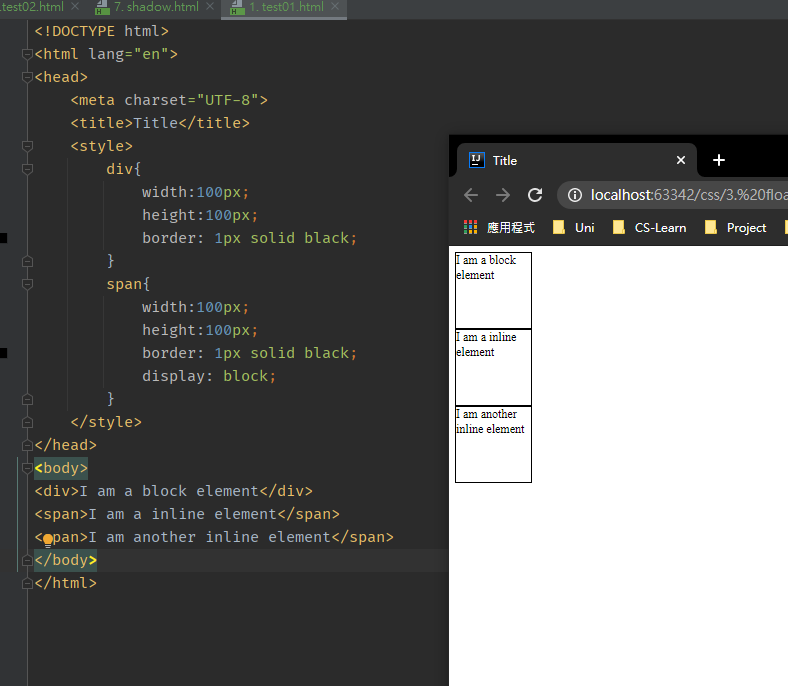

> 係span加左一行display: block之後，就可以span轉為Block~
>
> display 常用嘅有
>
> 1. block
> 2. inline
> 3. inline-block (又係inline 又係block) (常用)
> 4. none (隱形，但係依然存在)

> 例子2

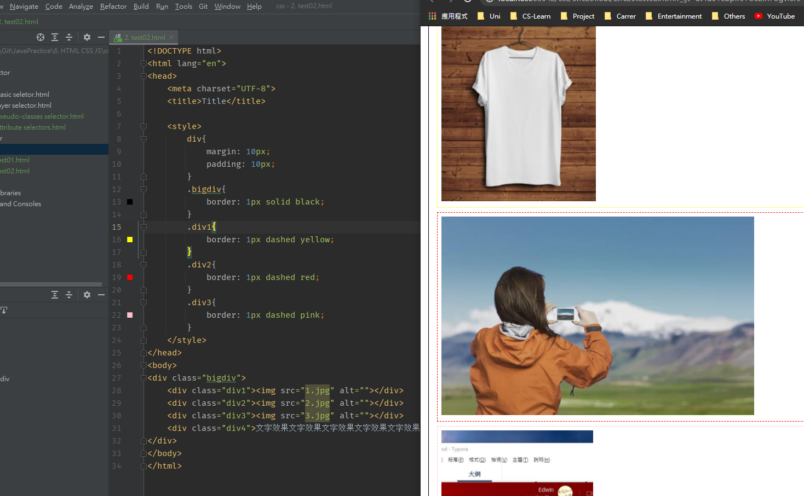

**有三幅圖，放係block入面，所以會撐開3行**

>float : left/right
>
>float類似係將個block升起，浮係空中，地面嘅位置用佢嘅影做個place holder
>
>**但係佢嘅實體係飛起，所以可以超出佢嘅父係block**
>
>例如呢個例子，飛起後就可以超出bigdiv呢個block

```html
<!DOCTYPE html>
<html lang="en">
<head>
    <meta charset="UTF-8">
    <title>Title</title>

    <style>
        div{
            margin: 10px;
            padding: 10px;
        }
        .bigdiv{
            border: 1px solid black;
        }
        .div1{
            border: 1px dashed yellow;
            display: inline-block;
            float:left;
        }
        .div2{
            border: 1px dashed red;
            display: inline-block;
            float:left;
        }
        .div3{
            border: 1px dashed pink;
            display: inline-block;
            float:left;
        }
    </style>
</head>
<body>
<div class="bigdiv">
    <div class="div1"></div>
    <div class="div2"></div>
    <div class="div3"></div>
    <div class="div4">文字效果文字效果文字效果文字效果文字效果文字效果文字效果文字效果文字效果文字效果文字效果文字效果</div>
</div>
</body>
</html>
```

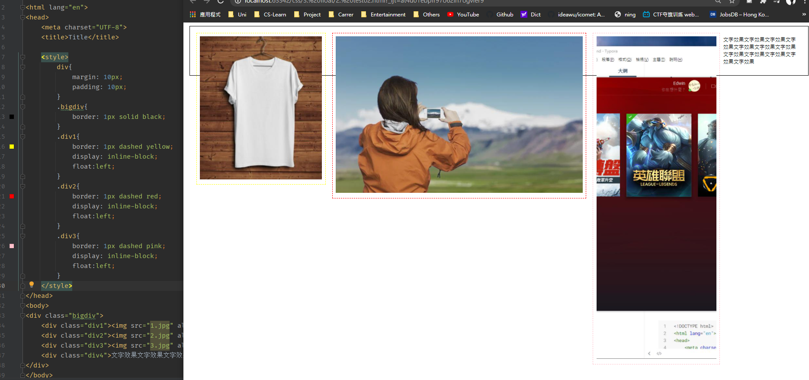


## 6.1 父係div邊框塌陷問題

> 上面嘅例子，父係div (bigdiv) 明顯地產生塌陷，無辦法裝曬佢嘅子元素

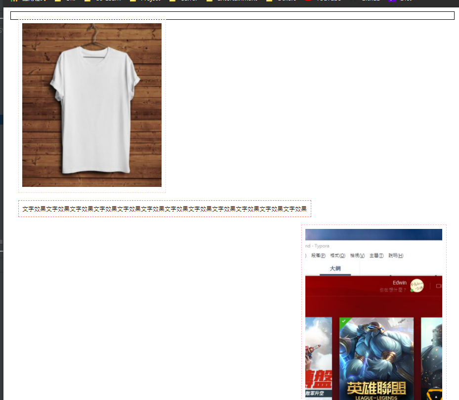

> 解決方法 1 : 係父係div加一個空div ，並且用clear: both
>
> **缺點：html結構不清晰**

```css
clear: right;   //左邊唔可以有float element
clear: left;	//右邊唔可以有float element
clear: both;	//兩邊都唔可以有float element
```

```html
<div class="clear"></div>

<style>
    .clear{
        clear:both;
    }
</style>
```

> 解決方法 2 : 係父係div嘅css 加一個 overflow: hidden
>
> **缺點：某些場景不能使用**

```html
<style>
    .bigdiv{
        overflow:hidden;
    }
</style>
```

> 解決方法 3 : 係css加一個父係嘅pseudo class ‘after’，係入面定義一個無內容嘅嘢去撐起父係div
>
> **留意係寫after**
>
> **比較常用，因為唔會改變html結構**

```html
<style>
    .bigdiv{
        overflow:hidden;
    }
    .bigdiv:after{
        content:'';
        display:block;
        clear:both;
    }
</style>
```


# 7. position

> 用position: relative/absolute 設置
>
> 測試嘅html如下

```html
<!DOCTYPE html>
<html lang="en">
<head>
    <meta charset="UTF-8">
    <title>Title</title>

    <style>
        div{
            margin: 10px;
            padding: 5px;
            font-size: 12px;
            line-height: 25px;
            font-size: 20px;
        }

        #father{
            border: 1px solid red;
            margin-top: 200px;
        }

        #first{
            background-color: sienna;
            border: 1px dashed greenyellow;
        }

        #second{
            background-color: lavenderblush;
            border: 1px dashed hotpink;
        }

        #third{
            background-color: olivedrab;
            border: 1px dashed blueviolet;
        }
    </style>
</head>
<body>
<div id="father">
    <div id ="first">first box</div>
    <div id ="second">second box</div>
    <div id ="third">third box</div>
</div>

</body>
</html>
```

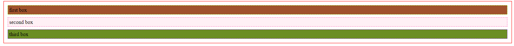

## 7.1 relative position

> 相對定位係相對於自己**原本**嘅位置，**原來嘅位置依然會被保留**

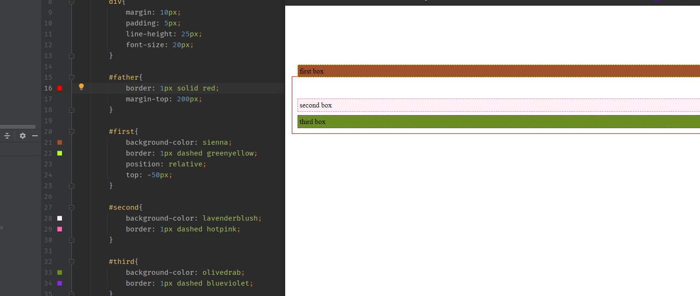

**係#first加入position: relative後，用 top: -50px**

> 點解係上移？因為宜家嘅位置相對於原本嘅位置嚟講，宜家嘅top 減左50

## 7.2 absolute position

> **原來嘅位置不保留**
>
> 1. 如果父係無相對/絕對定位，佢嘅位置就係相對於瀏覽器
> 2. 父係存在定位，佢嘅位置就相對於父係 (**通常父係用relative position，子係用absolute**)


## 7.3 fixed position

> 無論其他野點郁，佢都無會郁，用途：放廣告？


# 8. 其他常用

> 用z-index設置層數

```css
.abc{
    z-index: 123;   
}
```

> 用opacity: 0.5	設置**背景**透明度