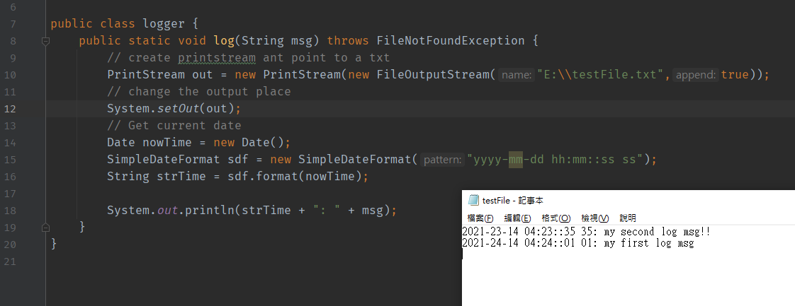

# 1. IO的分類

>按照byte作為單位嘅stream好常用，因為可以讀唔同類型嘅文件，例如txt, png, mp3等
>
>而按char作為單位嘅stream通常只用作讀取純txt文件，連word都讀唔到
>
>​	**從disk去memory叫做Read，亦叫做 input**
>
>​	**從memory去disk叫做Write，亦叫做output**
>
>Java IO主要有4種，如下

### byte輸入流 java.io.InputStream

### byte輸出流 java.io.OutputStream

### char輸入流 java.io.Reader

### char輸出流 java.io.Writer 

## 1.1 注意事項

所有stream都有implement closeable interface，所以用完**記得call close()**

所有output stream都有implement flushable interface，用完**記得call flush()**去清空pipe入面嘅資料


------------------

總共有**16**個iostream需要掌握

**file**

1. java.io.FileStream **重要**
2. java.io.FileOutputStream **重要**
3. java.io.FileReader
4. java.io.FileWriter

**轉換(將byte轉char)**

5. java.io.InputStreamReader
6. java.io.OuputStreamWriter

**buffer**

7. java.ioBufferedReader
8. java.io.BufferedWriter
9. java.io.BufferedInputStream
10. javav.io.BufferedOutputStream

**data**

11. java.io.DataInputStream
12. java.ioDataOutputStream

**output**

13. java.io.PrintWriter
14. java.io.PrintStream **重要**

**object**

15. java.io.ObjectInputStream **重要**
16. java.io.ObjectOutputStream **重要**


# 2. FileStream

## 2.1 java.io.FileStream


第三個步驟read data，係首先準備一個byte[]，用呢個byte[]一次讀多個byte，然後output。

testFile.txt呢個file嘅內容係 12345，所以bytes嘅長度係4嘅話，佢就一次讀4個，然後output

> **我想一次讀曬所有嘢，可以點做？**

-> 可以用available()呢個method

```java
byte[] bytes = new byte[in.available()];
int readCount = in.read(bytes);
System.out.println(new String(bytes));
```

呢個method會check txt file入面剩餘byte係幾多，如果一開始就做嘅話就讀到成個file總共有幾多byte

用呢個num去整一個byte[] array，就可以一次讀曬，連loop都唔洗

**留意呢個方法只適合唔太大嘅file，因為file太大個byte[] 會爆**

> **我想skip幾個byte唔讀，可以點做？**

-> 可以用skip()呢個method

```java
in.skip(2); // long num
System.out.println(new String(in.read()));
```

就會跳左前面2個byte，直接output第三個byte嘅ASCII


## 2.2 java.io.FileOutputStream


FileOutputStream第二個參數default係false，如果係false就會直接覆蓋文件，而唔係係後面追加

要追加嘅話就用true

**記得output一定要flush()**


## 2.3 Copy file


留意最尾close()，要一個一個嚟，唔可以一齊，因為如果用同一個try catch，萬一上面個fis有exception，咁就關唔到下面個fos


> 留意下面嘅reader只可以讀寫普通txt，因為係讀寫char，唔似上面讀寫byte

## 2.4 java.io.FileReader


做法同上面大同小異，由於呢個係用reader唔係stream，所以用char[]接收

**java.io.FileWriter做法都係同上，用char[]寫，唔再重複，記得flush()**


# 3. Buffer

> 用buffer stream唔需要自定義char[]或者byte[]，佢自己有


留意第11行，constructor接收左一個FileReader嘅object，點解呢？

因為佢接收緊Reader呢個object，FileReader係佢嘅subclass所以可以

簡單黎講就係用FileReader呢個節點去幫手讀，**BufferReader可以一次讀一行**

**最尾close()只需要close外層嘅BufferedReader就得**，因為BufferedReader嘅destruction會自動close FileReader


## 3.1 轉換+buffer

> 問：如果俾個FileInputStream，要你用BufferReader輸出，咁點？

一個係Stream，處理嘅係byte[]，另外一個係Reader，處理嘅係char[]

我地可以用轉換器 InputStreamReader，呢個嘢接收stream，而佢係一個Reader！

```java
public class test {
    public static void main(String[] args) throws IOException {
        FileInputStream in = new FileInputStream("E:\\testFile.txt");
        InputStreamReader reader = new InputStreamReader(in); //轉換
        BufferedReader br = new BufferedReader(reader);

        String s = null;
        while((s = br.readLine()) != null){
            System.out.println(s);
        }

        br.close();
    }
}
```

例如咁樣，中間套一層InputStreamReader去轉

**BufferedWriter都係差唔多，用FileWriter做節點**


# 4. DataStream

java.io.DataInputStream 及 java.io.DataOutputStream

```java
package DataStream;

import java.io.*;

public class output {
    public static void main(String[] args) throws IOException {
        DataOutputStream dos = new DataOutputStream(new FileOutputStream("E:\\testFile.txt"));

        byte b = 20;
        short s = 35;
        int i = 60;
        float f = 70.5F;
        long l = 13L;

        dos.writeByte(b);
        dos.writeShort(s);
        dos.writeInt(i);
        dos.writeFloat(f);
        dos.writeLong(l);

        dos.flush();
        dos.close();
    }
}
```

DataOutputStream都係向一個file寫嘢，同上面FileOutput，BufferedWriter等唔一樣嘅就係：佢會寫埋data type

留意15-19行

呢個file gen左之後用txt開係會亂碼，咁點讀呢？

**就係配合翻DataInputStream，讀取翻果個file，留意需要跟翻datatype嘅順序讀，例如第一個讀Byte，第二個讀Short等等**


# 5. System intput/output stream

其實java.io.PrintStream，就係我地常見嘅System.out.println("")

System.out 會return一個PrintStream object，跟住我地call 佢嘅println() method，原理就係咁




PrintStream default ouput place係console，我地可以用第12行改佢嘅output place，跟住寫個log~

當有事件發生果陣就加埋時間寫入log入面