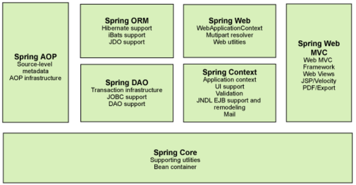
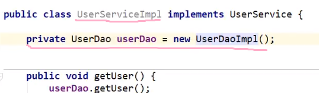
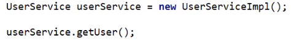
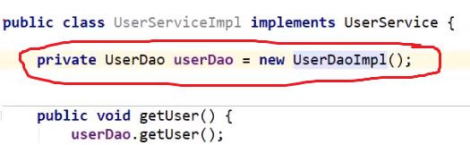
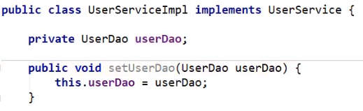
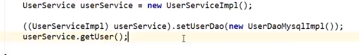
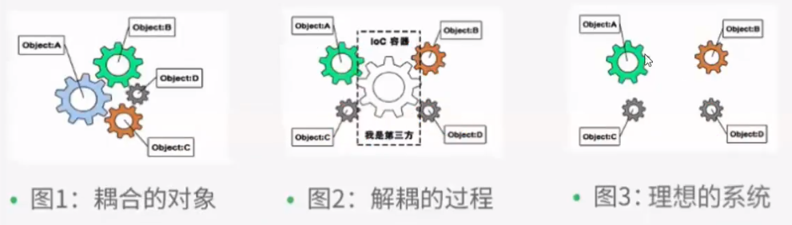
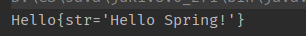

 

# 1. Intro

**Spring框架**是 Java平台的一個開源的全棧（Full-stack）應用程式框架和控制反轉容器實現，一般被直接稱為 Spring。該框架的一些核心功能理論上可用於任何 Java 應用，但 Spring 還為基於Java企業版（Java EE)平台構建的 Web 應用提供了大量的擴充支援。Spring 沒有直接實現任何的編程模型，但它已經在 Java 社群中廣為流行，基本上完全代替了企業級JavaBeansEJB）模型。

> document: https://docs.spring.io/spring-framework/docs/current/reference/html/core.html


`核心功能模組`

- 基於 JavaBeans 的採用控制反轉（Inversion of Control，IoC）原則的組態管理，使得應用程式的組建更加簡易快捷。
- 資料庫事務的一般化抽象層，允許聲明式（Declarative）事務管理器，簡化事務的劃分使之與底層無關。
- JDBC 抽象層提供了有針對性的異常等級（不再從 SQL 異常中提取原始代碼），簡化了錯誤處理，大大減少了程式設計師的編碼量。再次利用 JDBC 時，你無需再寫出另一個'終止'（finally）模組。並且面向 JDBC 的異常與 Spring 通用資料存取物件（Data Access Object）異常等級相一致。
- 以資源容器，DAO 實現和事務策略等形式與 Hibernate，JDO 和 MyBatis 、SQL Maps 整合。利用控制反轉機制全面解決了許多典型的 Hibernate 整合問題。所有這些全部遵從 Spring 通用事務處理和通用資料存取物件異常等級規範。


`重點`

- Spirng 免費，open source
- IOC (inversion of control)、AOP (aspect-oriented programming)


## 1.2 maven dependency

```xml
<!-- https://mvnrepository.com/artifact/org.springframework/spring-webmvc -->
<dependency>
    <groupId>org.springframework</groupId>
    <artifactId>spring-webmvc</artifactId>
    <version>5.2.0.RELEASE</version>
</dependency>
<!--需要與mybatis做整合，所以要呢個↓-->
<dependency>
    <groupId>org.springframework</groupId>
    <artifactId>spring-jdbc</artifactId>
    <version>5.2.0.RELEASE</version>
</dependency>
```


## 1.3 組成




# 2. IOC

## 2.1 intro

> 之前寫一個應用，要寫以下幾個file
>
> - UserDao
> - UserDaoImplementation
> - UserService
> - UserServiceImplementation
>
> 當user發出請求，由 service layer call dao layer，完成操作

咁 Dao 點同 Service產生關係呢？就係係 service layer加一個 dao object



> 當user發出請求，就 new 一個 service object，等 service layer call dao layer
>
> 

咁樣嘅話有一個問題：每次 user發出新請求，姐係request一個新嘅 dao object，我地 (programmer) 需要改 service layer嘅code



就係改呢個 service implementation， new 另外一個 dao implementation

`但係咁做係program控制呢個dao object，太麻煩，我地應該改變諗法，令user控制呢個object`



> 就係唔寫死呢個 UserDao object，而係`提供一個setter`，當user改變需求，直接用setter new一個對應嘅dao object就得

 


## 2.2 總結

>之前係program 主動創建 object，控制權係programmer手上
>
>用setter之後，會根據user需求創建，控制權係 user手上



- IOC（Inverse Of Control）控制反轉，即把建立物件的權利交給框架，也就是指將物件的建立、物件的儲存、物件的管理交給了spring容器

- spring容器是spring中的一個核心模組，用於管理物件，底層可以理解為是一個map集合
- `IOC: 獲得object嘅方式反轉`
- `Spring實現IOC嘅係 IOC container，其實現方法是 Dependency Injection (DI)`

> 而用spring嘅話，spring IoC container就會幫我地控制 object 嘅創建以及管理，programmer唔需要再new object，set property； 稱為IoC


# 3. Hello Spring

`1. pojo`

```java
package com.test.pojo;

public class Hello {
    private String str;

    public String getStr() {
        return str;
    }

    public void setStr(String str) {
        this.str = str;
    }

    @Override
    public String toString() {
        return "Hello{" +
                "str='" + str + '\'' +
                '}';
    }
}
```

`2. 寫bean`

> bean簡介：In Spring, the objects that form the backbone of your application and that are managed by the Spring IoC container are called beans. A bean is an object that is instantiated, assembled, and otherwise managed by a Spring IoC container.
>
> 重點：
>
> - `bean係object`
> - bean被Spring IoC container 管理 (由呢個container  instantiated, assembled)
> - 一個program由多個bean構成
>
> 官網：https://docs.spring.io/spring-framework/docs/current/reference/html/core.html

​		`beans.xml`

```xml
<?xml version="1.0" encoding="UTF-8"?>
<beans xmlns="http://www.springframework.org/schema/beans"
       xmlns:xsi="http://www.w3.org/2001/XMLSchema-instance"
       xsi:schemaLocation="http://www.springframework.org/schema/beans
        https://www.springframework.org/schema/beans/spring-beans.xsd">
	<!--id自己set，class綁定pojo-->
    <!--property係pojo嘅property，可以用value set佢嘅value-->
    <bean id="hello" class="com.test.pojo.Hello">
        <property name="str" value="Hello Spring!"/>
    </bean>

</beans>
```

`3. test`

```java
public class Test {
    public static void main(String[] args) {
        // 1. 必定要寫，獲取Spring container 
        ApplicationContext context = new ClassPathXmlApplicationContext("beans.xml");
        // 2. 用applicationContext獲取bean
        Hello hello = (Hello)context.getBean("hello");
        System.out.println(hello.toString());

    }
}
```

output如下




> 反思：
>
> 1. Hello 呢個object由邊個創建？
>    - 由Spring創建
> 2. Hello object入面 str呢個property由邊個設置？
>    - 由Spring container設置

> 總結：
>
> 以前我地需要 set好曬 pojo入面嘅property，又要 new；
>
> 宜家將控制權交俾 IoC container，由佢負責 new object及set property，我地只需要寫好bean，需要用果陣去container攞！
>
> `唔再需要改source code，要實現唔同操作，只需要更改xml 文件`


# 4. How IoC create object

> 下面嘅例子基於`User pojo`

`User pojo`

```java
package com.test.pojo;

public class User {
    private String name;

    public User(){
        
    }

//  public User(String name) {  有參構造
//      this.name = name;
//  }

    public String getName() {
        return name;
    }

    public void setName(String name) {
        this.name = name;
    }
}
```

```java
public class Test {
    public static void main(String[] args) {
        // 1. 必定要寫，獲取Spring container 
        ApplicationContext context = new ClassPathXmlApplicationContext("beans.xml");
        // 2. 用applicationContext獲取bean
        User user = (User)context.getBean("user");
        System.out.println(hello.toString());
    }
}
```

- `當我地用 context.getBean() method，就會用default constructor create object`
- `留意：getBean時會創建該xml下所有bean object`

- 如果要用有參數嘅constructor:

  1. index賦值 (contructor argument index)

     ```xml
     <bean id="user" class="com.test.pojo.user">
     	<constructor-arg index="0" value="Tom"/>
     </bean>
     ```

     為 index = 0 嘅argument賦值為Tom

  2. 參數名

     ```xml
     <bean id="user" class="com.test.pojo.user">
     	<constructor-arg name="name" value="Tom"/>
     </bean>
     ```

     

     


