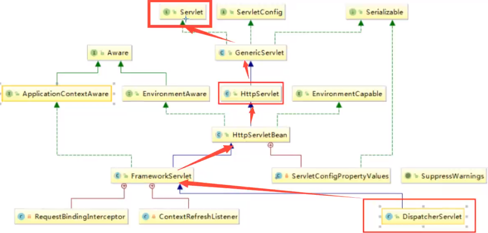
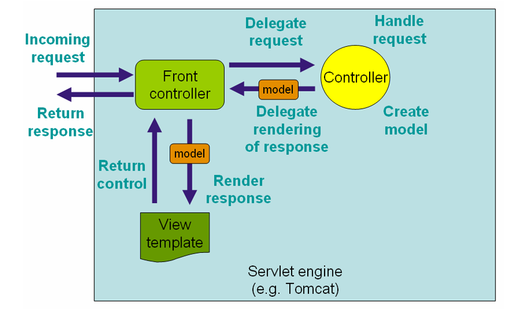
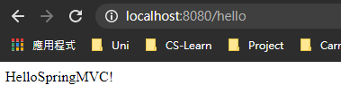
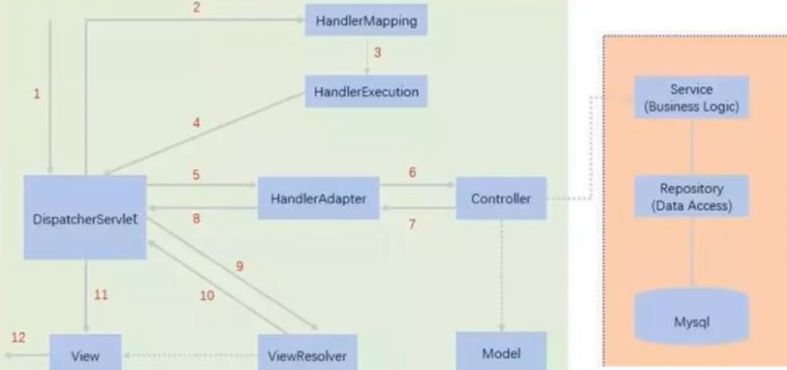
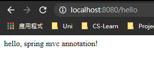
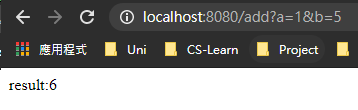
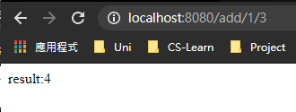

> document：https://docs.spring.io/spring-framework/docs/current/reference/html/web.html
>
> document2: https://docs.spring.io/spring-framework/docs/4.3.24.RELEASE/spring-framework-reference/html/

# 1. Intro

## 1.1 回顧MVC

**MVC模式**（Model–view–controller）是軟件工程中的一種架構模式，分為三個基本部分：模型（Model）、視圖（View）和控制器（Controller）。

- M : model (mapper, service)
  - program實際嘅功能，以及database交互等等
- V : view (jsp)
  - 俾 user睇
- C : controller (servlet)
  - 接收請求，獲取數據，轉發請求


## 1.2 springMVC

點解要學SpringMVC？

- 簡單易學，搞笑
- 與Spring兼容好
- 功能強大：RESTful，數據驗證等等
- 多人用！  =.=


## 1.3 Dispatcher Servlet

SpringMVC入面有一個 dispatcherServlet ，作用係控制全局 (可以理解為控制中心)，當user發出請求，佢會負責攔截並接受請求，然後分俾唔同handler去處理呢個request

佢本質上都係一個servlet，具體如下圖







# 2. HelloMVC

`1. 在resources目錄下增加springmvc-servlet.xml`

需要註冊兩個bean，並加入resource view resolver

```xml
<?xml version="1.0" encoding="UTF-8"?>
<beans xmlns="http://www.springframework.org/schema/beans"
       xmlns:xsi="http://www.w3.org/2001/XMLSchema-instance"
       xsi:schemaLocation="http://www.springframework.org/schema/beans
        https://www.springframework.org/schema/beans/spring-beans.xsd">
    <!--Handler mapping                <------------   -->
    <bean class="org.springframework.web.servlet.handler.BeanNameUrlHandlerMapping"/>
    <!--Handler adapter                <------------   -->
    <bean class="org.springframework.web.servlet.mvc.SimpleControllerHandlerAdapter"/>
    <!--Resource View resolver          <------------   -->
    <bean class="org.springframework.web.servlet.view.InternalResourceViewResolver" id="InternalResourceViewResolver">
        <property name="prefix" value="/WEB-INF/jsp/"/>
        <property name="suffix" value=".jsp"/>
    </bean>
    
</beans>
```

`2. 在web.xml加入dispatcherServlet`

```xml
<?xml version="1.0" encoding="UTF-8"?>
<web-app xmlns="http://xmlns.jcp.org/xml/ns/javaee"
         xmlns:xsi="http://www.w3.org/2001/XMLSchema-instance"
         xsi:schemaLocation="http://xmlns.jcp.org/xml/ns/javaee http://xmlns.jcp.org/xml/ns/javaee/web-app_4_0.xsd"
         version="4.0">
	<!--加入以下servlet及servlet mapping-->
    <servlet>
        <servlet-name>springmvc</servlet-name>
        <servlet-class>org.springframework.web.servlet.DispatcherServlet</servlet-class>
		<!--DispatcherServlet需要綁定spring configuration file-->
        <init-param>
            <param-name>contextConfigLocation</param-name>
            <param-value>classpath:springmvc-servlet.xml</param-value>
        </init-param>
        <load-on-startup>1</load-on-startup>
    </servlet>
	<!--url-pattern: / ，代表所有request都要經過springmvc嘅dispathcherServlet-->
    <servlet-mapping>
        <servlet-name>springmvc</servlet-name>
        <url-pattern>/</url-pattern>
    </servlet-mapping>
</web-app>
```

之前寫javaweb，servlet嘅class係需要自己寫，然後加入映射。宜家寫spring mvc就係用佢提供嘅 dispatcherServlet，直接導入就ok

`3. 寫一個controller-HelloController.java`

```java
public class HelloController implements Controller{
    @Override
    public ModelAndView handleRequest(HttpServletRequest request, HttpServletResponse response) throws Exception {
        ModelAndView mv = new ModelAndView();

        /*加object，放入 modelAndView中*/
        mv.addObject("msg","HelloSpringMVC!");
        /*設置要轉發嘅view， hello 。由於已經係springmvc-servlet.xml配好resolver，會自動加prefix，suffix*/
        mv.setViewName("hello"); // return 俾resolver之後，佢會將呢個名變成/WEB-INF/jsp/hello.jsp
        return mv;
    }
}
```

`4. 在springmvc-servlet.xml加入/hello handler`

```xml
<?xml version="1.0" encoding="UTF-8"?>
<beans xmlns="http://www.springframework.org/schema/beans"
       xmlns:xsi="http://www.w3.org/2001/XMLSchema-instance"
       xsi:schemaLocation="http://www.springframework.org/schema/beans
        https://www.springframework.org/schema/beans/spring-beans.xsd">

    <!--Handler mapping-->
    <bean class="org.springframework.web.servlet.handler.BeanNameUrlHandlerMapping"/>
    <!--Handler adapter-->
    <bean class="org.springframework.web.servlet.mvc.SimpleControllerHandlerAdapter"/>
    <!--Resource View resolver-->
    <bean class="org.springframework.web.servlet.view.InternalResourceViewResolver" id="InternalResourceViewResolver">
        <property name="prefix" value="/WEB-INF/jsp/"/>
        <property name="suffix" value=".jsp"/>
    </bean>

    <!-- 加入handler          <------------   -->
    <bean id="/hello" class="com.test.controller.HelloController"/>
</beans>
```

我地仲需要一個jsp嚟顯示呢個view，所以加一個 hello.jsp

`5. hello.jsp`

```jsp
<%@ page contentType="text/html;charset=UTF-8" language="java" %>
<html>
<head>
    <title>Title</title>
</head>
<body>
${msg}  <%--直接攞ModelAndView 入面存放嘅msg--%>
</body>
</html>
```

然後就可以set tomcat，run！輸入 /hello後顯示如下




## 2.1 原理

1. user send request
2. dispatcherServlet 接收並攔截request
3. dispatcherServlet將url send俾handlerMapping
4. handlerMapping根據url搵出對應嘅handler，并return俾dispatcherServlet，例如上面嘅例子就會搵出 hello呢個handler
5. dispatcherServlet將handler信息send俾handlerAdapter (負責處理controller)
6. handlerAdapter call controller
7. controller負責處理user request，資料以modelAndView 形式return，return俾handlerAdapter，然後再return俾dispatcherServlet
8. dispatcherServlet將modelAndView send俾ViewResolver resolve
9. ViewResolver return一個解析好嘅view name (加入prefix, suffix等) 俾dispatcherServlet
10. dispatcherServlet搵出view嘅具體位置
11. 俾user睇！




# 3. Annotation

上面嘅example係原理，實際上無咩人用，而係用annotation嚟完成。下面將會用相似嘅例子做翻output

`1. 新增springmvc-servlet.xml`

```xml
<?xml version="1.0" encoding="UTF-8"?>
<beans xmlns="http://www.springframework.org/schema/beans"
       xmlns:xsi="http://www.w3.org/2001/XMLSchema-instance"
       xmlns:context="http://www.springframework.org/schema/context"
       xmlns:mvc="http://www.springframework.org/schema/mvc"
       xsi:schemaLocation="http://www.springframework.org/schema/beans
        https://www.springframework.org/schema/beans/spring-beans.xsd http://www.springframework.org/schema/context https://www.springframework.org/schema/context/spring-context.xsd http://www.springframework.org/schema/mvc https://www.springframework.org/schema/mvc/spring-mvc.xsd">

    <!--1. 自動scan annotation-->
    <context:component-scan base-package="com.test.controller"/>
    <!--2. 呢一行令mvc annotation生效，例如@RequestMapping；而之前嘅做法係註冊兩個bean，分別為handlerMapping及handlerResolver-->
    <mvc:annotation-driven/>
    <!--3. 令spring mvc不處理static resources： .css .js .html , etc-->
    <mvc:default-servlet-handler/>
    <!--4. viewResolver依然要自己整-->
    <bean class="org.springframework.web.servlet.view.InternalResourceViewResolver" id="InternalResourceViewResolver">
        <property name="prefix" value="/WEB-INF/jsp/"/>
        <property name="suffix" value=".jsp"/>
    </bean>

</beans>
```

> 留意第二步

`2. web.xml`

```xml
<?xml version="1.0" encoding="UTF-8"?>
<web-app xmlns="http://xmlns.jcp.org/xml/ns/javaee"
         xmlns:xsi="http://www.w3.org/2001/XMLSchema-instance"
         xsi:schemaLocation="http://xmlns.jcp.org/xml/ns/javaee http://xmlns.jcp.org/xml/ns/javaee/web-app_4_0.xsd"
         version="4.0">

    <servlet>
        <servlet-name>springmvc</servlet-name>
        <servlet-class>org.springframework.web.servlet.DispatcherServlet</servlet-class>

        <init-param>
            <param-name>contextConfigLocation</param-name>
            <param-value>classpath:springmvc-servlet.xml</param-value>
        </init-param>
        <load-on-startup>1</load-on-startup>
    </servlet>

    <servlet-mapping>
        <servlet-name>springmvc</servlet-name>
        <url-pattern>/</url-pattern>
    </servlet-mapping>
</web-app>
```

> 同之前一樣，都係要加入 DispatcherServlet，並與spring configuration file連接，set mapping

`3. 寫Controller: HelloController.java`

```java
@Controller
public class HelloController {
    @RequestMapping("/hello")
    public String hello(Model model){
        model.addAttribute("msg","hello, spring mvc annotation!");
        return "hello"; // return view name俾resolver，加上prefix suffix後變成 /WEB-INF/jsp/hello.jsp
    }
}
```

> @Controller代表呢個係Controller，同之前嘅implements Controller作用一樣：代表呢個class會被Spring控制，呢個class下面所有methods，如果return type係String，會被view resolver處理
>
> @RequestMapping係寫 url地址，同之前註冊一個 id="/hello" 嘅bean一樣，當收到 localhost:8080/hello呢個請求，handlerMapping就會搵到有呢個annotation嘅method，進行處理

最尾當然都要寫翻個jsp

`4. hello.jsp`

```jsp
<%@ page contentType="text/html;charset=UTF-8" language="java" %>
<html>
<head>
    <title>Title</title>
</head>
<body>
${msg}
</body>
</html>
```

`5. 結果`




# 4. RESTful

REST = Representational state transfer

而RESTful可以理解為一種資源定位嘅`style`，係互聯網上，所有嘢都可以稱為資源，例如png, mp4, jpg等等，都係由user 請求

點解要用RESTful

- view及資料分離，令view可以重複使用 (例如兩份唔同嘅資料send去同一個jsp，動態顯示)
- 安全！ (相對而言)

- 高效利用cache，令response速度更快


傳統方式send request:

方法單一，post或者get

1. http://127.0.0.1/item/queryItem.action?id=1 (query, id = 1, method=GET)
2. http://127.0.0.1/item/addItem.action (add, method=POST)
3. http://127.0.0.1/item/updateItem.action (update, method=POST)
4. http://127.0.0.1/item/deleteItem.action?id=1 (delete, id = 1, method=GET)


RESTful:

可以通過唔同嘅 request method (GET, POST, PUT, DELETE, etc) 實現唔同嘅效果

例如 request url一樣，但係 return嘅view不同

1. http://127.0.0.1/item/1 (query, method=GET)
2. http://127.0.0.1/item (add, method=POST)
3. http://127.0.0.1/item (update, method=PUT)
4. http://127.0.0.1/item/1 (delete, method=DELETE)

留意 1,4 係一樣，2,3 係一樣；呢個就係 (相對)安全嘅原因所在，淨係睇url都無人知你係申請緊資源定提交緊資料，而傳統方式就可以分到


## 4.1 例子及比較

`傳統寫法：RESTfulController.java`

```java
@Controller
public class RESTfulController {
    @RequestMapping("/add")
    public String test01(int a, int b, Model model){
        int ans = a+b;
        model.addAttribute("msg", "result:"+ ans);
        return "result";
    }
}
```

> 呢個function作用係output一個a+b答案，a及b係url傳入嘅參數，最後return俾 /WEB-INF/jsp/result.jsp

`傳統寫法：結果`



由url可以睇出，需要傳入參數，並且唔好睇==


`RESTful：RESTfulController.java`

```java
@Controller
public class RESTfulController {
    @RequestMapping("/add/{a}/{b}")
    public String test01(@PathVariable int a, @PathVariable int b, Model model){
        int ans = a+b;
        model.addAttribute("msg", "result:"+ ans);
        return "result";
    }
}
```

> 留意第三行 @RequestMapping，用url接收參數，然後計算
>
> 用呢個做法，參數需要加一個 @PathVariable

`RESTful：結果`



> 留意 url 分別


#4 提到，用RESTful style寫，url可以一樣但係return result唔一樣，點解呢？

就係用翻 request method嚟區分，呢度要知翻@RequestMapping 有幾個sub type，分別對應唔同嘅 requestMethods

常用嘅有：

```java
@GetMapping
@PostMapping
@PutMapping
@DeleteMapping
```

當接收 url後，如果有衝突，就會用 method區分，例如

```java
@Controller
public class RESTfulController {
    @GetMapping("/add/{a}/{b}")
    public String test01(@PathVariable int a, @PathVariable int b, Model model){
        int ans = a+b;
        model.addAttribute("msg", "GET result:"+ ans);
        return "result";
    }
    
    @PostMapping("/add/{a}/{b}")
    public String test02(@PathVariable int a, @PathVariable int b, Model model){
        int ans = a+b;
        model.addAttribute("msg", "POST result:"+ ans);
        return "result";
    }  
}
```

至於 request method就可以用翻html嘅 form 嚟設置


# 5. Encoding

解決中文亂碼問題！之前 java web階段，亂碼問題係用filter解決，呢度都可以！

`1. 寫filter`

```java
public class CharacterEncodingFilter implements Filter {
    // Server (Tomcat) 開啟前會自動初始化
    @Override
    public void init(FilterConfig filterConfig) throws ServletException {

    }

    @Override
    public void doFilter(ServletRequest servletRequest, ServletResponse servletResponse, FilterChain filterChain) throws IOException, ServletException {
        // 1. 將亂碼問題解決
        servletRequest.setCharacterEncoding("utf-8");
        servletResponse.setCharacterEncoding("utf-8");

        // 2. 用filter chain將信號再傳出去
        filterChain.doFilter(servletRequest,servletResponse);
       
    }
	// Server 關閉時會自動銷毀
    @Override
    public void destroy() {

    }
}
```

`2. web.xml加入filter`

```xml
<filter>
    <filter-name>utf-8-filter</filter-name>
    <filter-class>com.test.CharacterEncodingFilter</filter-class>
</filter>
<filter-mapping>
    <filter-name>utf-8-filter</filter-name>
    <url-pattern>/*</url-pattern>  <!--選擇將所有request過濾，包括 .jsp-->
</filter-mapping>
```


# 6. JSON

JSON = Javascript Object Notation，係一種`資料交換格式`

JSON 是個以純文字為基底去儲存和傳送簡單結構資料，你可以透過特定的格式去儲存任何資料，也可以透過物件或array來傳送較複雜的資料。一旦建立了您的 JSON 資料，就可以非常簡單的跟其他程式溝通或交換資料，因為 JSON 就只是個純文字格式。

> 簡單而言就係一個中介/buffer，通常用於server及web之間嘅資料交換
>
> ref: https://blog.wu-boy.com/2011/04/%E4%BD%A0%E4%B8%8D%E5%8F%AF%E4%B8%8D%E7%9F%A5%E7%9A%84-json-%E5%9F%BA%E6%9C%AC%E4%BB%8B%E7%B4%B9/comment-page-1/

> ```javascript
> var obj = {"a": "Hello", "b": "world"};  // 用{}包裹，係一個object
> var str = ‘{"a": "Hello", "b": "world"}’;// 用''包裹，係一個JSON str
> ```


JSON string -> JavaScript object

```javascript
var obj = JSON.parse('{"a": "Hello", "b": "world"}');
// 結果：{"a": "Hello", "b": "world"}   (留意{}已經消失)
```

JavaScript object -> JSON string

```javascript
var json_str = JSON.stringify({"a": "Hello", "b": "world"});
// 結果：'{"a": "Hello", "b": "world"}' (留意新增'')
```


