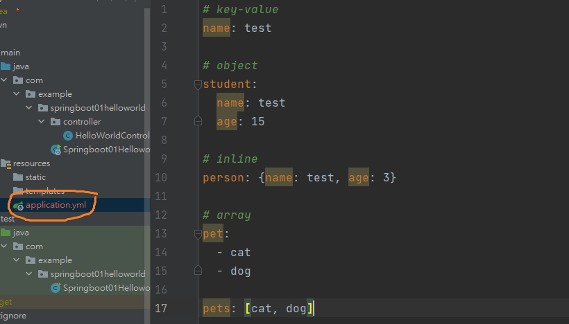

# 1. Hello world

## 1.1 Create project


Create project by clicking file -> new project -> spring initializr

## 1.2 Project entry


The project entry is named xxxxApplication, start Tomcat server by running this file

> The default server is Tomcat, and the port number is 8080


> Open a web, we could see that the application is running

## 1.3 Hello world


```java
@RestController
public class HelloWorldController {
    @RequestMapping("/hello")
    public String hello(){
        return "hello world!";
    }
}
```

Add a controller `in the same level of your springbootApplication file (as shown in the circle)`, and write this classic example. Then run the application again


We could get in to this page by sending a request to /hello, and the result is correct!

> In springboot, all the (simple) configuration is completed by default. Thus we could run it directly


# 2. Configuration

## 2.1 yaml

Yaml is a [human-readable](https://en.wikipedia.org/wiki/Human-readable) [data-serialization language](https://en.wikipedia.org/wiki/Serialization). It is commonly used for [configuration files](https://en.wikipedia.org/wiki/Configuration_file) and in applications where data is being stored or transmitted. 

> In Spring, we used to use xml as configuration file. But in Spring boot, yml is suggested

`syntax`



**There is a space before each value**

```yaml
# key-value
name: test

# object
student:
  name: test
  age: 15

# inline
person: {name: test, age: 3}

# array
pet:
  - cat
  - dog

pets: [cat, dog]
```

## 2.2 property injection in yml

> If a class has constant properties, we could do property injection in yml, such as database config etc.

In this chapter, two objects are created: `Dog` and `Person`


```java
@Component
@Data
@AllArgsConstructor
@NoArgsConstructor
public class Dog {
    private String name;
    private Integer age;
}
```

```java
@Component
@Data
@AllArgsConstructor
@NoArgsConstructor
public class Person {
    private String name;
    private Integer age;
    private List<Object> hobbyList;
    private Dog dog;
}
```

> Here we did not inject the properties to Person and Dog yet, but let's write a JUnit test case first.

```java
@SpringBootTest
class Springboot02ConfigApplicationTests {

    @Autowired
    private Person person;

    @Test
    void contextLoads() {
        System.out.println(person);
    }
}
```


Simply print the person object here, it is clear that all the properties are null

--------------------------------------------------

`injection start now`


Write person's properties in application.yml (right hand side), and then add an annotation @ConfigurationProperties(prefix = "xxxxx") in the Person class to indicate the binding. Run the test again, we would see


The properties are successfully injected!

## 2.3 Active another config file

`spring.profiles.active`

We could use spring.profiles.active = xxx to active the configuration file we want. For example, there are four files here:

- application.yml

- application-dev.yml
- application-test.yml
- application-production.yml

The syntax could be written in **application.yml** or in the **run configuration**. 

>**application.yml would be considered no matter which file is selected**
>
>Note that if the configuration file is placed on the same place as the default config file, we could write the suffix only, such as the highlighted part (application-`dev`.yml)

`in application.yml`


`in run config`


# 3. Thymeleaf

>https://www.thymeleaf.org/index.html

**Thymeleaf** is a modern server-side Java template engine for both web and standalone environments.

To put it simply, thymeleaf could be applied when we need to write html, css and javascript. We would adopt thymeleaf as frontend in the following part since it is suggested by the spring boot. (`but in most situation, we would use React, Vue or Angular rather than Thymeleaf`).

## 3.1 Standard expression syntax

> https://www.thymeleaf.org/doc/tutorials/3.0/usingthymeleaf.html
>
> Refer to the Thymeleaf document part 4 Standard Expression Syntax

- Simple expressions:
  - Variable Expressions: `${...}`
  - Selection Variable Expressions: `*{...}`
  - Message Expressions: `#{...}`
  - Link URL Expressions: `@{...}`
  - Fragment Expressions: `~{...}`

## 3.2 Attribute Precedence

| Order | Feature                         | Attributes                                 |
| :---- | :------------------------------ | :----------------------------------------- |
| 1     | Fragment inclusion              | `th:insert` `th:replace`                   |
| 2     | Fragment iteration              | `th:each`                                  |
| 3     | Conditional evaluation          | `th:if` `th:unless` `th:switch` `th:case`  |
| 4     | Local variable definition       | `th:object` `th:with`                      |
| 5     | General attribute modification  | `th:attr` `th:attrprepend` `th:attrappend` |
| 6     | Specific attribute modification | `th:value` `th:href` `th:src` `...`        |
| 7     | Text (tag body modification)    | `th:text` `th:utext`                       |
| 8     | Fragment specification          | `th:fragment`                              |
| 9     | Fragment removal                | `th:remove`                                |

>https://www.thymeleaf.org/doc/tutorials/3.0/usingthymeleaf.html#attribute-precedence

