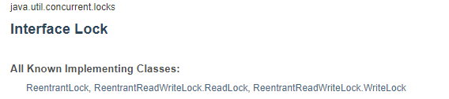

# 1. Introduction

## 1.1 What is JUC?

Java Util - Concurrent Collection (JUC) are a set of collections APIs that are designed and optimized specifically for synchronized multithreaded access. They are grouped under the *java.util.concurrent* package.  
 
## 1.2 Process and thread

- Process means a program is in execution, whereas **thread means a segment of a process.**
- A Process is not Lightweight, whereas Threads are Lightweight.
- A **Process takes more time to terminate**, and the **thread takes less time to terminate**.
- **Process takes more time for creation**, whereas **Thread takes less time for creation**.
- **Process** likely **takes more time for context switching** whereas as **Threads takes less time for context switching**.
- A **Process is mostly isolated**, whereas **Threads share memory**.
- **Process does not share data, and Threads share data with each other**.


> One way to view a thread is as an independent program counter operating **within** a process.

## 1.3 Concurrency and parallelism

`Concurrent`

- CPU 1 core, switch **rapidly** between threads **as if** many threads running together

`Parallel`

- CPU > 1 core, threads could run simultaneously

## 1.4 Why we need high concurrency?

> **Maximize CPU usage**

## 1.5 Process state


- `New`

  When a process is first created, it occupies the "**new**" state. In this state, the process awaits admission to the "ready" state.

- `Ready`

  A "**ready**" or "waiting" process has been loaded into **main memory** and is awaiting execution on a CPU

- `Running`

  A process moves into the running state when it is chosen (by CPU) for execution.

- `Blocked`

  A process transitions to a "**blocked**" state when it **cannot carry on** without an external change in state **or event occurring**. For example, a process may block on a call to an I/O device such as a printer, if the printer is not available. Processes also commonly block when they require user input, or require access to a critical section which must be executed atomically. Such critical sections are protected using a synchronization object such as a semaphore or mutex.

- `Suspend`

  The process would change to **suspend** state in some situations, such as:

  - **Swapping**

    The OS needs to release sufficient main memory to bring in a process that is ready to execute.

  - **Parent Process Request**

    A parent process may wish to suspend execution of a descendent to examine or modify the suspended process, or to coordinate the activity of various descendants.

  - **Interactive User Request**

    User may wish to suspend execution of a program for purpose of debugging

  - **Timing**

    A process may be executed periodically (e.g., an accounting or system monitoring process) and may be suspended while waiting for the next time.

- `Terminated`

  A process may be terminated, either from the "running" state by completing its execution or by explicitly being killed. In either of these cases, the process moves to the "**terminated**" state.

## 1.6 Thread state

> Refer to java.lang.Thread.State, there are 6 states in a thread

```java
public enum State {
    /**
     * Thread state for a thread which has not yet started.
     */
    NEW,

    /**
     * Thread state for a runnable thread.  A thread in the runnable
     * state is executing in the Java virtual machine but it may
     * be waiting for other resources from the operating system
     * such as processor.
     */
    RUNNABLE,

    /**
     * Thread state for a thread blocked waiting for a monitor lock.
     * A thread in the blocked state is waiting for a monitor lock
     * to enter a synchronized block/method or
     * reenter a synchronized block/method after calling
     * {@link Object#wait() Object.wait}.
     */
    BLOCKED,

    /**
     * Thread state for a waiting thread.
     * A thread is in the waiting state due to calling one of the
     * following methods:
     * <ul>
     *   <li>{@link Object#wait() Object.wait} with no timeout</li>
     *   <li>{@link #join() Thread.join} with no timeout</li>
     *   <li>{@link LockSupport#park() LockSupport.park}</li>
     * </ul>
     *
     * <p>A thread in the waiting state is waiting for another thread to
     * perform a particular action.
     *
     * For example, a thread that has called <tt>Object.wait()</tt>
     * on an object is waiting for another thread to call
     * <tt>Object.notify()</tt> or <tt>Object.notifyAll()</tt> on
     * that object. A thread that has called <tt>Thread.join()</tt>
     * is waiting for a specified thread to terminate.
     */
    WAITING,

    /**
     * Thread state for a waiting thread with a specified waiting time.
     * A thread is in the timed waiting state due to calling one of
     * the following methods with a specified positive waiting time:
     * <ul>
     *   <li>{@link #sleep Thread.sleep}</li>
     *   <li>{@link Object#wait(long) Object.wait} with timeout</li>
     *   <li>{@link #join(long) Thread.join} with timeout</li>
     *   <li>{@link LockSupport#parkNanos LockSupport.parkNanos}</li>
     *   <li>{@link LockSupport#parkUntil LockSupport.parkUntil}</li>
     * </ul>
     */
    TIMED_WAITING,

    /**
     * Thread state for a terminated thread.
     * The thread has completed execution.
     */
    TERMINATED;
}
```

# 2. Synchronized and lock

> Usually, there are 2 methods to write concurrent program
>
> - Use the synchronized key word provided by Java
> - Use the java concurrent lock library

`Example used in this chapter`

**multiple threads modifying same resource (ticket)**

```java
public class Test {
    public static void main(String[] args) {
        Ticket ticket = new Ticket();

        new Thread(() -> {
            for (int i = 0; i < 500; i++) {
                ticket.sell();
            }
        }, "A").start();

        new Thread(() -> {
            for (int i = 0; i < 500; i++) {
                ticket.sell();
            }
        }, "B").start();

        new Thread(() -> {
            for (int i = 0; i < 500; i++) {
                ticket.sell();
            }
        }, "C").start();
    }
}

class Ticket {
    private int tickets = 500;

    public void sell(){
        if(tickets > 0){
            System.out.println("Ticket " + (tickets--) + " is sold by " + Thread.currentThread().getName() + ". Ticket left: " + tickets);
        }
    }
}
```

In this example, three threads (A, B, C) want to buy some tickets from class Ticket. Let's see the output.


The output is quite messy since threads are competing against each other and they are modifying the same resource.

## 2.1 Synchronized

> We could use the keyword synchronized to make sure only one thread can access the resource at a given point in time.

All synchronized blocks synchronize on the same object can only have one thread executing inside them at a time. All **other threads attempting to enter the synchronized block are blocked until the thread inside the synchronized block exits the block**.


## 2.2 Lock

> We could also adopts the**java.util.concurrent.locks library**to make sure only one thread can access the resource at a given point in time.
>
> ```java
>      Lock l = ...;
>      l.lock();
>      try {
>          // access the resource protected by this lock
>      } finally {
>          l.unlock();
>      }
> ```



There are three implementations of the lock interface. We would use reentrant lock here


## 2.3 Output


Output after using **synchronized** or **lock**

# 3. Producer and consumer problem

> **This is a typical problem for multithreading programming.**
>
> Background: There is a producer and a consumer in the market. When number of resource != 0, consumer could buy it; when it is == 0, producer need to produce.

`Example (including synchronized version and lock version)`

```java
import java.util.concurrent.locks.Condition;
import java.util.concurrent.locks.Lock;
import java.util.concurrent.locks.ReentrantLock;

public class ProducerAndConsumer {
    public static void main(String[] args) {
        Chicken chicken = new Chicken();

        // there are 2 producers and 2 consumers
        new Thread(() -> {
            for (int i = 0; i < 10; i++) {
                try {
                    chicken.increment();
                } catch (InterruptedException e) {
                    e.printStackTrace();
                }
            }
        }, "Producer1").start();

        new Thread(() -> {
            for (int i = 0; i < 10; i++) {
                try {
                    chicken.decrement();
                } catch (InterruptedException e) {
                    e.printStackTrace();
                }
            }
        }, "Consumer1").start();

        new Thread(() -> {
            for (int i = 0; i < 10; i++) {
                try {
                    chicken.increment();
                } catch (InterruptedException e) {
                    e.printStackTrace();
                }
            }
        }, "Producer2").start();

        new Thread(() -> {
            for (int i = 0; i < 10; i++) {
                try {
                    chicken.decrement();
                } catch (InterruptedException e) {
                    e.printStackTrace();
                }
            }
        }, "Consumer2").start();
    }
}

// synchronized version
class Chicken{
    private int quantity = 0;

    public synchronized void increment() throws InterruptedException {
        while(quantity != 0) { // there are some chicken left, no need to produce, keep waiting
            this.wait();
        }
        quantity++; // quantity = 0 now, need to produce 1 chicken for consumer
        System.out.println(Thread.currentThread().getName() + " produced 1 chicken. Quantity => " + quantity);
        notifyAll(); // notify consumer it is done
    }

    public synchronized void decrement() throws InterruptedException {
        while(quantity == 0) { // no chicken, keep waiting
            this.wait();
        }
        quantity--; // quantity > 0 now, consumer could buy 1 chicken
        System.out.println(Thread.currentThread().getName() + " consumed 1 chicken. Quantity => " + quantity);
        notifyAll(); // notify producer
    }
}

// lock version
class Chicken2{
    private int quantity = 0;

    private Lock lock = new ReentrantLock();
    private Condition condition = lock.newCondition(); // use condition to wait and notify

    public  void increment() throws InterruptedException {
        lock.lock(); // add lock
        try {
            while(quantity != 0) {
                condition.await(); // **
            }
            quantity++;
            System.out.println(Thread.currentThread().getName() + " produced 1 chicken. Quantity => " + quantity);
            condition.signalAll(); // **
        } catch (InterruptedException e) {
            e.printStackTrace();
        } finally {
            lock.unlock(); // unlock
        }
    }

    public  void decrement() throws InterruptedException {
        lock.lock();
        try {
            while(quantity == 0) {
                condition.await();
            }
            quantity--;
            System.out.println(Thread.currentThread().getName() + " consumed 1 chicken. Quantity => " + quantity);
            condition.signalAll();
        } catch (InterruptedException e) {
            e.printStackTrace();
        } finally {
            lock.unlock();
        }
    }
}
```

`output`


# 4. Safe list

> List is the most commonly used data structures in working. When we need to create a String list, usually we would write
>
> ```java
> List<String> list = new ArrayList<>();
> ```
>
> It seems good, however, when many threads modifying the list at the same time. It would throw **ConcurrentModificationException**!

`Example`

```java
public class SafeList {
    public static void main(String[] args) {
        List<String> list = new ArrayList<>();

        for (int i = 0; i < 10; i++) {
            new Thread(() -> {
                list.add(UUID.randomUUID().toString().substring(0,3));
                System.out.println(list);
            }).start();
        }
    }
}
```

In this example, we create 10 threads, each thread put a String into the list. When we run the program, it ouputs:


> Conclusion: ArrayList is **NOT** thread safe.
>
> 
>
> Its add() function simply grow the list by 1 capacity and then put the data to it. When multiple threads putting elements into the same position, it would throws exception.

`Thread safe list`

To ensure the list is thread safe, we could use the following methods:

- **Adopts Vector**

  ```java
  List<String> list = new Vector<>();
  ```

  It is thread safe because it applies the reentrance lock (synchronized keyword)

  

- **Adopts Collections.synchronizedList()**

  ```java
  List<String> list = Collections.synchronizedList(new ArrayList<>());
  ```

  It is thread safe because it use the mutex lock

  

- **Adopts CopyOnWriteArrayList**

  ```java
  List<String> list = new CopyOnWriteArrayList<>();
  ```

  CopyOnWriteArrayList is a library under Java concurrent package. When a thread wants to add object to it, it would NOT modify the original array directly. Instead, it would copy the old array to a new array, and then put the newly added element to the new array. Then set the array pointer to the new array. 

  ```java
  public void add(int index, E element) {
      final ReentrantLock lock = this.lock;
      lock.lock();
      try {
          Object[] elements = getArray();
          int len = elements.length;
          if (index > len || index < 0)
              throw new IndexOutOfBoundsException("Index: "+index+
                                                  ", Size: "+len);
          Object[] newElements;
          int numMoved = len - index;
          if (numMoved == 0)
              newElements = Arrays.copyOf(elements, len + 1);
          else {
              newElements = new Object[len + 1];
              System.arraycopy(elements, 0, newElements, 0, index);
              System.arraycopy(elements, index, newElements, index + 1,
                               numMoved);
          }
          newElements[index] = element;
          setArray(newElements);
      } finally {
          lock.unlock();
      }
  }
  ```

# 5. Runnable and Callable

> Review: there are 3 types of method to create a thread
>
> - Use the thread class
> - Implement Runnable interface
> - Implement Callable interface

In previous examples,  method 1 is used commonly. In this chapter, we would go through Runnable and Callable methods.

## 5.1 Runnable

```java
public class MyRunnable {
    public static void main(String[] args) {
        new Thread(new MyThread2()).start();
    }
}

class MyThread2 implements Runnable{
    @Override
    public void run() {
        System.out.println(Thread.currentThread().getName() + " is running");
    }
}
```

Step:

1. Write a class implement Runnable interface
2. Create a thread using new Thread()
3. Send a Runnable implementation to Thread constructor as a parameter

4. Call the start method

## 5.2 Callable

```java
public class MyCallable {
    public static void main(String[] args) {
        FutureTask task = new FutureTask(new MyThread());
        new Thread(task).start();
    }
}

class MyThread implements Callable<String>{
    @Override
    public String call() throws Exception {
        return "Call!";
    }
}
```

Step:

1. Write a class implement Callable interface

2. Create a FutureTask object, send Callable implementation as argument

3. Create thread object, send FutureTask as argument

   **Thread class constructor only accepts Runnable object, we could not use a Callable object to create a thread. However, we could use FutureTask as a medium, since future task class is one of the implementations of Callable interface and it accepts Callable as constructor argument.**

> Callable VS Runnable
>
> - Callable could throw exception
> - Callable could return value

# 6. Useful utilities in concurrent package

## 6.1 CountDownLatch

>A synchronization aid that allows one or more threads to wait until a set of operations being performed in other threads completes.
>
>A `CountDownLatch` is initialized with a given *count*. The [`await`](https://docs.oracle.com/javase/7/docs/api/java/util/concurrent/CountDownLatch.html#await()) methods block **until the current count reaches zero** due to invocations of the [`countDown()`](https://docs.oracle.com/javase/7/docs/api/java/util/concurrent/CountDownLatch.html#countDown()) method, after which all waiting threads are released and any subsequent invocations of [`await`](https://docs.oracle.com/javase/7/docs/api/java/util/concurrent/CountDownLatch.html#await()) return immediately.

```java
public class MyCountDownLatch {
    public static void main(String[] args) throws InterruptedException {
        CountDownLatch countDownLatch = new CountDownLatch(5); // set init count = 5

        for (int i = 0; i < 5; i++) {
            new Thread(() -> {
                System.out.println("Thread " + Thread.currentThread().getName() + " is running");
                countDownLatch.countDown(); // count down by 1
            }, String.valueOf(i)).start();
        }
        countDownLatch.await();  // wait until the count is = 0
        System.out.println("Finish!");
    }
}
```

> The main thread would be blocked by countDownLatch.await() until the count = 0

## 6.2 CyclicBarrier

>A synchronization aid that allows a set of threads to all wait for each other to reach a common barrier point. CyclicBarriers are useful in programs involving a fixed sized party of threads that must occasionally wait for each other. The barrier is called *cyclic* because it can be re-used after the waiting threads are released.
>
>
>
>A `CyclicBarrier` supports an optional [`Runnable`](https://docs.oracle.com/javase/7/docs/api/java/lang/Runnable.html) command that is run once per barrier point, after the last thread in the party arrives, but before any threads are released. This *barrier action* is useful for updating shared-state before any of the parties continue.

```java
public class MyCyclicBarrier {
    public static void main(String[] args) {
        CyclicBarrier barrier = new CyclicBarrier(7, ()->{
            System.out.println("Summon the dragon by 7 dragon balls!");
        });

        for (int i = 0; i < 7; i++) {
            new Thread(()->{
                System.out.println("Get dragon ball " + Thread.currentThread().getName());

                try {
                    barrier.await();
                } catch (InterruptedException e) {
                    e.printStackTrace();
                } catch (BrokenBarrierException e) {
                    e.printStackTrace();
                }
            }, String.valueOf(i+1)).start();
        }
    }
}
```

>In the above example, we set the count = 7 initially, and send a thread to it (when count == 0, it would run). In the loop, we use **barrier.await()** to block the current thread **AND** decrement the count by 1.
>
>When count == 0, the program will print **Summon the dragon by 7 dragon balls!**. Then it would also terminates all the awaiting threads. 


`The dragon could be summoned cyclically if we set the loop >= 7, let say 20. Then the dragon would come up 2 times, and at last there would be 6 threads in the blocking state (since there would be 6 thread awaiting at the end)`

## 6.3 Semaphore

>A counting semaphore. Conceptually, a semaphore maintains a set of permits. Each [`acquire()`](https://docs.oracle.com/javase/7/docs/api/java/util/concurrent/Semaphore.html#acquire()) blocks if necessary until a permit is available, and then takes it. Each [`release()`](https://docs.oracle.com/javase/7/docs/api/java/util/concurrent/Semaphore.html#release()) adds a permit, potentially releasing a blocking acquirer. However, no actual permit objects are used; the `Semaphore` just keeps a count of the number available and acts accordingly.

```java
public class MySemaphore {
    public static void main(String[] args) {
        Semaphore semaphore = new Semaphore(2);
        for (int i = 0; i < 4; i++) {
            new Thread(() -> {
                try {
                    semaphore.acquire();
                    System.out.println(Thread.currentThread().getName() + " get a position");
                    TimeUnit.SECONDS.sleep(2);
                    System.out.println(Thread.currentThread().getName() + " is leaving");
                } catch (InterruptedException e) {
                    e.printStackTrace();
                } finally {
                    semaphore.release();
                }
            }, String.valueOf(i)).start();
        }
    }
}
```

> Since the init permits is 2, only 2 threads could enter the session when they call acquire(). Other threads would be blocked in the acquire(). When they release(), the permits in semaphore would be incremented by 1, therefore the blocking thread could enter the critical session.


# 7. ReadWriteLock

> ReadWriteLock allows:
>
> - When a thread is writing, other threads could not write OR read (must be blocked)
> - When there is no thread writing, it allows multiple threads read the resource at the same time

```java
public class MyReadWriteLock {
    public static void main(String[] args) {
        Resource resource = new Resource();
        for (int i = 0; i < 4; i++) {
            new Thread(() -> {
                resource.put(Thread.currentThread().getName(), Thread.currentThread().getName());
            }, String.valueOf(i)).start();
        }

        for (int i = 0; i < 4; i++) {
            new Thread(() -> {
                resource.get(Thread.currentThread().getName());
            }, String.valueOf(i)).start();
        }
    }
}

class Resource{
    private ReadWriteLock readWriteLock = new ReentrantReadWriteLock();
    private volatile Map<String, Object> resourceMap = new HashMap<>();

    public void put(String key, Object val){
        readWriteLock.writeLock().lock();

        try {
            System.out.println(Thread.currentThread().getName() + " is writing");
            resourceMap.put(key, val);
            System.out.println(Thread.currentThread().getName() + " finish writing");
        } catch (Exception e) {
            e.printStackTrace();
        } finally {
            readWriteLock.writeLock().unlock();
        }
    }

    public Object get(String key){
        readWriteLock.readLock().lock();

        Object o = null;
        try {
            System.out.println(Thread.currentThread().getName() + " is getting");
            o = resourceMap.get(key);
            System.out.println(Thread.currentThread().getName() + " finish getting");
        } catch (Exception e) {
            e.printStackTrace();
        } finally {
            readWriteLock.readLock().unlock();
            return o;
        }

    }
}
```


# 8. BlcokingQueue

`BlockingQueue` methods come in four forms, with different ways of handling operations that cannot be satisfied immediately, but may be satisfied at some point in the future: one throws an exception, the second returns a special value (either `null` or `false`, depending on the operation), the third blocks the current thread indefinitely until the operation can succeed, and the fourth blocks for only a given maximum time limit before giving up. These methods are summarized in the following table:

|             | *Throws exception*                                           | *Special value, wont throw exception*                        | *Blocks*                                                     | *Times out*                                                  |
| ----------- | ------------------------------------------------------------ | ------------------------------------------------------------ | ------------------------------------------------------------ | ------------------------------------------------------------ |
| **Insert**  | [add(e)](https://docs.oracle.com/javase/7/docs/api/java/util/concurrent/BlockingQueue.html#add(E)) | [offer(e)](https://docs.oracle.com/javase/7/docs/api/java/util/concurrent/BlockingQueue.html#offer(E)) | [put(e)](https://docs.oracle.com/javase/7/docs/api/java/util/concurrent/BlockingQueue.html#put(E)) | [offer(e, time, unit)](https://docs.oracle.com/javase/7/docs/api/java/util/concurrent/BlockingQueue.html#offer(E, long, java.util.concurrent.TimeUnit)) |
| **Remove**  | [remove()](https://docs.oracle.com/javase/7/docs/api/java/util/concurrent/BlockingQueue.html#remove(java.lang.Object)) | [poll()](https://docs.oracle.com/javase/7/docs/api/java/util/concurrent/BlockingQueue.html#poll(long, java.util.concurrent.TimeUnit)) | [take()](https://docs.oracle.com/javase/7/docs/api/java/util/concurrent/BlockingQueue.html#take()) | [poll(time, unit)](https://docs.oracle.com/javase/7/docs/api/java/util/concurrent/BlockingQueue.html#poll(long, java.util.concurrent.TimeUnit)) |
| **Examine** | [element()](https://docs.oracle.com/javase/7/docs/api/java/util/Queue.html#element()) | [peek()](https://docs.oracle.com/javase/7/docs/api/java/util/Queue.html#peek()) | *not applicable*                                             | *not applicable*                                             |

`add(), remove() and element()`

```java
public class MyBlockingQueue {
    public static void main(String[] args) {
        ArrayBlockingQueue<Object> queue = new ArrayBlockingQueue<>(3); // size of 3
		// add() return true/false
        System.out.println(queue.add("a")); 
        System.out.println(queue.add("b"));
        System.out.println(queue.add("c"));

        System.out.println(queue.element()); // element() return peek value

        System.out.println(queue.add("d")); // throw IllegalStateException since the queue is full

        System.out.println(queue.remove()); // remove() remove peek value (FIFO), return it if !null
        System.out.println(queue.remove());
        System.out.println(queue.remove());
        System.out.println(queue.remove()); // throw NoSuchElementException since the queue is empty
    }
}
```

`offer()`

```java
public class MyBlockingQueue {
    public static void main(String[] args) {
        ArrayBlockingQueue<Object> queue = new ArrayBlockingQueue<>(3);
		// offer() return true/false
        System.out.println(queue.offer("a")); // output true
        System.out.println(queue.offer("b")); // output true
        System.out.println(queue.offer("c")); // output true
        System.out.println(queue.offer("d")); // output false
    }
}
```

`poll() and peak()`

```java
public class MyBlockingQueue {
    public static void main(String[] args) {
        ArrayBlockingQueue<Object> queue = new ArrayBlockingQueue<>(3);
        // offer() return true/false
        System.out.println(queue.offer("a")); // output true 
        System.out.println(queue.offer("b")); // output true
        System.out.println(queue.offer("c")); // output true

        System.out.println(queue.poll()); // output "a"
        System.out.println(queue.poll()); // output "b"

        System.out.println(queue.peek()); // peek(), output "c" since the peek of queue is "c"

        System.out.println(queue.poll()); // output "c"
        System.out.println(queue.poll()); // output "null"

        System.out.println(queue.peek()); // peek(), output "null" since no element left
    }
}
```

`put() and take()`

```java
public class MyBlockingQueue {
    public static void main(String[] args) throws InterruptedException {
        ArrayBlockingQueue<Object> queue = new ArrayBlockingQueue<>(3);

        // put() does not return anything!
        queue.put("a");
        queue.put("b");
        queue.put("c");
        System.out.println("a,b,c are placed into the queue, start to put d");
        queue.put("d"); // block here since pull() would call await()
        System.out.println("finish"); // would not print

    }
}
```


> The last statement "finish" would not be printed since the thread would be blocked forever, until some other thread interrupt it.
>
> This also apply to take(), code is omitted here

`offer() and pull`


We could add a specific time value to offer(), it would wait and try to add the object to the queue during that period of time.

```java
public class MyBlockingQueue {
    public static void main(String[] args) throws InterruptedException {
        ArrayBlockingQueue<Object> queue = new ArrayBlockingQueue<>(3);

        // offer() return true/false
        System.out.println(queue.offer("a")); // output true
        System.out.println(queue.offer("b")); // output true
        System.out.println(queue.offer("c")); // output true
        System.out.println(queue.offer("d", 2, TimeUnit.SECONDS)); // wait 2 sec, then output false
    }
}
```

# 9. Thread pool

## 9.1 Introduction

> In the above sections, we used to write **new Thread()** to create a thread. However, it is not appropriate as whenever the system create or terminate a thread, it needs so many resources. 
>
> We could apply thread pool to solve this problem. Thread pool is basically a **container that contains a group of worker threads that are waiting for the job and reused many times**
>
> By using thread pool, it could:
>
> - `avoids latency in execution due to frequent creation and destruction`
> - `save the resources`
> - `make it easier to maintain the threads`

## 9.2 Three methods to create a thread pool

The thread pool is provided by **java.util.concurrent.Executors**. We could use the following methods to create a thread pool:

```java
public class MyThreadPool {
    public static void main(String[] args) {
        // 1. create a thread pool that only support 1 thread
        ExecutorService executor = Executors.newSingleThreadExecutor();
        // 2. create a thread pool that supports many threads (3 thread in this example)
        ExecutorService executor2 = Executors.newFixedThreadPool(3);
        // 3. this thread pool would dynamically expand if needed
        ExecutorService executor3 = Executors.newCachedThreadPool();
        
        
        for (int i = 0; i < 10; i++) {
            // execute the task from thread pool, instead of new Thread()
            executor.execute(() -> { 
                System.out.println(Thread.currentThread().getName() + " is running");
            });
        }
    }
}
```

`fiexed thread pool` 

**Fixed thread pool contains unbounded queue with a fixed number of threads, when new tasks comes in. It would assign the task to any idle thread; if all threads are busy, the task would wait for the idle thread in a FIFO queue**

`cached thread pool`

**When a new task comes in. If there is an idle thread waiting on the queue, then the task producer hands off the task to that thread. Otherwise, since the queue is always full, the executor creates a new thread to handle that task**.

## 9.3 DO NOT USE the above methods!

**!!!!!!!!!!!!!!!!!!!!!!!!!!!!!!**

> NOT a joke. Since the above methods may leads to OOM (out of memory), especially using a cached thread pool. Therefore, it is better to create a ThreadPoolExecutor by manually.

When we click into Executors.newCachedThreadPool(), actually it is calling the constructor of ThreadPoolExecutor by sending different arguments (Also apply to other thread pool).

```java
public ThreadPoolExecutor(int corePoolSize,
                          int maximumPoolSize,
                          long keepAliveTime,
                          TimeUnit unit,
                          BlockingQueue<Runnable> workQueue) {
    this(corePoolSize, maximumPoolSize, keepAliveTime, unit, workQueue,
         Executors.defaultThreadFactory(), defaultHandler);
}
```

`Params:`

- **corePoolSize**

  The number of threads to keep in the pool, **even if they are idle**

- **maximumPoolSize**

  The maximum number of threads to allow in the pool

- **keepAliveTime**

  When the number of threads is greater than the core, this is the maximum time that excess idle threads will wait for new tasks before terminating.

- **unit**

  The time unit for the keepAliveTime argument (For example, TimeUnit.SECOND)

- **workQueue**

  The queue to use for holding tasks before they are executed. This queue will hold only the Runnable tasks submitted by the execute method.

- **threadFactory**

  The factory to use when the executor creates a new thread

- **handler**

  The handler to use when execution is blocked because the thread bounds and queue capacities are reached

`Why it may leads to out of memory (OOM)?`

```java
public static ExecutorService newCachedThreadPool() {
    return new ThreadPoolExecutor(0, Integer.MAX_VALUE,
                                  60L, TimeUnit.SECONDS,
                                  new SynchronousQueue<Runnable>());
}
```

The above code is the constructor of newCachedThreadPool, we could see that the maximum pool size is set to **Integer.MAX_VALUE**. Therefore the program may keep expanding the thread pool when there is a new task, which may leads to OOM.

> So, we should create the ThreadPoolExecutor by ourselves! Following part is the example.

`Example of creating personalized ThreadPoolExecutor`

```java
ExecutorService executor4 = new ThreadPoolExecutor(
    3, 
    6,
    3L,
    TimeUnit.SECONDS,
    new LinkedBlockingQueue<>(3),
    Executors.defaultThreadFactory(),
    new ThreadPoolExecutor.AbortPolicy()
);
```
**Let say there are 10 tasks submitted at the same time.**

Task 1 - 3 : create thread 1 - 3 and assign to tasks to them
	
Task 4 - 6 : place them to the blocking queue, now the blocking queue is full

Task 7 - 9 : create thread 4 - 6 and assign task to them

Task 10 : It would be handled according to the handler. In this example, abort policy is used, so when this task comes in, the program would throw **RejectedExecutionException**.

> To sum up, the maximum threads in the thread pool would be maximumPoolSize + size of workQueue, in the above example would be 6 + 3 = 9
>
> Logic in execute()
> 1. If there is a idle thread, assign task to it
> 2. If there is no idle thread, and worker thread < corePoolSize, create a new thread and assign task to it
> 3. If there is no idle thread, and the worker thread == corePoolSize, put the task to blocking queue
> 4. If there is no idle thread, and the worker thread < maximumPoolSize, and the blocking queue is full, create a new thread and assign task to it
> 5. If worker thread == maximumPoolSize and blocking queue is full, send the task to handler

## 9.4 Four abort policies

As mentioned in chapter 9.3. When thread bounds and queue capacities are reached, the task would be sent to a handler. There are four types of handler provided by RejectedExecutionHandler, they are:


1. **AbortPolicy**

   

   > Throw RejectedExecutionException

2. **CallerRunsPolicy**

   

   > Return the task to the caller's thread. Let the caller's thread run it.
   >
   > `-> Go back to where it came from`

3. **DiscardOldestPolicy**

   

   > Remove the head element in the blocking queue since it is the oldest task. Then execute the newly come in task immediately.

4. **DiscardPolicy**

   

   > Do nothing to the new task (discard it)

