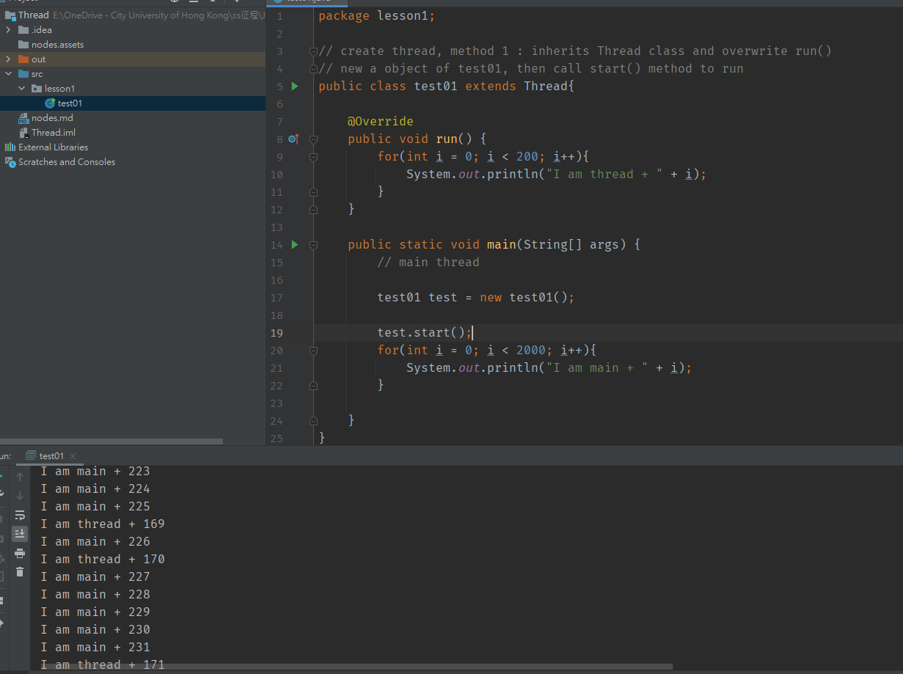
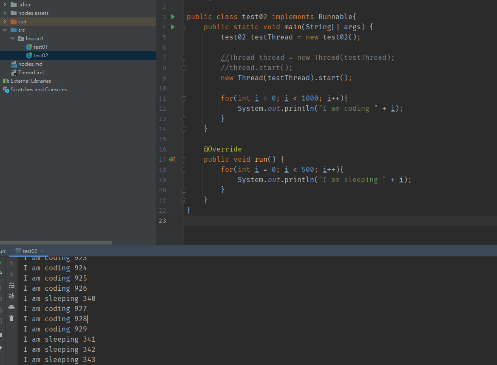
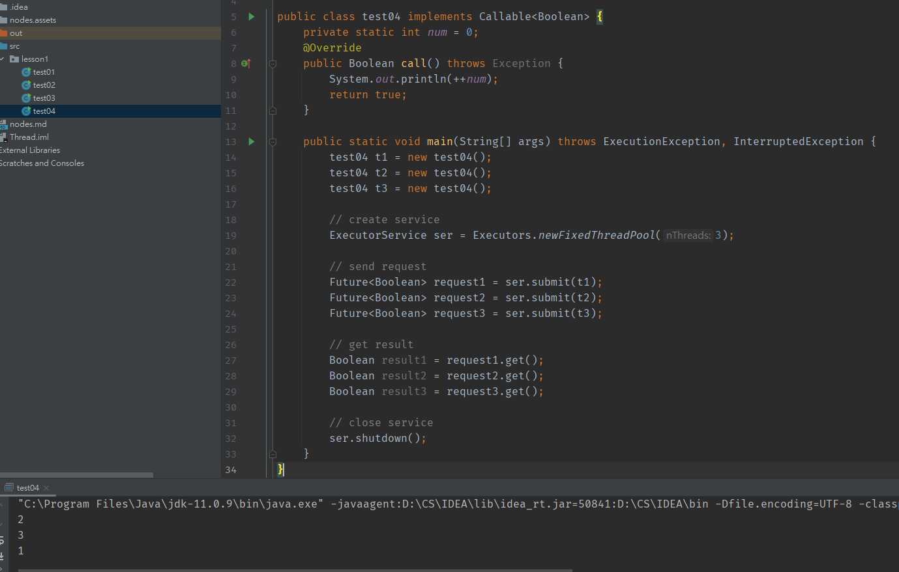

# 1. 初識thread

## 1.1 三種創建多線程的方式


> 1. Thread class				->繼承Thread 
> 2. Runnable                  ->Runnable interface
> 3. Callable                     ->Callable interface


# 2. 方法實現

## 2.1 Thread class

步驟有三：

​	**1. 自定義class, inherits Thread class**

​	**2. rewrite run() method**

​	**3. create the object, call start() method**




喺main同test01各有一個loop，如果唔用thread，照常行到17行果陣會搞掂run()入面嘅for loop先

但係宜家用左線程，咁呢兩個線程就會同步執行，**線程唔一定即刻執行，先後由CPU決定**，所以下面結果可能會交替出現

> 唔建議用呢個方法：避免OOP單繼承所帶嚟嘅局限性

## 2.2 Use unnable interface



第二個方法都係有三步：

1. **寫一個class implements Runnable interface**
2. **係main() new一個Thread，將一個Runnable interface傳入去做construction**
3. **call Thread.start()**

留意第九行係第7-8嘅縮寫

> 建議使用：呢個做法可避免單繼承，方便同一個object被多個thread 調用

## 2.3 Use Callable interface

第三個方法有七步：

1. 實現Callable interface，需要return type
2. rewrite call()，需要throw exception
3. create object
4. 建立服務: ExecutorService ser = Executors.newFixedThreadPool();
5. 提交服務: Future<Boolean> result = ser.submit();
6. 獲取結果: boolean r1 = result1.get();
7. 關閉服務: ser.shutdownNow();



留意implements Callable<>要寫type，跟住下面call()，request同result都要用呢個type接收

要靠service嚟做申請同接收結果，去到最尾close翻個service


# 3. Lamda expression

點解我地要用？因為**好簡潔**

> 例子: new Thread (()->System.out.println("I am learning multithreading")).start();


學lamda前先要了解咩叫**Functional Interface**，佢嘅定義如下

**任何一個interface，如果得唯一一個abstract method，佢就係functional interface，例如：**

```java
public interface Runnable{
    public abstract void run();
}
```

就係我地之前用緊嘅Runnable! 

只要一步步將之前寫嘅class簡化，最尾就出到Lambda expression！

```java
package lesson1;

public class testLambda01 {
    // 3. static member class
    static class Like2 implements ILike{

        @Override
        public void lambda() {
            System.out.println("I like lambda2!!");
        }
    }


    public static void main(String[] args) {
        ILike like = new Like();
        like.lambda();

        like = new Like2();
        like.lambda();

        // 4. local inner class
        class Like3 implements ILike{

            @Override
            public void lambda() {
                System.out.println("I like lambda3!!");
            }
        }

        like = new Like3();
        like.lambda();

        // 5. anonymous inner class (必須藉助interface或者upper class)
        like = new ILike() {
            @Override
            public void lambda() {
                System.out.println("I like lambda4!!");
            }
        };
        like.lambda();

        // 6. 用lambda簡化
        // 由於前面已經知道like係ILike interface，所以可以主省略第五步嘅new ILike()同一堆call function嘅野
        like = () -> System.out.println("I like lambda5!!");
        like.lambda();
    }


}

// 1. create functional interface
interface ILike{
    void lambda();
}
// 2. class implements functional interface
class Like implements ILike{

    @Override
    public void lambda() {
        System.out.println("I like lambda!!");
    }
}
```

第一步當然係create個interface先

最初學嘅話，如果要create個Like object，我地會做第二步嘅寫法，implements ILike interface，再去整

跟住又學到第二步同第三步，用static member class / local inner class進一步簡化program

最近學到anoymous inner class，連class都唔洗寫，借助ILike interface寫就得

> 上面嘅步驟其實就係一步一步簡化嘅過程

**再簡化就會出到第六步嘅寫法，我地連new，override，function name呢啲都唔寫**

**因為成個interface得一個function，所以complier會知call邊個**

```java
package lesson1;

public class testLambda02 {

    public static void main(String[] args) {

        //ILove love = (int a) -> System.out.println("i love u " + a);
        //ILove love = (a) -> System.out.println("i love u " + a); //唔要return type
        ILove love = a -> System.out.println("i love u " + a); //連括號都唔要
        
        love.love(3000);


    }
}

interface ILove{
    void love(int a);
}
```

第二個例子，終極簡化版，lambda expression入面arguments嘅括號都唔要！


# 4 Thread底層原理及例子

Thread底層做緊一個類似**靜態代理商**嘅嘢

代理商要代理真實嘅角色，代理商object同真實object都要implement同一個interface，例如

```java
package lesson1;

public class test05 {
    public static void main(String[] args) {
        // 4. 開始run
        // you.HappyMarry(); 原本寫法係自己嘅function自己call
        // 但係宜家用代理，所以寫呢行，而係new一個true object送去代理商
        
        You you = new You();
        // 送you呢個object入去後，再用中介嘅HappyMarry() call
        // 跟住就照常new一個代理商，然後call佢嘅method
        // 由於代理商有代理true object，並且會call埋true object嘅method
        // 所以會call曬所有HappyMarry()
        // WeddingCompany weddingCompany = new WeddingCompany(you);
        // weddingCompany.HappyMarry();

        // 再進一步簡化，用lambda expression
        // 留意本身係new Thread(sd一個Runnable interface).start();
        new Thread(()-> System.out.println("I am lambda expression")).start();
        new WeddingCompany(new You()).HappyMarry(); //呢一行係第8,9嘅簡化版
    }
}
// 1. 第一步create interface
interface Marry{
    void HappyMarry();
}
// 2. 第二步整真實人物嘅class
class You implements Marry{

    @Override
    public void HappyMarry() {
        System.out.println("I am so happy to marry u~");
    }
}
// 3. 第三步整代理商嘅class
class WeddingCompany implements Marry{
    private Marry target; //留意，代理商入面有pointer指向真實人物

    public WeddingCompany(Marry target){
        this.target = target;
    }

    private void before(){
        System.out.println("Before marry~~Prepare the wedding");
    }

    private void after(){
        System.out.println("After the wedding~~Get the money");
    }

    @Override
    public void HappyMarry() { //實現代理商自己嘅method，並且由佢做中介call埋target嘅method
        before();
        target.HappyMarry();
        after();
    }
}
```


