# 1. 初識thread

## 1.1 三種創建多線程的方式


> 1. Thread class				->繼承Thread 
> 2. Runnable                  ->Runnable interface
> 3. Callable                     ->Callable interface


# 2. 方法實現

## 2.1 Thread class

步驟有三：

​	**1. 自定義class, inherits Thread class**

​	**2. rewrite run() method**

​	**3. create the object, call start() method**


喺main同test01各有一個loop，如果唔用thread，照常行到17行果陣會搞掂run()入面嘅for loop先

但係宜家用左線程，咁呢兩個線程就會同步執行，**線程唔一定即刻執行，先後由CPU決定**，所以下面結果可能會交替出現

> 唔建議用呢個方法：避免OOP單繼承所帶嚟嘅局限性

## 2.2 Use unnable interface


第二個方法都係有三步：

1. **寫一個class implements Runnable interface**
2. **係main() new一個Thread，將一個Runnable interface傳入去做construction**
3. **call Thread.start()**

留意第九行係第7-8嘅縮寫

> 建議使用：呢個做法可避免單繼承，方便同一個object被多個thread 調用

## 2.3 Use Callable interface

第三個方法有七步：

1. 實現Callable interface，需要return type
2. rewrite call()，需要throw exception
3. create object
4. 建立線程池: ExecutorService ser = Executors.newFixedThreadPool();
5. 提交: Future<Boolean> result = ser.submit();
6. 獲取結果: boolean r1 = result1.get();
7. 關閉: ser.shutdownNow();


留意implements Callable<>要寫type，跟住下面call()，request同result都要用呢個type接收

要靠service嚟做申請同接收結果，去到最尾close翻個service


# 3. Lamda expression

點解我地要用？因為**好簡潔**

> 例子: new Thread (()->System.out.println("I am learning multithreading")).start();


學lamda前先要了解咩叫**Functional Interface**，佢嘅定義如下

**任何一個interface，如果得唯一一個abstract method，佢就係functional interface，例如：**

```java
public interface Runnable{
    public abstract void run();
}
```

就係我地之前用緊嘅Runnable! 

只要一步步將之前寫嘅class簡化，最尾就出到Lambda expression！

```java
package lesson1;

public class testLambda01 {
    // 3. static member class
    static class Like2 implements ILike{

        @Override
        public void lambda() {
            System.out.println("I like lambda2!!");
        }
    }


    public static void main(String[] args) {
        ILike like = new Like();
        like.lambda();

        like = new Like2();
        like.lambda();

        // 4. local inner class
        class Like3 implements ILike{

            @Override
            public void lambda() {
                System.out.println("I like lambda3!!");
            }
        }

        like = new Like3();
        like.lambda();

        // 5. anonymous inner class (必須藉助interface或者upper class)
        like = new ILike() {
            @Override
            public void lambda() {
                System.out.println("I like lambda4!!");
            }
        };
        like.lambda();

        // 6. 用lambda簡化
        // 由於前面已經知道like係ILike interface，所以可以主省略第五步嘅new ILike()同一堆call function嘅野
        like = () -> System.out.println("I like lambda5!!");
        like.lambda();
    }


}

// 1. create functional interface
interface ILike{
    void lambda();
}
// 2. class implements functional interface
class Like implements ILike{

    @Override
    public void lambda() {
        System.out.println("I like lambda!!");
    }
}
```

第一步當然係create個interface先

最初學嘅話，如果要create個Like object，我地會做第二步嘅寫法，implements ILike interface，再去整

跟住又學到第二步同第三步，用static member class / local inner class進一步簡化program

最近學到anoymous inner class，連class都唔洗寫，借助ILike interface寫就得

> 上面嘅步驟其實就係一步一步簡化嘅過程

**再簡化就會出到第六步嘅寫法，我地連new，override，function name呢啲都唔寫**

**因為成個interface得一個function，所以complier會知call邊個**

```java
package lesson1;

public class testLambda02 {

    public static void main(String[] args) {

        //ILove love = (int a) -> System.out.println("i love u " + a);
        //ILove love = (a) -> System.out.println("i love u " + a); //唔要return type
        ILove love = a -> System.out.println("i love u " + a); //連括號都唔要
        
        love.love(3000);


    }
}

interface ILove{
    void love(int a);
}
```

第二個例子，終極簡化版，lambda expression入面arguments嘅括號都唔要！


# 4. Thread底層原理及例子

Thread底層做緊一個類似**靜態代理商**嘅嘢

代理商要代理真實嘅角色，代理商object同真實object都要implement同一個interface，例如

```java
package lesson1;

public class test05 {
    public static void main(String[] args) {
        // 4. 開始run
        // you.HappyMarry(); 原本寫法係自己嘅function自己call
        // 但係宜家用代理，所以寫呢行，而係new一個true object送去代理商
        
        You you = new You();
        // 送you呢個object入去後，再用中介嘅HappyMarry() call
        // 跟住就照常new一個代理商，然後call佢嘅method
        // 由於代理商有代理true object，並且會call埋true object嘅method
        // 所以會call曬所有HappyMarry()
        // WeddingCompany weddingCompany = new WeddingCompany(you);
        // weddingCompany.HappyMarry();

        // 再進一步簡化，用lambda expression
        // 留意本身係new Thread(sd一個Runnable interface).start();
        new Thread(()-> System.out.println("I am lambda expression")).start();
        new WeddingCompany(new You()).HappyMarry(); //呢一行係第8,9嘅簡化版
    }
}
// 1. 第一步create interface
interface Marry{
    void HappyMarry();
}
// 2. 第二步整真實人物嘅class
class You implements Marry{

    @Override
    public void HappyMarry() {
        System.out.println("I am so happy to marry u~");
    }
}
// 3. 第三步整代理商嘅class
class WeddingCompany implements Marry{
    private Marry target; //留意，代理商入面有pointer指向真實人物

    public WeddingCompany(Marry target){
        this.target = target;
    }

    private void before(){
        System.out.println("Before marry~~Prepare the wedding");
    }

    private void after(){
        System.out.println("After the wedding~~Get the money");
    }

    @Override
    public void HappyMarry() { //實現代理商自己嘅method，並且由佢做中介call埋target嘅method
        before();
        target.HappyMarry();
        after();
    }
}
```


# 5. Thread的五大states


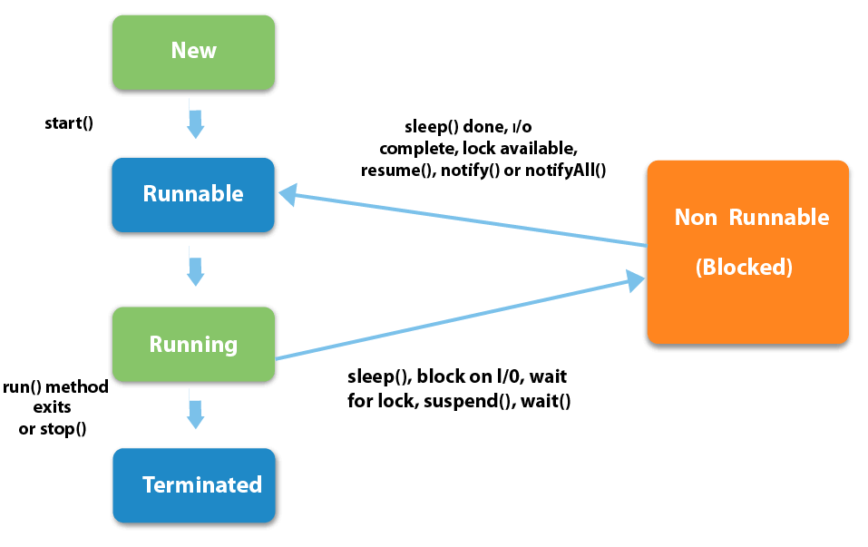

> 一個thread從出生到死亡一共經歷5個狀態，分別係
>
> new->runnable->running->terminated，而waiting嘅話係穿插係runnable同running中間

### 1) New

The thread is in new state if you create an instance of Thread class but before the invocation of start() method.

```java
Thread t = new Thread();
```

執行上述code就會進入到new呢個state

### 2) Runnable

The thread is in runnable state after invocation of start() method, but the thread scheduler has not selected it to be the running thread.

```java
t.start();
```

執行start()就會進入Runnable state，之後等CPU執行(**未必即刻開始**)

### 3) Running

The thread is in running state if the thread scheduler has selected it.

開始運行

### 4) Non-Runnable (Blocked)

This is the state when the thread is still alive, but is currently not eligible to run. 

例如俾人sleep()左，wait，或者同步鎖定果陣就係呢個state，block解除之後，重新進入Running狀態

### 5) Terminated

A thread is in terminated or dead state when its run() method exits.

Thread死亡或者行完


# 6. Thread的常用method

| Method                       | Explaination                                        |
| ---------------------------- | --------------------------------------------------- |
| stop()                       | 要自己寫，唔用Thread原本提供果個                    |
| setPriority(int newPriority) | 更改Thread嘅priority                                |
| static void sleep(long x)    | 指定一個thread，要佢係x毫秒內訓覺                   |
| void join()                  | 類似俾一個thread打尖行先                            |
| static void yield()          | 暫停宜家執行緊嘅thread object，並開始執行其他thread |
| void interrupt()             | 中斷thread，**不推薦使用**                          |
| boolean isAlive()            | 測試thread係咪work緊                                |


## 6.1 stop()

```java
package lesson2method;

public class stopMethod implements Runnable{
    private boolean flag = true;

    @Override
    public void run() {
        int i = 0;
        while(flag){
            System.out.println("I am thread " + i++);
        }
    }

    public void stop(){
        flag = false;
    }

    public static void main(String[] args) {
        stopMethod testThread = new stopMethod();
        new Thread(testThread).start();

        for (int i = 0; i < 1000; i++) {
            if(i == 900){
                testThread.stop();
                System.out.println("The thread is stop!");
            }
            System.out.println("I am main " + i);
        }
    }
}
```

stop()要自己寫，做法係係class內部起一個flag，並且提供對外接口去改個flag，當flag == false果陣thread就會stop

呢個例子係main嘅for loop行到900就stop佢

## 6.2 sleep()

```java
package lesson2method;

public class sleepMethod{
    private static int sec = 10;

    public static void main(String[] args) throws InterruptedException {
        sleepMethod.countDown();
    }

    public static void countDown() throws InterruptedException {
        while(sec >= 0) {
            Thread.sleep(1000);
            System.out.println(sec--);
        }
    }
}
```

呢度係用sleep模擬一個10秒嘅countdown，用static純粹係因為唔想new object.....

countDown()入面，whileloop每行一次都要佢訓1秒先

> sleep()指定當前線程阻塞嘅秒數(in ms)
>
> 需要throws InterruptedException
>
> 每次sleep()完之後係翻翻去Runnable state，等CPU調用
>
> sleep()通常用作倒計時，模擬delay等等
>
> **每個object都有一個lock，sleep()係唔會release個lock**

## 6.3 yeild()

```java
package lesson2method;

public class yeildMethod {
    public static void main(String[] args) {
        myYield yeildTest = new myYield();

        new Thread(yeildTest, "A").start();
        new Thread(yeildTest,"B").start();
    }
}

class myYield implements Runnable{

    @Override
    public void run() {
        System.out.println(Thread.currentThread().getName() + " start working");
        Thread.yield();
        System.out.println(Thread.currentThread().getName() + " finish!");

    }
}
```

yield()嘅作用係禮讓。例如A行緊果陣，如果佢yield()，就會從Running state退出黎去翻Runnable state，俾個機會B同佢重新爭過

**未必會禮讓成功，因為A退到Runnable state之後，都係由CPU揀邊個行先，所以it depends on CPU**

**上面個例子唔係好準確地表達到呢個意思，但係都照用住先**


## 6.4 join()

> join()嘅作用係打尖，不推薦使用，否則會組成線程阻塞

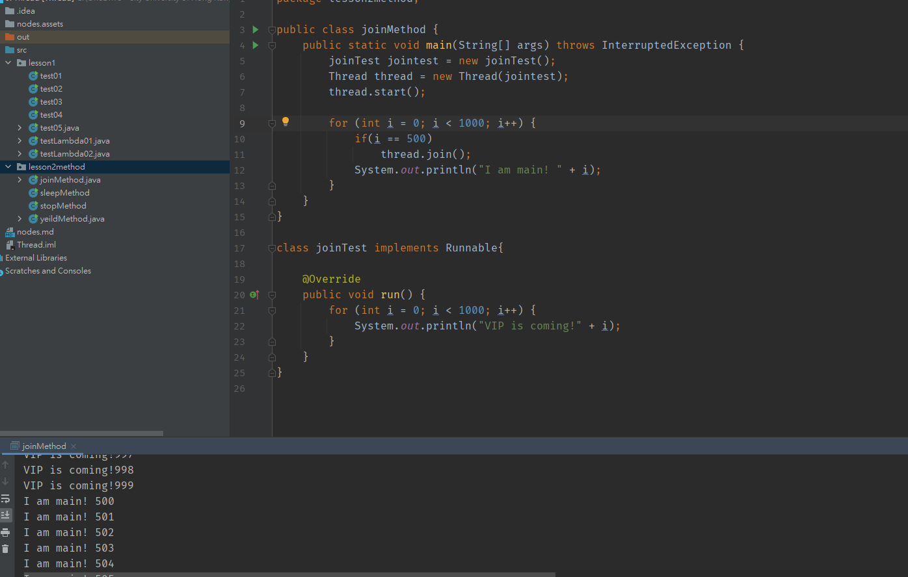

2個線程，一個main一個thread，當main for loop行到500果陣，用thread.join()俾thread打尖，係呢個時候thread會繼續執行run()，直到執行完畢，所以佢嘅foor loop會行到1000之後先到main行


## 6.5 state()

> state()嘅作用係查詢線程狀態，有以下幾個狀態

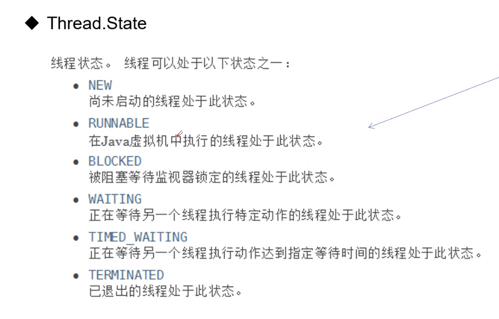

```java
package lesson2method;

public class statusMethod {
    public static void main(String[] args) throws InterruptedException {
        Thread thread = new Thread(()->{
            for (int i = 0; i < 5; i++) {
                try {
                    Thread.sleep(1000);
                } catch (InterruptedException e) {
                    e.printStackTrace();
                }
            }
            System.out.println("Finish!!!!!!!!");
        });

        Thread.State state = thread.getState();
        System.out.println(state); // should be new

        thread.start(); // start the thread
        state = thread.getState();
        System.out.println(state); // should be runnable

        while(state != Thread.State.TERMINATED){
            Thread.sleep(500);
            state = thread.getState();
            System.out.println(state);
        }
    }
}
```

```
NEW
NEW
TIMED_WAITING
TIMED_WAITING
TIMED_WAITING
TIMED_WAITING
TIMED_WAITING
TIMED_WAITING
TIMED_WAITING
TIMED_WAITING
TIMED_WAITING
Finish!!!!
TERMINATED

Process finished with exit code 0
```

**留意要create 一個state object去裝thread.getState()，佢嘅type 係 Thread.State**

**呢個例子用lambda做**


## 6.6 setPriority()

> Thread嘅priority係 1 - 10； 1最低，10最高

```java
package lesson2method;

public class priorityMethod {
    public static void main(String[] args) {
        // main's default priority
        System.out.println(Thread.currentThread().getName() + "\t\t"+Thread.currentThread().getPriority());

        test t = new test();
        Thread thread1 = new Thread(t);
        Thread thread2 = new Thread(t);
        Thread thread3 = new Thread(t);
        Thread thread4 = new Thread(t);

        thread1.setPriority(7);
        thread1.start();
        thread2.setPriority(5);
        thread2.start();
        thread3.setPriority(9);
        thread3.start();
        thread4.setPriority(1);
        thread4.start();

    }
}

class test implements Runnable{
    @Override
    public void run() {
        System.out.println(Thread.currentThread().getName() + "\t"+Thread.currentThread().getPriority());
    }
}
```

創建4個線程，再加主線程有5個線程，分別output佢地嘅priority，output結果如下

```main		5
main		5
Thread-0	7
Thread-1	5
Thread-3	1
Thread-2	9
```

> main thread default priority  = **5**
>
> **點解priority = 9 嘅 thread3最尾先output？？**
>
> -> 雖然set曬priority，都係要睇CPU執行邊個先，priority並不代表全部，只能夠代表priority高嘅有較大幾率先	 執行


## 6.7 setDaemon()

> Daemon thread係守護線程	佢嘅作用係幫助user-level thread執行
>
> **當user-level thread執行完畢後 daemon thread先會關閉**
>
> **留意Virtual machine會確保user-level thread執行完畢先關閉，但係唔會確保daemon thread執行完畢**
>
> daemon thread例子：後台自動記錄dialog，garbage collection等等

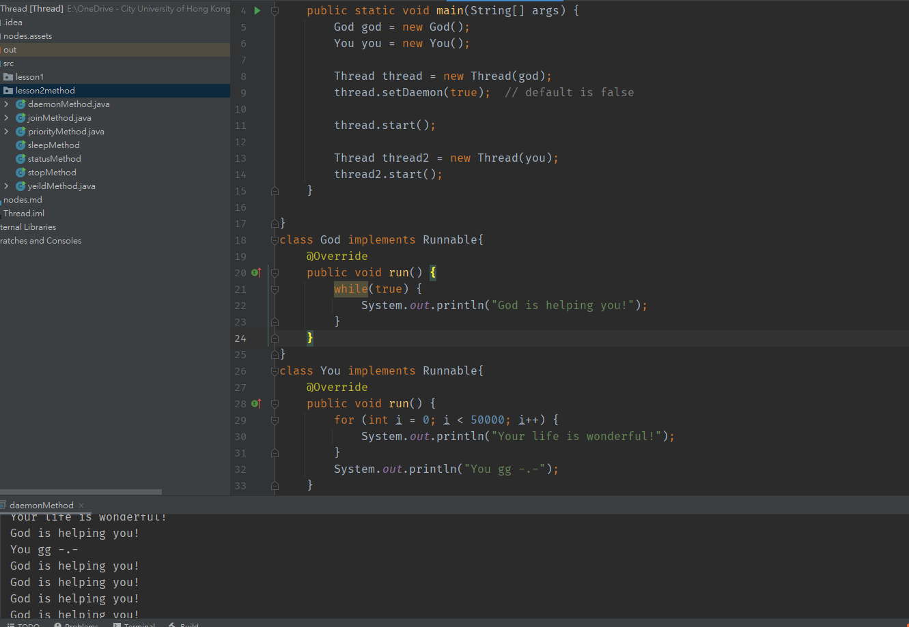

上面例子god係守護線程，you係用戶線程，god一直守護住you，直到you行左5000次之後gg左，god依然繼續，直到program close


# 7. 線程同步

## 7.1 簡介

> 如果一個object被多個thread調用，會導致唔同步嘅問題
>
> 例如個object有100張飛，宜家有2個人(thread)去搶飛
>
> 一開始有100張，2個人同時搶，佢地一個要70張，另外果個要40張
>
> 咁唔通最尾飛嘅數量會變做 -10 張？
>
> ->明顯地係無可能

**咁我地點解決呢個問題呢？就係用線程同步(thread synchronization)**

>線程同步其實就係一種等待嘅機制，由**排隊+鎖**所組成
>
>例如，宜家又係果2個人買飛，但係宜家唔俾佢地同時搶，而係要佢地排隊
>
>咁就可以解決到**大部分**嘅同步問題
>
>點解係大部分呢？因為總會有人打尖，如果排第二果個人想打尖，排第一嘅人係無佢辦法
>
>解決方法就係**加鎖**
>
>let say買飛個counter係有個防爆門，每個人買飛都要入去，跟住鎖住度門，等佢出嚟之後再到下一個入去
>
>咁就可以解決到呢個問題

但係線程同步都有壞處


## 7.2 例子

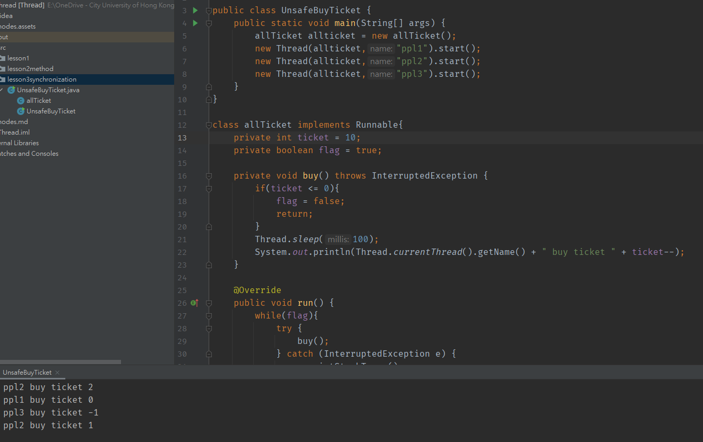

呢個program模擬翻買飛嘅情況，宜家有10張飛，3個人買，唔同步嘅話就可能出現 buy ticket -1嘅情況


## 7.3 同步 synchornized method

> synchornized係一個隱式同步鎖，分為syn method同syn object
>
> 只需要係method度加個synchronized 就可以
>
> synchronized method係鎖住this 呢個object，換言之邊個call 果個method鎖邊個

```java
package lesson3synchronization;

public class UnsafeBuyTicket {
    public static void main(String[] args) {
        allTicket allticket = new allTicket();
        new Thread(allticket,"ppl1").start();
        new Thread(allticket,"ppl2").start();
        new Thread(allticket,"ppl3").start();
    }
}

class allTicket implements Runnable{
    private int ticket = 10;
    private boolean flag = true;

    private synchronized void buy() throws InterruptedException {
        if(ticket <= 0){
            flag = false;
            return;
        }
        Thread.sleep(100);
        System.out.println(Thread.currentThread().getName() + " buy ticket " + ticket--);
    }

    @Override
    public void run() {
        while(flag){
            try {
                buy();
            } catch (InterruptedException e) {
                e.printStackTrace();
            }
        }
    }
}
```

用翻上面買飛嘅例子，係buy()呢個method度加左synchronized，並且開始run，結果如下

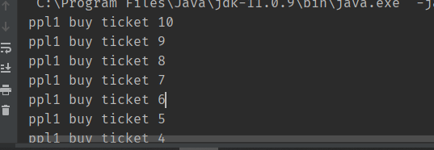

全部都係ppl1買？點解呢？

**留意sleep()**係放左係synchronized buy()度，記唔記得**之前講過sleep()係唔會釋放鎖？**，所以pp1仍然俾人鎖住，所以pp1唯有不斷係run()入面call buy()，直接買曬所有飛

> 解決辦法：將Thread.sleep(100)放係run() method入面
>
> 例如呢個例子可以放係第29行，buy()嘅位置，將buy()移後
>
> **咁嘅話就可以阻塞買到飛嘅thread，俾機會其他thread**

> 留意呢個synchronized究竟鎖邊個object，由於個method係allTicket呢個class入面，所以係syn緊
>
> 第五行嘅        allTicket allticket = new allTicket();     allticket object
>
> **->鎖住啲飛**

## 7.4 同步 synchronized object

```java
package lesson3synchronization;

public class UnsafeBank {
    public static void main(String[] args) {
        Account acc = new Account(100, "pocket money");

        Drawing you = new Drawing(acc, 50,"You");
        Drawing otherPpl = new Drawing(acc, 100,"Other ppl");
        you.start();
        otherPpl.start();
    }
}

class Account{
    public int money;
    public String name;

    public Account(int money, String name) {
        this.money = money;
        this.name = name;
    }
}

class Drawing extends Thread{
    Account account;
    int drawingMoney;
    int yourMoney;

    public Drawing(Account account, int drawingMoney, String name){
        super(name);
        this.account = account;
        this.drawingMoney = drawingMoney;
    }

    @Override
    public void run(){
        if(account.money - drawingMoney < 0){
            System.out.println("Your account's money is not enough!");
            return;
        }

        try {
            Thread.sleep(1000);
        } catch (InterruptedException e) {
            e.printStackTrace();
        }

        account.money -= drawingMoney;
        yourMoney += drawingMoney;
        System.out.println(account.name + " has " + account.money);
        System.out.println(this.getName() + " has " + yourMoney);
    }
}
```

用第二個例子，有一個共用嘅account，入面有100蚊

有2個人同時攞錢，如果無加同步下，一個攞50一個攞100係可以，最尾account就變做 -50

**宜家係第36行run() method前面加個synchronized**

結果佢嘅output都係同無同步一樣，點解呢？

**因為鎖嘅係攞錢呢個動作嘅object (鎖緊第七八行嘅Drawing you同Drawing otherPpl)，而唔係鎖account**

解決方法：用synchronized object，用法如下

```java
package lesson3synchronization;

public class UnsafeBank {
    public static void main(String[] args) {
        Account acc = new Account(100, "pocket money");

        Drawing you = new Drawing(acc, 50,"You");
        Drawing otherPpl = new Drawing(acc, 100,"Other ppl");
        you.start();
        otherPpl.start();
    }
}

class Account{
    public int money;
    public String name;

    public Account(int money, String name) {
        this.money = money;
        this.name = name;
    }
}

class Drawing extends Thread{
    Account account;
    int drawingMoney;
    int yourMoney;

    public Drawing(Account account, int drawingMoney, String name){
        super(name);
        this.account = account;
        this.drawingMoney = drawingMoney;
    }

    @Override
    public void run(){
        synchronized (account){
            if(account.money - drawingMoney < 0){
                System.out.println("Your account's money is not enough!");
                return;
            }

            try {
                Thread.sleep(1000);
            } catch (InterruptedException e) {
                e.printStackTrace();
            }

            account.money -= drawingMoney;
            yourMoney += drawingMoney;
            System.out.println(account.name + " has " + account.money);
            System.out.println(this.getName() + " has " + yourMoney);
        }
    }
}
```

留意第run()入面，有個synchronized(account){}，呢一句就係對account呢個object上鎖

> **記住鎖係需要放係需要 增刪改 cru 嘅object上面**


# 8. 死鎖 deadlock

> 宜家有檯面上有一支唇膏同一塊鏡仔
>
> 有2個girls想化妝，佢地各自都需要唇膏同鏡
>
> 0 = 攞唇膏先，1 = 攞鏡先
>
> 當A lock 左唇膏， B lock左鏡
>
> 而佢地同時間想攞對方嘅嘢，就會形成死鎖 (邊個都唔肯放手先，導致program 崩潰，唔可以正常關閉)

形成死鎖嘅四大條件：

 1. **Mutual execulsion(互斥)**

    Only one process at a time can use a resource. (object係同一時間只能被調用一次)

	2. **Hold and wait(請求與保持)**

    Process holding at least one resource is waiting to acquire additional resources held by other processes

    (Process攞住自己啲嘢唔放，並且請求其他人嘅資源)

	3. **No preemption (不剝削)**

    Resources are released only voluntarily by the process holding the resource, after the process is finished with it

    Process已獲得嘅資源，喺未用完之前，唔可以強行剝削

	4. **Circular wait (循環等待)**

    There exists a set {P1 , …, Pn } of waiting processes. 

    P1 is waiting for a resource that is held by P2.

    P2 is waiting for a resource that is held by P3 … Pn is waiting for a resource that is held by P1

死鎖例子如下

```java
package lesson3synchronization;

public class deadlock {
    public static void main(String[] args) {
        Makeup girl1 = new Makeup(0,"girl1");
        Makeup girl2 = new Makeup(1,"girl2");

        girl1.start();
        girl2.start();
    }
}

class Lipstick{

}

class Mirror{

}

class Makeup extends Thread{
    // static，確保每種資源只有一個
    public static Lipstick lipstick = new Lipstick();
    public static Mirror mirror = new Mirror();

    public int choice; // 0 = 攞唇膏先， 1 = 攞鏡先
    public String girlname;

    public Makeup(int choice, String name) {
        this.choice = choice;
        this.girlname = name;
    }

    private void makeup() throws InterruptedException {
        if(choice == 0){
            synchronized (lipstick){
                System.out.println(this.girlname + " get lipstick");
                Thread.sleep(1000);
                synchronized (mirror){ // 不釋放lipstick直接鎖mirror
                    System.out.println(this.girlname + " get mirror");
                }
            }
        } else{
            synchronized (mirror) {
                System.out.println(this.girlname + " get mirror");
                Thread.sleep(2000);
                synchronized (lipstick) { // 不釋放mirror直接鎖lipstick
                    System.out.println(this.girlname + " get lipstick");
                }
            }
        }
    }

    @Override
    public void start() {
        try {
            makeup();
        } catch (InterruptedException e) {
            e.printStackTrace();
        }
    }
}
```

留意第35-48行

兩個人都係係持有自己嘅物品果陣想攞其他人嘅物品，陷入僵局，形成死鎖

只要解除上面4個形成死鎖條件嘅其中一個，就可以破除死鎖，例如

```java
class Makeup extends Thread{
    // static，確保每種資源只有一個
    public static Lipstick lipstick = new Lipstick();
    public static Mirror mirror = new Mirror();

    public int choice; // 0 = 攞唇膏先， 1 = 攞鏡先
    public String girlname;

    public Makeup(int choice, String name) {
        this.choice = choice;
        this.girlname = name;
    }

    private void makeup() throws InterruptedException {
        if(choice == 0){
            synchronized (lipstick){
                System.out.println(this.girlname + " get lipstick");
                Thread.sleep(1000);
                } // 釋放lipstick
                synchronized (mirror){ // 再鎖mirror
                System.out.println(this.girlname + " get mirror");
            }
        } else{
            synchronized (mirror) {
                System.out.println(this.girlname + " get mirror");
                Thread.sleep(2000);
            } // 釋放mirror
            	synchronized (lipstick) { // 再鎖lipstick
              	System.out.println(this.girlname + " get lipstick");
            }
        }
    }

    @Override
    public void start() {
        try {
            makeup();
        } catch (InterruptedException e) {
            e.printStackTrace();
        }
    }
}
```

留意第16-29行，只要先釋放已經無用嘅鎖，再請求其他Process嘅資源，就破除左stop and wait呢個條件


# 9. Lock鎖

> Lock鎖係一個顯式同步鎖，用嚟syn object
>
> 當中比較常用嘅喺ReentrantLock (可重入鎖)

```java
package lesson4lock;

import java.util.concurrent.locks.ReentrantLock;

public class locktest {
    public static void main(String[] args) {
        BuyTicket buyticket = new BuyTicket();
        new Thread(buyticket, "thread1").start();
        new Thread(buyticket, "thread2").start();
        new Thread(buyticket, "thread3").start();
    }
}

class BuyTicket implements Runnable {
    private int ticket = 10;

    private final ReentrantLock lock = new ReentrantLock();

    @Override
    public void run() {
        lock.lock();
        try {
            while (true) {
                if (ticket > 0) {
                    System.out.println(Thread.currentThread().getName() + " buy ticket " + ticket--);
                    try {
                        Thread.sleep(1000);
                    } catch (InterruptedException e) {
                        e.printStackTrace();
                    }
                } else {
                    break;
                }
            }
        } finally {
            lock.unlock();
        }
    }
}
```

BuyTicket入面定義左個reentrantlock，留意最好係private final寫法，防止被改

下面run()，首先call lock嘅lock() method，將BuyTicket object上鎖，跟住用try finally寫

try入面寫需要嘅嘢，而finally入面unlock翻個object


# 10. Producer-consumer problem

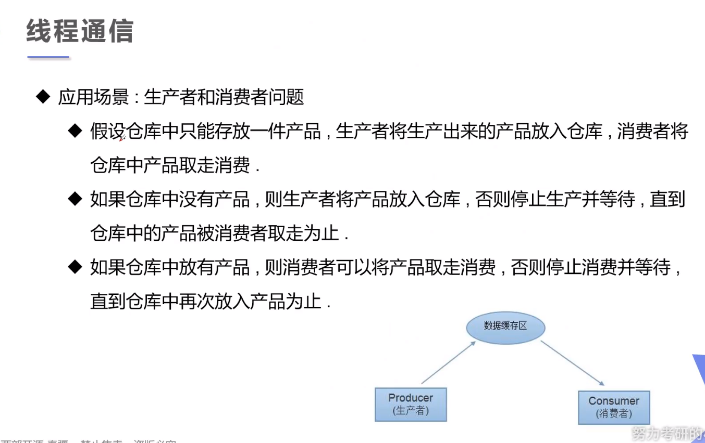


> 既然sysnchronized唔夠用，咁點呢？
>
> **-> 有幾個Object class嘅method可以用嚟做thread之間嘅通訊**

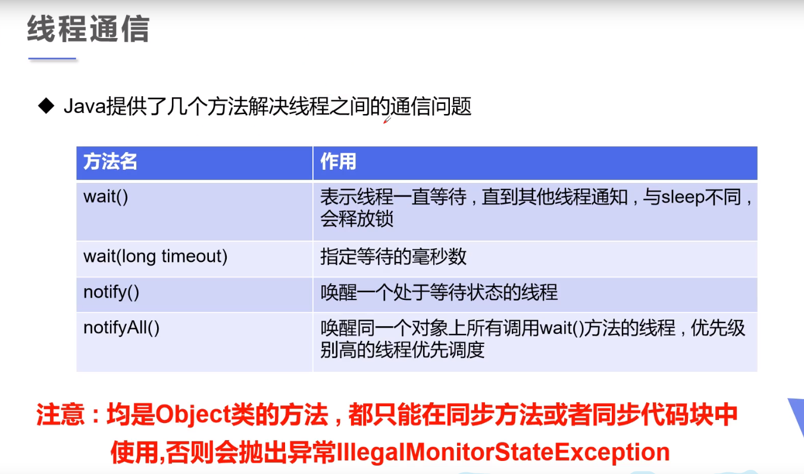

**留意wait()係會釋放鎖，而sleep()係抱住把鎖訓覺，唔會釋放鎖**


## 10.1 Monitors 管程法

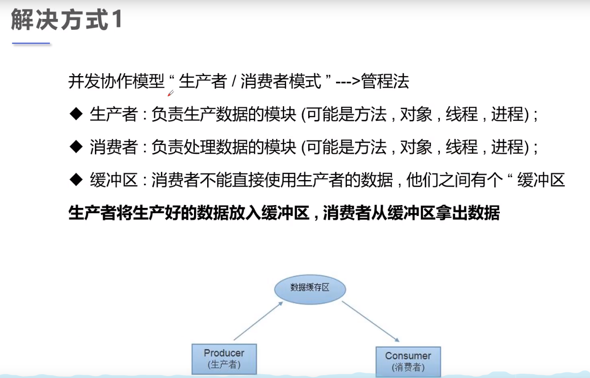

> 解決方式1: producer準備好嘅資源放係buffer，等consumer攞，例子如下

```java
package lesson4lock;

public class method1 {
    public static void main(String[] args) {
        SynContainer container = new SynContainer();

        new Producer(container).start();
        new Consumer(container).start();
    }
}

class Chicken{
    int id;
    public Chicken(int id){
        this.id = id;
    }
}

class Producer extends Thread{
    SynContainer container;
    public Producer(SynContainer container){
        this.container = container;
    }

    @Override
    public void run(){
        for (int i = 0; i < 100; i++) {
            container.push(new Chicken(i));
            System.out.println("整左第" + i + "隻雞");
        }
    }
}

class Consumer extends Thread{
    SynContainer container;
    public Consumer(SynContainer container){
        this.container = container;
    }

    @Override
    public void run(){
        for (int i = 0; i < 100; i++) {
            container.pop();
            System.out.println("買左第" + i + "隻雞");
        }
    }
}

class SynContainer{
    //容器大小 = 10
    private Chicken[] chickens = new Chicken[10];
    private int count = 0; // for chicken's index

    public synchronized void push(Chicken chicken){
        // 容器已滿，通知consumer，並且自己開始wait()
        while (count == chickens.length){
            try {
                this.wait();
            } catch (InterruptedException e) {
                e.printStackTrace();
            }
        }
        // 容器仲有位置，放入
        chickens[count++] = chicken;
        // 通知Consumer攞雞
        this.notifyAll();
    }

    public synchronized Chicken pop(){
        // 判斷可唔可以買，唔得就等
        while (count == 0){
            try {
                this.wait();
            } catch (InterruptedException e) {
                e.printStackTrace();
            }
        }
        // 可以買
        Chicken returnChicken = chickens[--count];
        // 已經買完一隻，有一個位空出嚟，通知Producer生產
        this.notifyAll();
        return returnChicken; // 帶走隻雞
    }
}
```

簡單而言就係生產者一直生產，直到container滿就wait()，有位就生產，跟住通知consumer

而consumer一直買，直到container 無雞就等，買完一隻就通知producer


## 10.2 Semaphores 信號燈法

>解決方式2: producer準備好嘅資源後，改變信號並通知consumer

```java
package lesson4lock;

public class method2 {
    public static void main(String[] args) {
        Show show = new Show();
        new Actor(show).start();
        new Audience(show).start();
    }
}

class Actor extends Thread{
    private Show show;
    public Actor(Show show){
        this.show = show;
    }

    @Override
    public void run(){
        for (int i = 0; i < 20; i++) {
            if(i%2 == 0){
                this.show.play("American show");
            } else if(i % 5 ==0){
                this.show.play("Another show 1");
            } else{
                this.show.play("Another show 2");
            }
        }
    }
}

class Audience extends Thread{
    private Show show;
    public Audience(Show show){
        this.show = show;
    }

    @Override
    public void run(){
        for (int i = 0; i < 20; i++) {
            this.show.watch();
        }
    }
}

class Show{
    String showName;
    boolean flag = true; // ture = 正在錄製， false = 已經錄好

    // show
    public synchronized void play(String showName){
        if(!flag){ //已經錄好，actor已經wait()，等觀眾睇
            try {
                this.wait();
            } catch (InterruptedException e) {
                e.printStackTrace();
            }
        }
        this.showName = showName;
        System.out.println("Actors: " + showName);
        this.flag = !this.flag; // 已經錄好節目，改變信號
        this.notifyAll(); // 通知觀眾睇
    }

    // watch
    public synchronized void watch(){
        if(flag){ //正在錄製，觀眾應該wait()，等actor錄
            try {
                this.wait();
            } catch (InterruptedException e) {
                e.printStackTrace();
            }
        }
        System.out.println("Audience watch " + showName);
        this.flag = !flag;
        this.notifyAll(); // 通知演員錄

    }
}
```

呢個例子係Acotr錄片俾audience睇，當flag = ture果陣，actor係應該要錄片，錄完之後就通知觀眾，並且改變信號

而Audience睇到信號 flag = false果陣，知道已經錄好，所以就嚟睇，並且睇完後更改信號 flag = true，通知actor


# 11. 線程池 thread pool

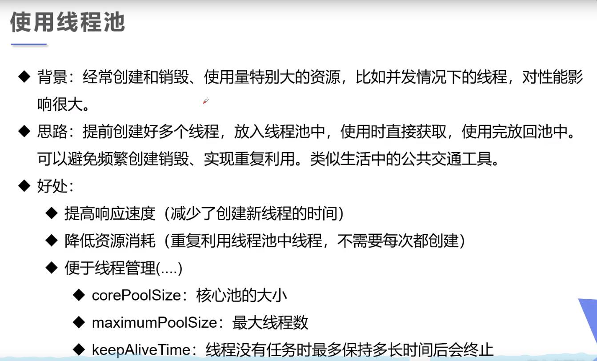

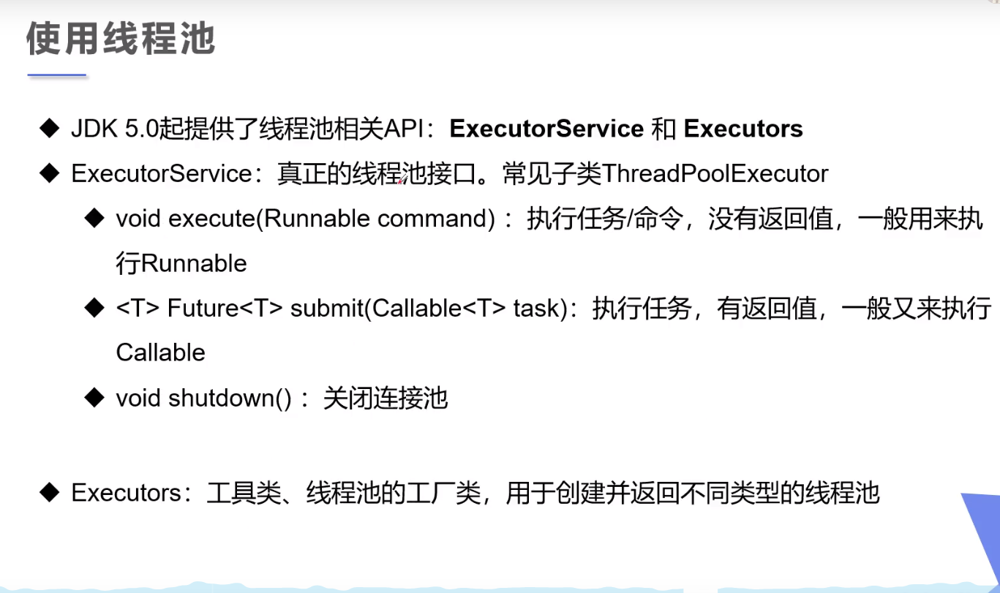

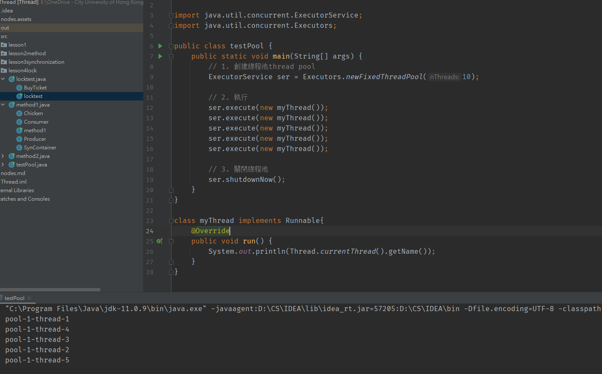