# 1. Annotation (註解) 簡介

## 1.1 作用

> Annotation唔係program本身，而係對program所作出嘅解釋(類似comment)
>
> **可以被其他program，例如complier讀取**

## 1.2 格式及例子

> Anootation 寫法: "@Annotation name"，
>
> 通常寫係package，class，method，field等等嘅上方，用以添加額外信息
>
> **例如 @Override，@SuppressWarning(value="unchecked") (用作表示抑制警告信息，亦可寫其他參數，例如"all"等，以抑制所有警告)，@Deprecated (用作表示不推介使用嘅function)**
>
> ->**可以通過reflection訪問呢啲 metadata (元數據)**


# 2. Meta annotation 元註解

**meta annotation係用嚟註解其他註解 = = **，當中有4個type

 

| Meta annotaion type | explaination                                                 |
| ------------------- | ------------------------------------------------------------ |
| @Target             | 被描述嘅annotation可以用喺咩地方，例如class，method等等      |
| @Retention          | 用咩級別保存註解信息，有3個級別 (SOURCE < CLASS < **RUNTIME**) |
| @Document           | 令annotation保存在javadoc中                                  |
| @Inherited          | 子類可繼承父類的annotation                                   |

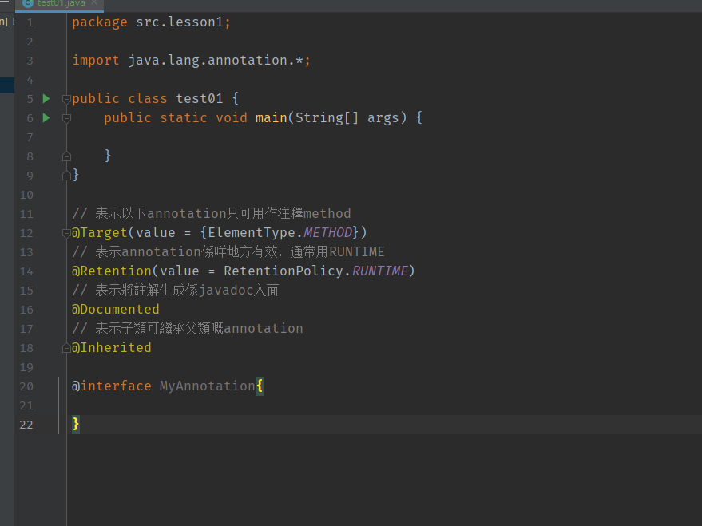


# 3. 註解內部寫法及作用

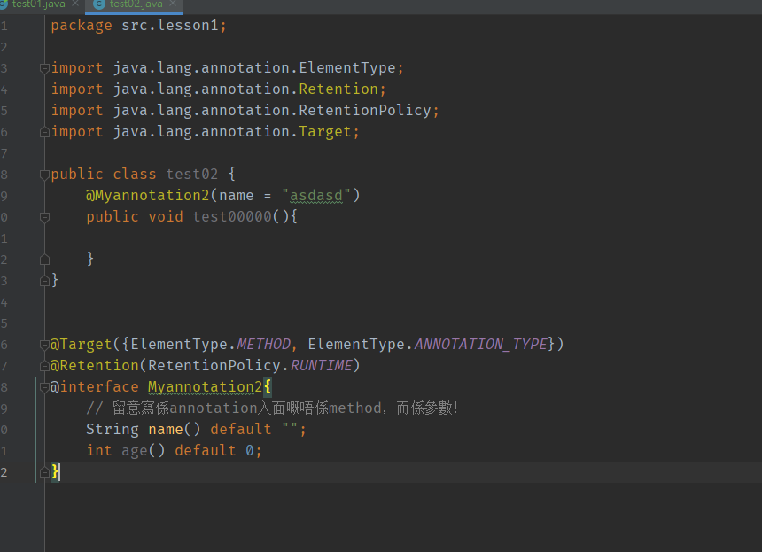

留意註解入面嘅係參數，佢嘅名就係參數嘅名，例如上面嘅例子，定義左一個String name()，所以佢嘅參數名就係name，default value可以set可以唔set

**如果得一個參數成員，一般用參數名為value**


# 4. 動態語言及靜態語言

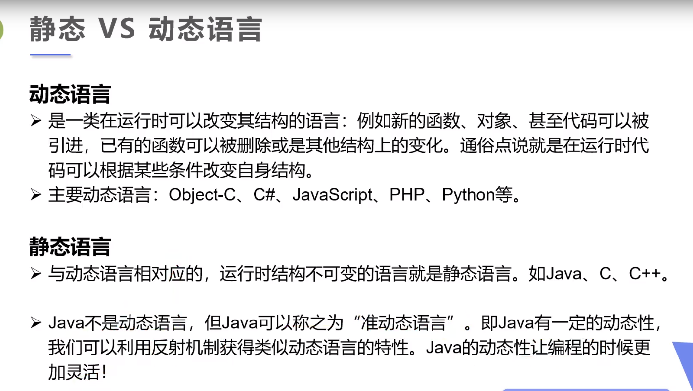

> **動態語言可以係運行期間改變結構，靜態語言唔可以**


# 5. Reflection (反射) 簡介

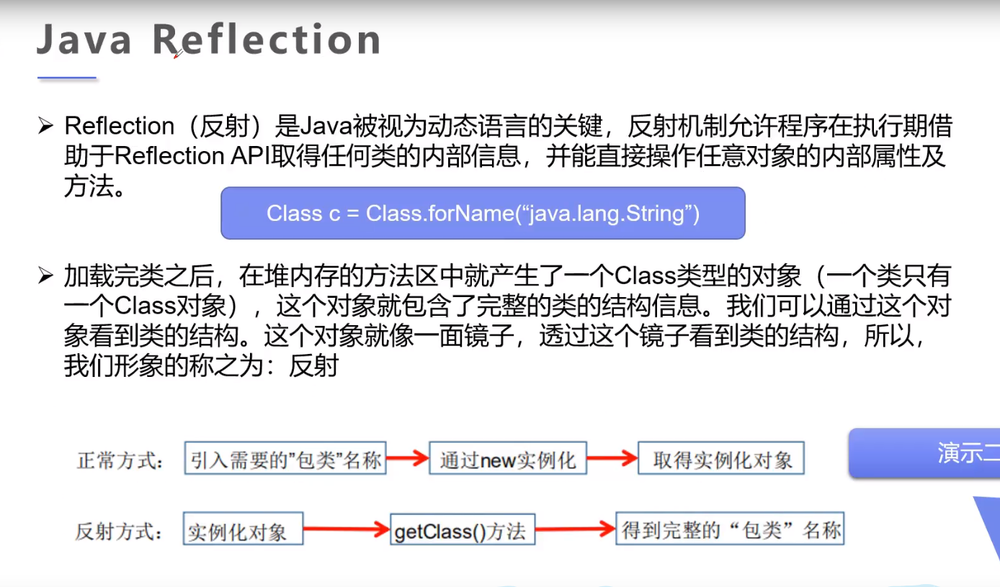

> 反射獲取Class object，而呢個object就好似一塊鏡，通過呢塊鏡可以睇到class入面所有嘢

> 優點：可以動態創建object，有靈活性
>
> 缺點：對性能有影響

## 5.1 反射為什麼比直接調用慢？

> 反射實際上係一種interpretative operation，我地講俾JVM聽需要佢做啲咩黎滿足我地嘅需要，而呢個動作往往慢於直接執行相同嘅operation
>
> 例子：JVM一開始咩資料都唔知，你話俾佢聽你要點點點果陣，例如要改field，佢要先查有無呢個field，點改，等等，所以會比較慢

## 5.2 Reflection 原理 - Class

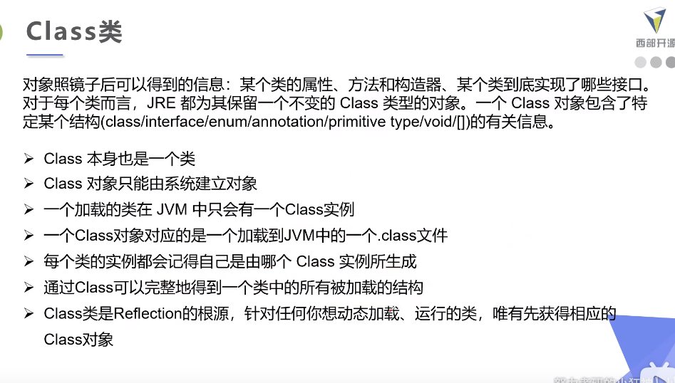

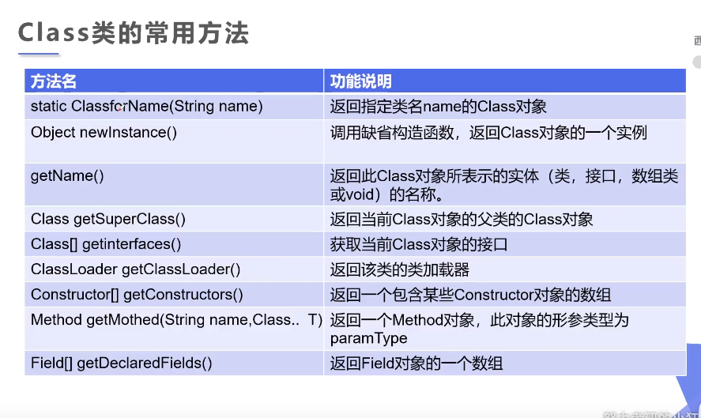

## 5.3 使用方法

> 第一步：獲得Class object
>
> 第二步：用Class object 創建一個 X object
>
> 第三步：用各種method獲取，更改X object入面嘅field

已知具體嘅class，可以用

```java
Class c1 = Person.class;
```

或者用path獲取，需要throws ClassNotFoundException

```java
Class c2 = Class.forName("src");
```

已知某個class嘅object，可以用

```java
Class c3 = person.getClass();
```

如果係primitive type，可以用

```java
Class c4 = Integer.TYPE;  //用TYPE獲取
```


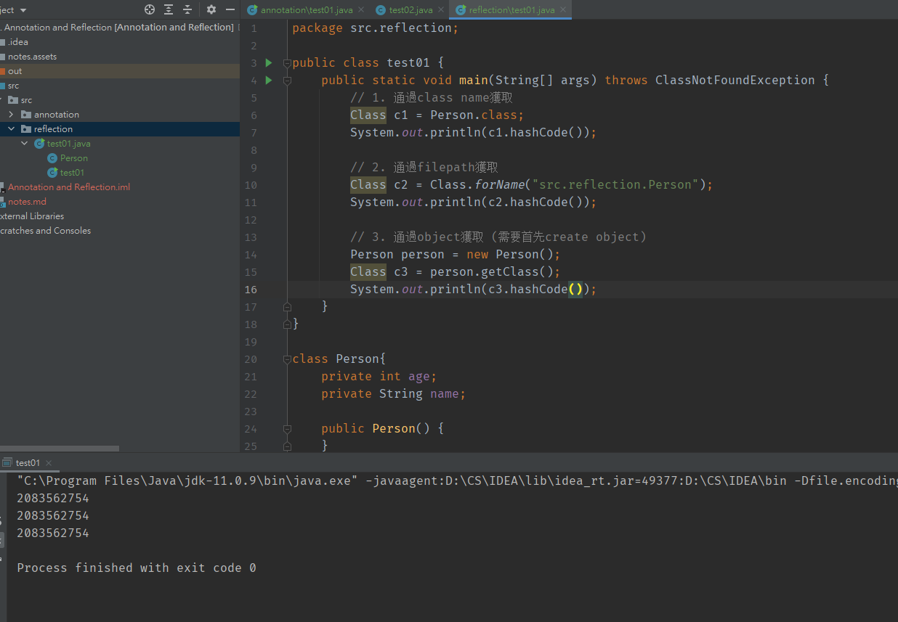

由於呢三個Class object嘅hashcode都係一樣，由此可見佢地3個係同一個Class object

**因為 5.1 講左JVM入面每個class只會有一個Class object**


# 6. class加載內存分析

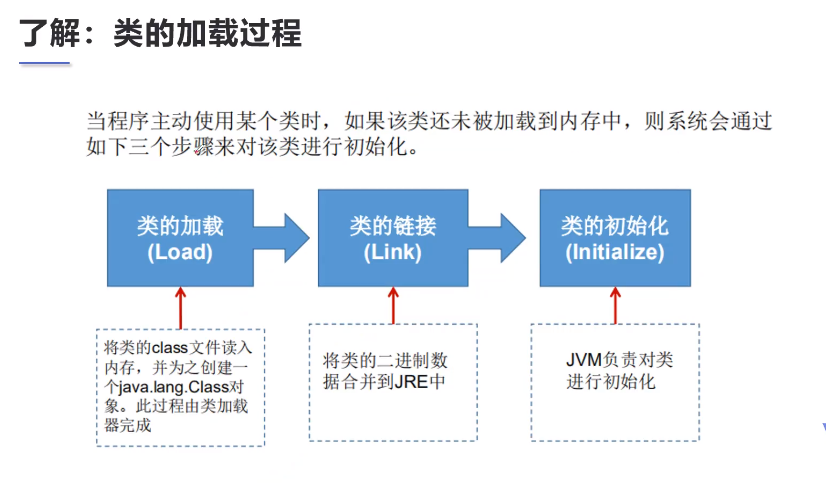

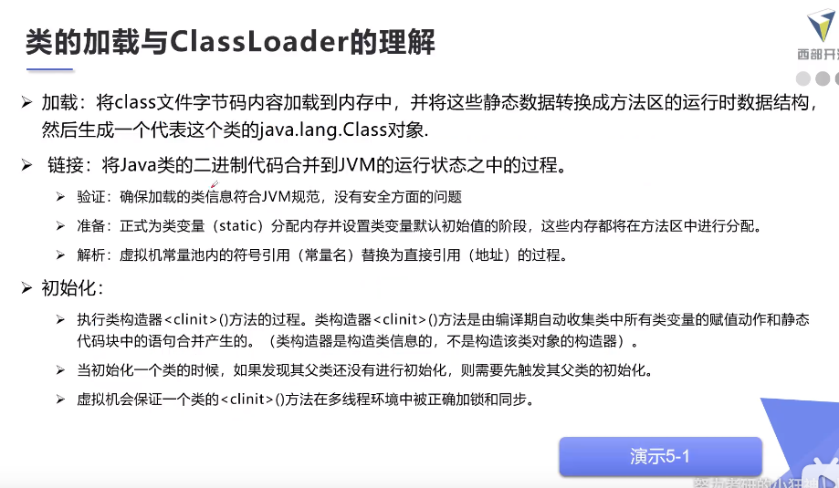

```
//暫時跳過
https://www.bilibili.com/video/BV1p4411P7V3?p=9
```

# 7. class initialization分析

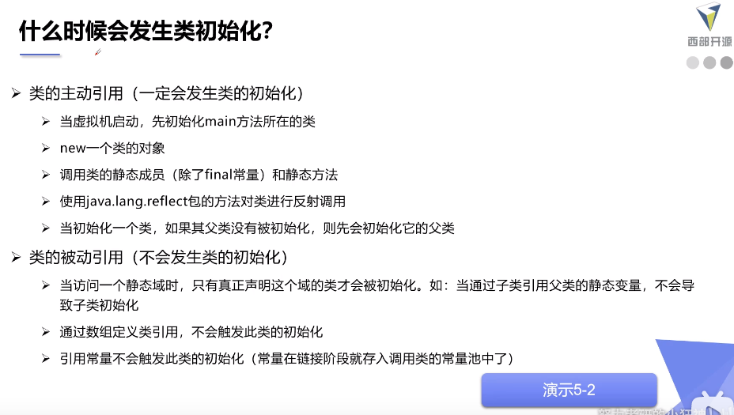

> main() 必定係最先initialize 
>
> 留意下面幾個被動引用：
>
> 1. 如果子類引用父類嘅static variable，只做父類，唔會initialize子類，因為個variable係屬於父類
> 2. create一個數組，例如People[] ppl = new People[10]; 唔會initialize Person，因為只係一個聲明
> 3. 引用class 入面嘅 final variable (常量)，因為link 階段已經搞掂


# 8. Classloader

## 8.1 作用

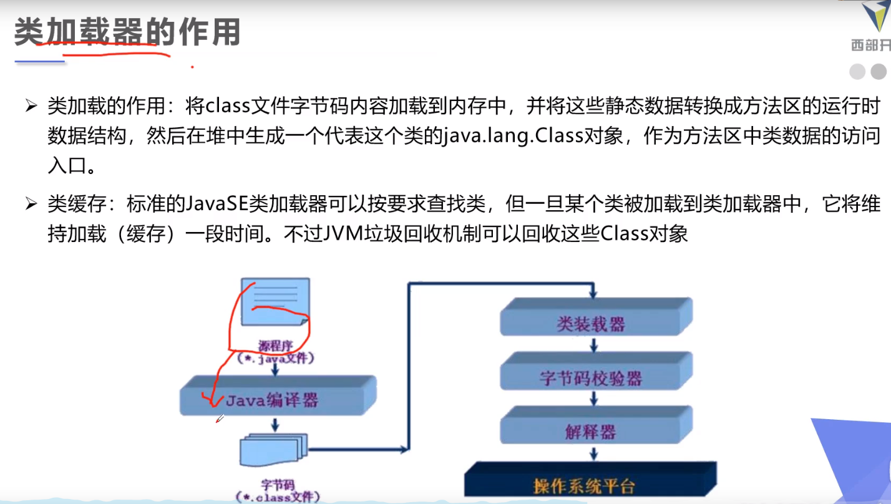

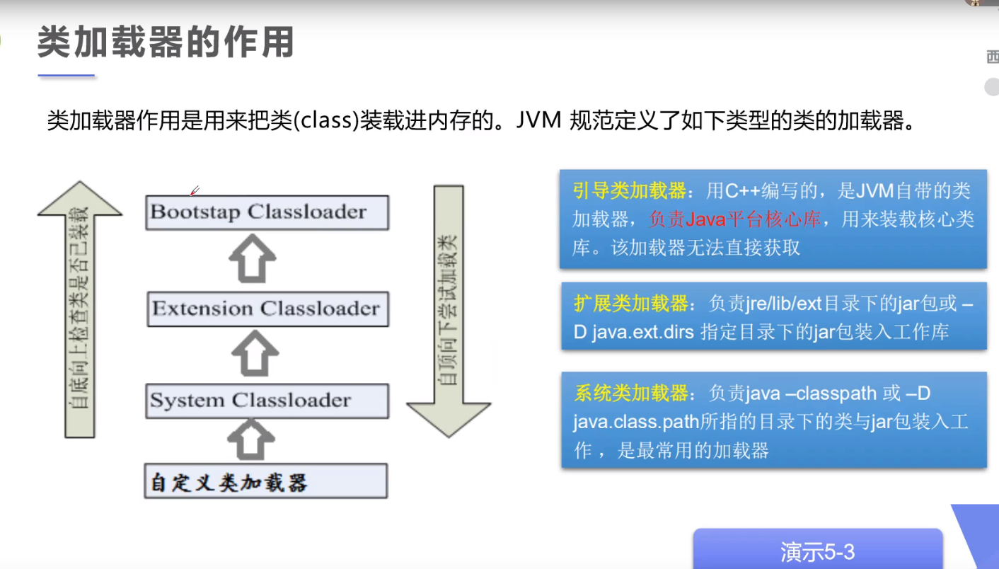

> System classloader -> extension classloader -> bootstap classloader (用c++寫嘅，獲取嘅話只會return null)

```java
// 獲取system classloader
ClassLoader loader1 = ClassLoader.getSystemClassLoader();
// 獲取system classloader 嘅父類loader  (extension class loader)
ClassLoader loader2 = loader1.getParent();
// 獲取bootstap Classloader
ClassLoader loader3 = loader2.getParent();
```


## 8.2 常用獲取class完整結構的method

```java
package src.reflection;

import java.lang.reflect.Constructor;
import java.lang.reflect.Field;
import java.lang.reflect.Method;

public class test02 {
    public static void main(String[] args) throws ClassNotFoundException, NoSuchFieldException, NoSuchMethodException {
        Class c1 = Class.forName("src.reflection.Person");

        // 獲取class name
        System.out.println(c1.getName());  // 獲取 packet name + class name
        System.out.println(c1.getSimpleName()); // 獲取 class name only

        // 獲取class variable
        Field[] fields = c1.getFields(); // 獲取public var only
        Field[] fields2 = c1.getDeclaredFields(); // 獲取所有var，包括private

        // 獲取指定var的值
        Field name = c1.getDeclaredField("name");

        // 獲取class method
        Method[] methods1 = c1.getMethods(); // 獲取自己及其父類的public method
        Method[] methods2 = c1.getDeclaredMethods(); // 獲取自己的所有method，包括private

        // 獲取指定嘅method
        // 第二個參數係果個method所需嘅參數嘅class，用作區分overload嘅method，null指果個method不需要參數
        Method getName = c1.getMethod("getName",null); //獲取getName method
        Method setName = c1.getMethod("setName", String.class); // 需要一個string作參數傳入setName method

        // 獲取constructor
        Constructor constructor1 = c1.getConstructor();


    }
}
```


# 9. Reflection常用method

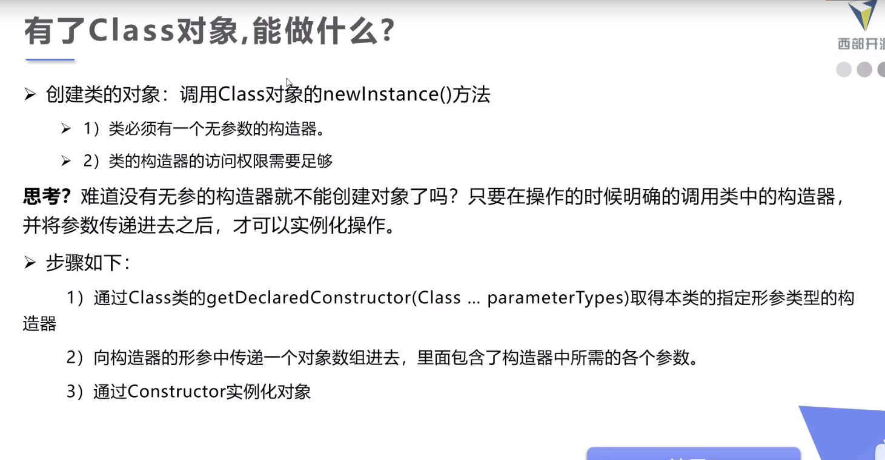

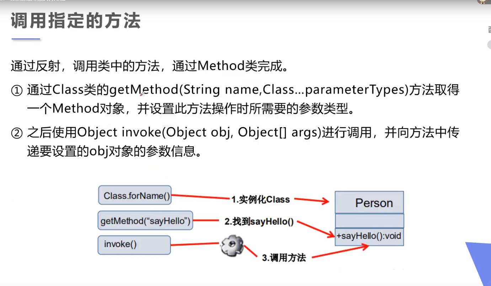

> 1. 獲取class嘅Class objcet
> 2. 用呢個Class object 創建一個Object (有參or無參)，下面個例子係Person
> 3. call Person object嘅各樣方法，**留意invoke() 同 setAccessible(true)**

```java
package src.reflection;

import java.lang.reflect.Constructor;
import java.lang.reflect.Field;
import java.lang.reflect.InvocationTargetException;
import java.lang.reflect.Method;

public class test03 {
    public static void main(String[] args) throws ClassNotFoundException, IllegalAccessException, InstantiationException, NoSuchMethodException, InvocationTargetException, NoSuchFieldException {
        // create Class object
        Class c1 = Class.forName("src.reflection.Person");

        // create a Person object by Class object c1
        Person person = (Person)c1.newInstance(); // 默認係用無參構造
        System.out.println(person);
        // output: Person{age=0, name='null'}

        // 如果想用有參構造點算？ 你要知道佢有參構造需要咩arguments先
        // 用getDeclaredConstructor攞到先，呢度直接跳過
        // 知道之後做法如下，先create一個constructor，再用呢個去create Person object
        Constructor constructor = c1.getDeclaredConstructor(int.class, String.class);
        Person person2 = (Person)constructor.newInstance(20, "Tom");
        System.out.println(person2);
        // output: Person{age=20, name='Tom'}


        // 通過reflection call Person入面嘅method
        // 先通過反射獲取class入面嘅method
        Method setName = c1.getDeclaredMethod("setName", String.class);
        setName.invoke(person,"Mary"); // 再用invoke去調用呢個method
        System.out.println(person.getName());
        // output: Mary


        // 通過reflection 改變person object嘅屬性
        Field age = c1.getDeclaredField("age");
        age.setAccessible(true); // age係private，本身係改唔到，但係Reflection可以用呢個方法去強行獲取private field
        age.set(person,25);
        System.out.println(c1.getDeclaredMethod("getAge", null).invoke(person));
        // output: 25
    }
}

```


# 10. Reflection 操作general type

同上面一樣，需要先獲取，再做操作

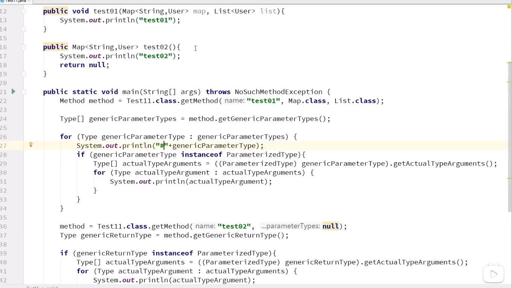

> 因為第一層for獲取嘅只係generalType嘅type，唔係真實嘅數據，所以需要用28-32行，獲取真實數據


# 11. Reflection獲取annotation信息

```java
package src.reflection;

import java.lang.annotation.*;
import java.lang.reflect.Field;

public class test04 {
    public static void main(String[] args) throws ClassNotFoundException, NoSuchFieldException {
        Class c1 = Class.forName("src.reflection.Student2");

        // 通過反射獲取annotation
        Annotation[] annotations = c1.getAnnotations();
        for(Annotation annotation : annotations){
            System.out.println(annotation);
        } // output: @src.reflection.Table(value="Student")

        // 獲取annotation's value
        Table table = (Table)c1.getAnnotation(Table.class);
        String value = table.value();
        System.out.println(value);
        // output: Student

        // 獲取class入面指定field嘅annotation
        Field f = c1.getDeclaredField("name");
        MyField myfield1 = f.getAnnotation(MyField.class);
        System.out.println(myfield1.columnName());
        System.out.println(myfield1.type());
        System.out.println(myfield1.length());
      	//  output: db_name
		//			varchar
		//			3
    }
}

@Table ("Student")
class Student2{
    @MyField(columnName = "db_id", type = "int", length = 10)
    private int id;
    @MyField(columnName = "db_age", type = "int", length = 10)
    private int age;
    @MyField(columnName = "db_name", type = "varchar", length = 3)
    private String name;

    public Student2(){

    }

    public Student2(int id, int age, String name) {
        this.id = id;
        this.age = age;
        this.name = name;
    }

    public int getId() {
        return id;
    }

    public void setId(int id) {
        this.id = id;
    }

    public int getAge() {
        return age;
    }

    public void setAge(int age) {
        this.age = age;
    }

    public String getName() {
        return name;
    }

    public void setName(String name) {
        this.name = name;
    }

}


@Target(ElementType.TYPE)
@Retention(RetentionPolicy.RUNTIME)
@interface Table{
    String value();
}

@Target(ElementType.FIELD)
@Retention(RetentionPolicy.RUNTIME)
@interface MyField{
    String columnName();
    String type();
    int length();
}
```

