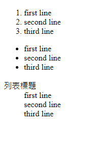
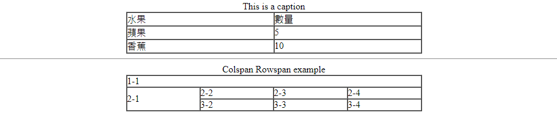
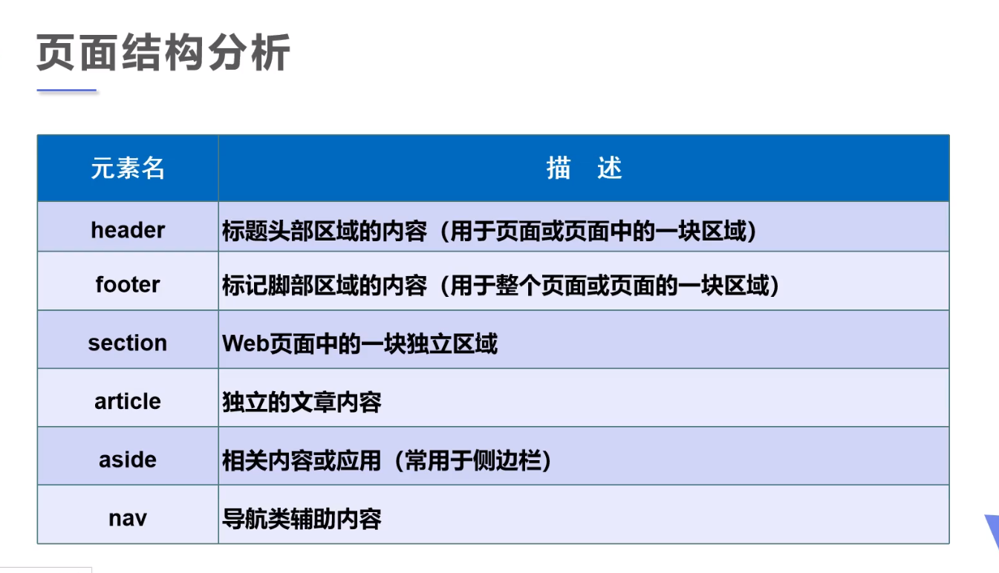
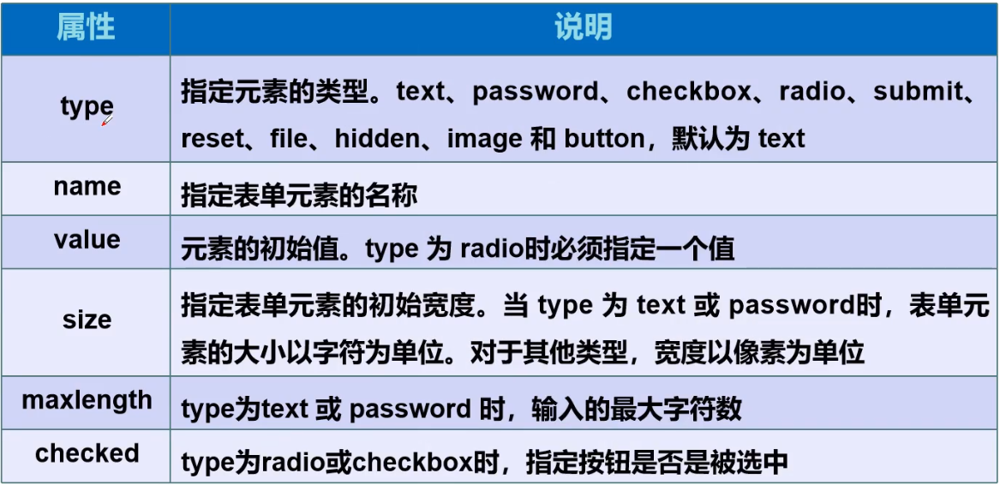
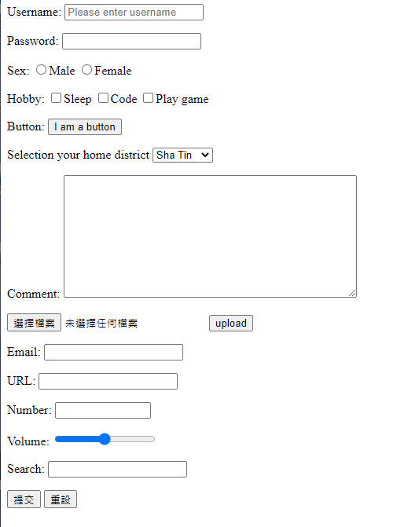

# 1. html基礎結構

> **基礎結構**分為head同body

```html
<!DOCTYPE html>
<html lang="UTF-8">

<!--網頁頭部-->
<head>
    <!--meta係描述性標籤，用嚟描述網站嘅信息-->
    <meta charset="UTF-8">
    <!--search engine會根據呢個content 嘅kw去搵我地嘅網站-->
    <meta name="ketwords", content="content">
    <!--網頁名-->
    <title>重溫html</title>
</head>
<!--網頁主體-->
<body>
hello world~
</body>
</html>
```

# 2. 各種label

## 2.1 基本label

```html
<!DOCTYPE html>
<html lang="en">
<head>
    <meta charset="UTF-8">
    <title>Title</title>
</head>
<body>
<!--標題label，共有6個，h1最大-->
<h1>h1 label</h1>
<h2>h2 label</h2>
<h3>h3 label</h3>
<h4>h4 label</h4>
<h5>h5 label</h5>
<h6>h6 label</h6>

<!--段落label，注意唔會自動分行，有空格亦會無視，*下面例子1同2 會癡埋變一行-->
<p>11111111111111
222222222</p>

<!--水平線label，創建一條水平線-->
<hr/>

<!--換行label-->
第一行<br/>
第二行<br/>
第三行<br/>

<!--特殊化label-->
<strong>我係粗體</strong>
<em>我係斜體</em>
<del>我係刪除線</del>
<ins>我係底線</ins>

</body>
</html>
```

## 2.2 img

```html
<!--src為文件路徑 (推介使用相對路徑)，alt為文件顯示唔到果陣，顯示嘅備用文字
另外有其他屬性，例如title=""，鼠標懸停果陣顯示嘅內容，width，height等等-->

```

## 2.3 a

```html
<a name="top">頂部</a>

<!--target默認係_self，係當前頁面打開，另一個常用嘅係_blank，係新一頁打開-->
<a href="path" target="_self">a link</a>
<!--可以跳到當前頁面嘅一個標籤，標籤都係<a></a>，入面需要一個element name=""
亦可以跳到其他頁面嘅<a></a>-->
<a href="#top">回到最頂</a>

<!--功能性連接: mailto   點擊後向該郵箱sd email-->
<a href="mailto:xxxxx@xx.com">click to send a email</a>
```


## 2.4 list

```html
<!DOCTYPE html>
<html lang="en">
<head>
    <meta charset="UTF-8">
    <title>Title</title>
</head>
<body>
<!-- 1. 有序列表 有1,2,3,4,5~ -->
<ol>
    <li>first line</li>
    <li>second line</li>
    <li>third line</li>
</ol>
<!-- 1. 無序列表 只有圓點 -->
<ul>
    <li>first line</li>
    <li>second line</li>
    <li>third line</li>
</ul>

<!-- 1. 自定義列表 -->
<dl>
    <dt>列表標題</dt>
    <dd>first line</dd>
    <dd>second line</dd>
    <dd>third line</dd>
</dl>

</body>
</html>
```

> 結果如下



## 2.5 table

```html
<!DOCTYPE html>
<html lang="en">
<head>
    <meta charset="UTF-8">
    <title>表格</title>
</head>
<body>
<!--表格table
文字說明 caption
表頭    thead (入面資料會bold，通常裝標題)
表格主體 tbody (裝主要data)
行      tr
列      td

表格屬性
border          設置表格邊框大小
cellspacing     格仔同格仔之間嘅空白間距                默認為2
cellpadding     格仔入面嘅內容同格仔邊框之前嘅空白間距     默認為1
width
height
align           擺係網頁嘅咩位                        (left,center,right)
colspan         跨列
rowspan         跨行
-->

<table width="500" border="1" cellspacing="0" cellpadding="0"   align="center">
    <caption>This is a caption</caption>
    <thead>
        <tr>
            <td>水果</td>
            <td>數量</td>
        </tr>
    </thead>
    <tbody>
        <tr>
            <td>蘋果</td>
            <td>5</td>
        </tr>
        <tr>
            <td>香蕉</td>
            <td>10</td>
        </tr>
    </tbody>
</table>
<hr/>
<table width="500" border="1" cellspacing="0" cellpadding="0"   align="center">
    <caption>Colspan Rowspan example</caption>
    <tr>
        <td colspan="4">1-1</td>
    </tr>
    <tr>
        <td rowspan="2">2-1</td>
        <td>2-2</td>
        <td>2-3</td>
        <td>2-4</td>
    </tr>
    <tr>
        <td>3-2</td>
        <td>3-3</td>
        <td>3-4</td>
    </tr>
</table>
</body>
</html>
```

> 結果如下



## 2.6 video and audio

```html
<!DOCTYPE html>
<html lang="en">
<head>
    <meta charset="UTF-8">
    <title>video and audio</title>
</head>
<body>
<!--
video，audio常用元素有
controls    自動顯示control bar
autoplay    自動播放
src         可以寫網站，或者路徑，建議相對路徑
-->
<video src="src"></video>

<audio src="src2"></audio>
</body>
</html>
```


# 3. tml進階結構

> 除左head，body之外
>
> 常用嘅結構有header (通常用作導航欄)
>
> section (中間嘅獨立區域)
>
> footer (底部資訊區)



> **仲有div，div用嚟分區，好重要！！！！！！！！！！！！！！！！！**


# 4. iframe

> iframe係頁面中一個內聯框架
>
> **可以係頁面當中開一個框，而呢個框顯示其他頁面嘅畫面

```html
<!DOCTYPE html>
<html lang="en">
<head>
    <meta charset="UTF-8">
    <title>iframe</title>
</head>
<body>
<iframe src="" name="hello" width = "1000px" height="800px" frameborder="0"></iframe>

<a href="https://www.google.com" target="hello">點擊在iframe開啟google</a>
</body>
</html>
```

**留意iframe嘅src係無寫，但係 a 連左去iframe，並且有個href，只要按一下就自動將iframe src變成google**

> 留意大網站基本上都block你呢個iframe，係做唔到


# 5. form 表單

> 常用element如下



> 例子及結果如下

```html
<!DOCTYPE html>
<html lang="en">
<head>
    <meta charset="UTF-8">
    <title>form</title>
</head>
<body>
<!--表單form
action:         表單提交嘅位置，可以係一個網站，或者一個請求處理嘅地址
method 提交方式:
    get     會係url顯示表單內容，但比較高效
    post    唔會係url顯示
-->
<form action="xxxxx" method="post">
    <!--placeholder用處係顯示默認值，required係必須要填寫-->
    <p>Username: <input type="text" name="username" placeholder="Please enter username" required></input></p>
    <p>Password: <input type="password" name="pwd"></p>

    <!--單選框-->
    <!--如要單選，name必須一樣，用以證明佢地係同一組，同一組只能選一個-->
    <p>
        Sex:
        <input type="radio" value="boy" name="sex">Male
        <input type="radio" value="girl" name="sex">Female
    </p>

    <!--多選框，留意input可用checked變默認選擇-->
    <p>
        Hobby:
        <input type="checkbox" value="sleep" name="hobby">Sleep</input>
        <input type="checkbox" value="code" name="hobby">Code</input>
        <input type="checkbox" value="game" name="hobby">Play game</input>
    </p>

    <!--按鈕-->
    <p>
        Button:
        <input type="button" name="btn1" value="I am a button">
    </p>

    <!--下拉框，列表框，留意option可用selected變默認值-->
    <p>
        Selection your home district
        <select name="HomeArea">
            <option value="ST" selected>Sha Tin</option>
            <option value="CT">Central</option>
            <option value="TM">Tun Mun</option>
        </select>
    </p>

    <!--文本域-->
    <p>
        Comment:
        <textarea name="textarea" cols="50" rows="10"></textarea>
    </p>

    <!--選擇文件-->
    <p>
        <input type="file" name="file">
        <input type="button" value="upload" name="uploadbtn">
    </p>

    <!--郵箱，留意label，點擊後鍵盤輸入會自動放係輸入框-->
    <p>
        <label for="email">Email:</label>
        <input type="email" name="email" id="email">
    </p>

    <!--url-->
    <p>
        <label for="url">URL:</label>
        <input type="url" name="url" id="url">
    </p>

    <!--數字框，step會創建一個增加減少嘅尖嘴，入面嘅數字代表每次點擊後加減幾多次-->
    <p>
        Number:
        <input type="number" name="number" max="9999999999" min="0" step="1">
    </p>

    <!--滑塊-->
    <p>
        Volume:
        <input type="range" name="volume" min="0" max="100" step="2">
    </p>

    <!--搜索框-->
    <p>
        Search:
        <input type="search" name="search">
    </p>

    <p>
        <input type="submit">
        <input type="reset">
    </p>
</form>
</body>
</html>
```



> 留意常用嘅element有placeholder，required等等