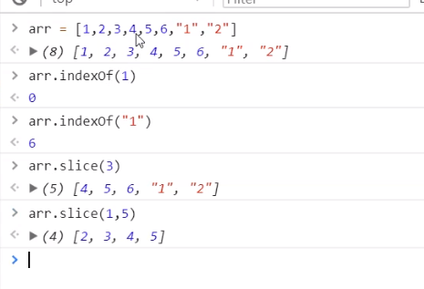
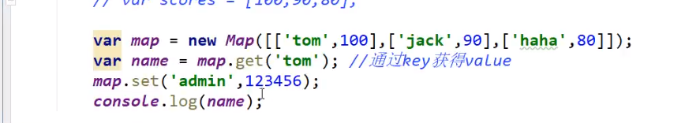
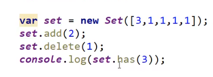
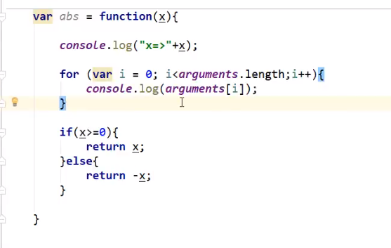
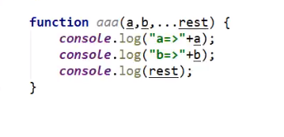
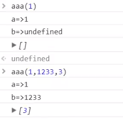
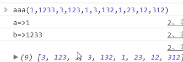

# 1. introduction

## 1.1 接入JavaScript的兩種方式

 寫係<head></head>之中

1. 內部接入

   ```html
   <script>
   	............
   </script>
   ```

2. 外部接入 

   例如有個js file係  js/abc.js

   ```html
   <script scr="js/abc.js"></script>
   ```

   

## 1.2 var/let/const

不同於其他languages， 有string, int, bool 等等，JavaScript只有幾種：

1. var  (global variable)
2. let   (local variable)
3. const (constant)

```html
<!DOCTYPE html>
<html lang="en">
<head>
    <meta charset="UTF-8">
    <title>Title</title>

    <script>
        /* 1. define variable: var, let */
        var num = 2;
        let num2 = 50;
        let num3 = 20;

        /* 2. if statement */
        if (num2 > num){
            alert("true!");
        } else if(num3 < num){
            /*........*/
        }

        /* 3. output on browser console */
        console.log("asdasdas");

    </script>
</head>
<body>

</body>
</html>
```

## 1.3 data type and syntax

==Number==

```javascript
123 		// integer
123.5 		// float
1.123e4		// scientific notation
NaN			// Not a number
Infinity	// infinity
```

==String==

```javascript
"adssfas"
'cvxcv'
```

==boolean==

```javascript
true
false
```

==logical operator==

```javascript
&&   		// 2 true = ture
||   		// 1 true = true
!    		// not false = true
```

==compare==

```javascript
==   		// equal
===			// all equal
```

> 留意NaN === NaN    係false
>
> 因為NaN 唔等於任何一個數，只能用isNaN(NaN)嚟判斷

==null and undefined==

```javascript
null		// null  ==
undefined	// undefined ==
```

==array==

```javascript
var array = [1,2,3,4,"asdasd",0.345]		// 可以唔一樣，因為var係萬能
// 超出index會output undefined
```

==object==

```javascript
var person = {
    name: "Tom",
    age: 20
} 
// 用大括號
// 每個element之間用逗號隔開

console.log(person.name)	// 會output Tom
```

## 1.4 嚴格檢查模式

**因為js太隨便，建議係js第一行加入 'use strict';    變成嚴格檢查模式**

**嚴格規範 javascript嘅code**


# 2. 詳細介紹data type

## 2.1 String

1. 特殊符號

```javascript
\'			// '
\n			// 隔行
\t			// 隔格
\x41		// output ASCII code 第41個 (A)
```

2. 多行string

```javascript
// 用tab上面嘅波浪號，可以包裹多行string
var msg = `
111111
22222
33333
`
```

3. ${} 用法

```javascript
let name = "Tom";
let age = 50;
let msg = "hello, ${name}";
```

4. 長度

```javascript
let name = "Tom";
console.log(name.length);   // 3
```

5. 留意String不可用index 直接改變！！！！！！！！！

```javascript
let name = "Jerry";
name[0] = "T";
console.log(name);  // 依然output Jerry
```

6. substring

```javascript
let name = "Tomandjerry";
console.log(name.substring(2));    // 由第二個開始直到最後  mandjerry
console.log(name.substring(0,3));  // [0,3) 包前唔包後	  To
```


## 2.2 Array

1. 長度

```javascript
var arr = [1,2,3];
arr.length = 5;    // 改變後arr length = 5,
// 留意如果用 arr.length = 1， 會造成data loss
```

2. indexof()

```javascript
var arr = [1,2,3];
arr.indexof(1);    //  2
```

3. slice()



```javascript
let arr = [1,2,3,4,5,6,7,"1","2"];
arr.slice(3);          // slice() 會 cut 呢個arr，從index 3 開始直到最後 [3,last]
					   // 然後return一個新arr
arr.slice(0,4)         // 如果2個參數俾曬，範圍係 [0,4)，包前唔包後， return [1,2,3,4]
```

4. 加入/刪除elements

> push: 在數組最後加入數據，例如arr.push("asda",54);
>
> pop :  刪除數組中最後的數據
>
> unshift: 在數組頭部加入數據
>
> shift:  刪除數組第一個數據

5. ​	常用method

```javascript
1.	arr.sort();
2.	arr.reverse();

3.	concat()   // 拼接數組，並return 新數組 (原本嘅arr不變)
let arr = [1,2,3];
arr.concat(["1","2","3"]);        // [1,2,3,"1","2","3"]

4.	join()     // 以char連接arr
let arr2 = ["a","b","c"];
arr2.join('-');     // arr2 變成 "a-b-c"
```


## 3.3 Object

1. define object

```javascript
var ObjectName = {
    property1 : something,
    property2 : something
}
```

2. 刪除 object入面某個屬性

```javascript
delete person.name      // 再output person，就會發現無左一個屬性
```

3. 增加 object的屬性

```javascript
person.asdfasdfasdf = "asdasda"   // 直接用 .  定義
```


## 3.4 flow concorl

1. if else

```javascript
if (...) {
    ....
    } else if (...){
    ....
} else {
    ....
}
```

2. loop

```javascript
while(...){
      .....
      }

//---------------------------------------

do{
    ...
}while(...)

//---------------------------------------
       
for(let i = 0; i < 100; i++){
    ......
}
    
//---------------------------------------
for(var x in arr){
    ......
}
    
//---------------------------------------
// 留意for in arr係會output array嘅index
// 而for of arr會output array嘅value
```


## 3.5 Map and Set

1. Map



用於裝一個 key及一個value，通過key獲得value

常用method： set()   增加一個key及對應的value

​								delete("xxx") 刪除對應的key及value


2. Set




set不可裝重複數據，如果有就自動刪除，剩翻一個


# 4. function

## 4.1 define

> 方式一，同其他languages差唔多

```javascript
function abc(x){  // 接收 var x (可以係任何野 ==)
    ......
}
```

> 方式二，通過anonymous function嘅方法define

```javascript
var abc = function(){
    ......
}
```

> **return type留意地方，例子如下**，下面function無論傳入正負數都係顯示正數

```javascript
function myfunction(x){
    if(x >= 0){
        return x;
    }else{
        return -x;
    }
}
```

> 如果無傳argument，直接call myfunction()，係會**return NaN**   


## 4.2 js獨有keywords

### 4.2.1 arguments



arguments代表該function傳入嘅嘢，無論傳入咩data type，有幾多個，都會轉化為一個array，並且存放係arguments入面


### 4.2.2 ...rest



係function入面接收 3 個arguments，第一個第二個會儲存入a，b

但係第三個及之後所有野，會存入一個叫做 rest 嘅數組



> 只傳一個，只傳3個嘅output



> 傳入多個參數嘅output