# 1. introduction

## 1.1 接入JavaScript的兩種方式

 寫係<head></head>之中

1. 內部接入

   ```html
   <script>
   	............
   </script>
   ```

2. 外部接入 

   例如有個js file係  js/abc.js

   ```html
   <script scr="js/abc.js"></script>
   ```

   

## 1.2 var/let/const

不同於其他languages， 有string, int, bool 等等，JavaScript只有幾種：

1. var 
2. let   
3. const

```html
<!DOCTYPE html>
<html lang="en">
<head>
    <meta charset="UTF-8">
    <title>Title</title>

    <script>
        /* 1. define variable: var, let */
        var num = 2;
        let num2 = 50;
        let num3 = 20;

        /* 2. if statement */
        if (num2 > num){
            alert("true!");
        } else if(num3 < num){
            /*........*/
        }

        /* 3. output on browser console */
        console.log("asdasdas");

    </script>
</head>
<body>

</body>
</html>
```

## 1.3 data type and syntax

==Number==

```javascript
123 		// integer
123.5 		// float
1.123e4		// scientific notation
NaN			// Not a number
Infinity	// infinity
```

==String==

```javascript
"adssfas"
'cvxcv'
```

==boolean==

```javascript
true
false
```

==logical operator==

```javascript
&&   		// 2 true = ture
||   		// 1 true = true
!    		// not false = true
```

==compare==

```javascript
==   		// equal
===			// all equal
```

> 留意NaN === NaN    係false
>
> 因為NaN 唔等於任何一個數，只能用isNaN(NaN)嚟判斷

==null and undefined==

```javascript
null		// null  ==
undefined	// undefined ==
```

==array==

```javascript
var array = [1,2,3,4,"asdasd",0.345]		// 可以唔一樣，因為var係萬能
// 超出index會output undefined
```

==object==

```javascript
var person = {
    name: "Tom",
    age: 20
} 
// 用大括號
// 每個element之間用逗號隔開

console.log(person.name)	// 會output Tom
```

## 1.4 嚴格檢查模式

**因為js太隨便，建議係js第一行加入 'use strict';    變成嚴格檢查模式**

**嚴格規範 javascript嘅code**


# 2. 詳細介紹data type

## 2.1 String

1. 特殊符號

```javascript
\'			// '
\n			// 隔行
\t			// 隔格
\x41		// output ASCII code 第41個 (A)
```

2. 多行string

```javascript
// 用tab上面嘅波浪號，可以包裹多行string
var msg = `
111111
22222
33333
`
```

3. ${} 用法

```javascript
let name = "Tom";
let age = 50;
let msg = "hello, ${name}";
```

4. 長度

```javascript
let name = "Tom";
console.log(name.length);   // 3
```

5. 留意String不可用index 直接改變！！！！！！！！！

```javascript
let name = "Jerry";
name[0] = "T";
console.log(name);  // 依然output Jerry
```

6. substring

```javascript
let name = "Tomandjerry";
console.log(name.substring(2));    // 由第二個開始直到最後  mandjerry
console.log(name.substring(0,3));  // [0,3) 包前唔包後	  To
```


## 2.2 Array

1. 長度

```javascript
var arr = [1,2,3];
arr.length = 5;    // 改變後arr length = 5,
// 留意如果用 arr.length = 1， 會造成data loss
```

2. indexof()

```javascript
var arr = [1,2,3];
arr.indexof(1);    //  2
```

3. slice()


```javascript
let arr = [1,2,3,4,5,6,7,"1","2"];
arr.slice(3);          // slice() 會 cut 呢個arr，從index 3 開始直到最後 [3,last]
					   // 然後return一個新arr
arr.slice(0,4)         // 如果2個參數俾曬，範圍係 [0,4)，包前唔包後， return [1,2,3,4]
```

4. 加入/刪除elements

> push: 在數組最後加入數據，例如arr.push("asda",54);
>
> pop :  刪除數組中最後的數據
>
> unshift: 在數組頭部加入數據
>
> shift:  刪除數組第一個數據

5. ​	常用method

```javascript
1.	arr.sort();
2.	arr.reverse();

3.	concat()   // 拼接數組，並return 新數組 (原本嘅arr不變)
let arr = [1,2,3];
arr.concat(["1","2","3"]);        // [1,2,3,"1","2","3"]

4.	join()     // 以char連接arr
let arr2 = ["a","b","c"];
arr2.join('-');     // arr2 變成 "a-b-c"
```


## 2.3 Object

1. define object

```javascript
var ObjectName = {
    property1 : something,
    property2 : something
}
```

2. 刪除 object入面某個屬性

```javascript
delete person.name      // 再output person，就會發現無左一個屬性
```

3. 增加 object的屬性

```javascript
person.asdfasdfasdf = "asdasda"   // 直接用 .  定義
```


## 2.4 flow concorl

1. if else

```javascript
if (...) {
    ....
    } else if (...){
    ....
} else {
    ....
}
```

2. loop

```javascript
while(...){
      .....
      }

//---------------------------------------

do{
    ...
}while(...)

//---------------------------------------
       
for(let i = 0; i < 100; i++){
    ......
}
    
//---------------------------------------
for(var x in arr){
    ......
}
    
//---------------------------------------
// 留意for in arr係會output array嘅index
// 而for of arr會output array嘅value
```


## 2.5 Map and Set

1. Map


用於裝一個 key及一個value，通過key獲得value

常用method： set()   增加一個key及對應的value

​								delete("xxx") 刪除對應的key及value


2. Set


set不可裝重複數據，如果有就自動刪除，剩翻一個


# 3. function

## 3.1 define

> 方式一，同其他languages差唔多

```javascript
function abc(x){  // 接收 var x (可以係任何野 ==)
    ......
}
```

> 方式二，通過anonymous function嘅方法define

```javascript
var abc = function(){
    ......
}
```

> **return type留意地方，例子如下**，下面function無論傳入正負數都係顯示正數

```javascript
function myfunction(x){
    if(x >= 0){
        return x;
    }else{
        return -x;
    }
}
```

> 如果無傳argument，直接call myfunction()，係會**return NaN**   


## 3.2 js獨有keywords

### 3.2.1 arguments


arguments代表該function傳入嘅嘢，無論傳入咩data type，有幾多個，都會轉化為一個array，並且存放係arguments入面


### 3.2.2 ...rest


係function入面接收 3 個arguments，第一個第二個會儲存入a，b

但係第三個及之後所有野，會存入一個叫做 rest 嘅數組


> 只傳一個，只傳3個嘅output


> 傳入多個參數嘅output

## 3.3 varible scope (作用域)

var 定義一個variable實際上係有作用域之分

假設係function入面declare，係function之外就唔可以用

```javascript
function func1(){
    var x = 1;
    x = x + 1;
}
x = x + 2;  // Uncaught ReferenceError : x is not defined
```

以下例子同理

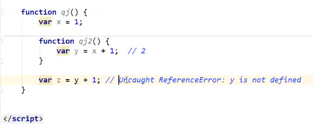


> var 定義variable會係function最頂部declare先

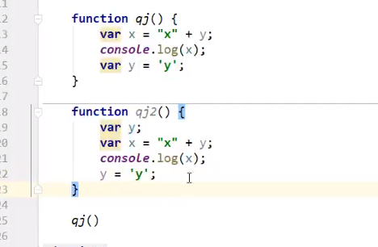

係呢度第一個function qj() ，同第二個function qj2()係一樣


### 3.3.1 global variable

> var係global variable，係全部地方都可以用

```javascript
// global variable var
x = 1;           // 唔寫會默認係 var x = 1;

function f(){
    console.log(x);
}
f();
console.log(x);
```

> 所有global variable都會自動綁定到一個 global object上面
>
> 佢就係 **window**

```javascript
var x = 'asdas';
window.alert(x);
window.alert(window.x);   // 都可以call，因為自動綁定左
```

> 咁所有varibale都綁定到window，後期多個file合埋一齊肯定會出現重複嘅variable name
>
> 點樣減少重複？

```javascript
// 定義一個自己嘅global object，類似於window
// 然後將所有variable綁去呢個global object
var test = {};

test.name = 'firsttest';   // 加一個variable
test.add = function (a,b){ // 加一個function
    return a + b;
}
```


### 3.3.2 local variable

> let係locla variable，只能係function入面用

```javascript
function test01(){
    for(var i = 0; i < 100; i++){
        console.log(i);
    }
    console.log(i+1);   //因為係var (global) 嘅關係，呢度仍然可以用呢個 i ，所以output 101
}

function test01(){
    for(let i = 0; i < 100; i++){  // 留意將var 換做let
        console.log(i);
    }
    console.log(i+1);   //因為係let (local) 嘅關係，呢度唔可以再用 i，output
                        // Uncaught referenceError: i is not defined
}
```


# 4. 內部object

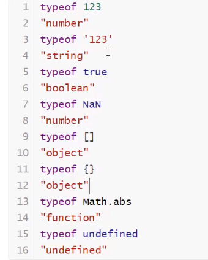

## 4.1 Date

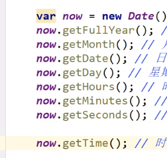

## 4.2 JSON

JSON string -> JSON object嘅轉法

```javascript
var user = {
    name : "Tom",
    age : 20,
    sex : 'm'
}

// output 原本嘅object
console.log(user);

// 將object 轉為JSON string
var jsonString = JSON.stringify(user);
console.log(jsonString);

// 將JSON string 轉為object
var jsonObject = JSON.parse(jsonString);
console.log(jsonObject);
```


第一個同第三個output都係object；而第二個係一個string

> 格式：
>
> - Object 用 {}
> - array    用 []
> - key       用 key:value

留意JSON object 同 Javascript object嘅分別

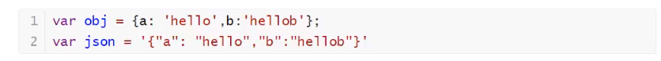


# 5. object oriented

## 5.1 prototype and class

java, c++, python等等嘅languages都係有個class，然後有object 繼承佢

> 但係JavaScript呢度，**以前**所“繼承”嘅並唔係class，而係一個prototype
>
> 用法如下

```javascript
        var person = {
            name : "Person",
            run : function(){
                console.log(this.name + " is running...");
            }
        }

        var Tom = {
            name : "Tom"
        }

        Tom.__proto__ = person;  // 將Tom 嘅prototype設置為person
        console.log(Tom.run());  // 就可以用person嘅方法，類似於繼承
```

> 但係**ES6之後(宜家)**，就可以用翻class (雖然本質上都係prototype)

```javascript
class Student{
    constructor(name) {
        this.name = name;
    }

    hello(){
        alert("hello!");
    }
}

var Tom = new Student("Tom");
```

> 留意 this.name **不須預先declare**

## 5.2 inheritance

> 同Java差唔多，都係用extends

```javascript
'use strict'
class Student{
    constructor(name) {
        this.name = name;
    }

    hello(){
        console.log("hello! I am " + this.name);
    }
}

class Undergrad extends Student{   // inheritance
    constructor(name, age) {
        super(name);
        this.age = age;
    }

    myAge(){
        console.log("I am " + this.name + ". My age is " + this.age);
    }
}

let Tom = new Student("Tom");
let Jerry = new Undergrad("Jerry", 20);
Tom.hello();
Jerry.myAge();
```


# 6. BOM (broswer object model)

> 1. window object，代表瀏覽器窗口

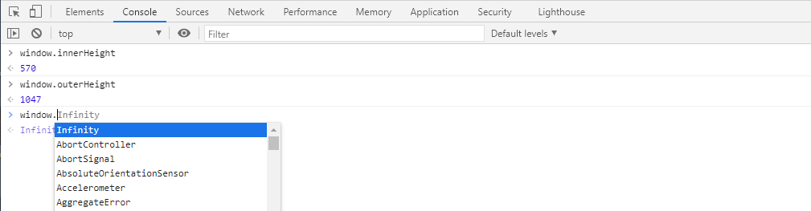


> 2. location object，代表當前頁面嘅URL info
>
> ​         例如宜家開左個google，再input  location

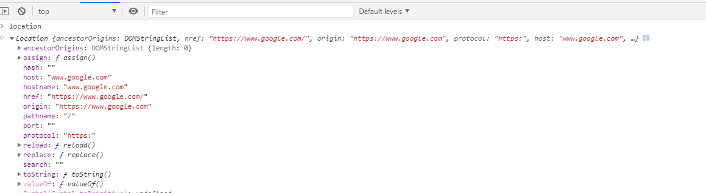

```javascript
host: "www.google.com"
hostname: "www.google.com"
href: "https://www.google.com/"
origin: "https://www.google.com"
pathname: "/"
port: ""
protocol: "https:"
```

> 3. document object，代表當前頁面

```html
<!DOCTYPE html>
<html lang="en">
<head>
    <meta charset="UTF-8">
    <title>Title</title>
</head>
<body>
<dl id="table">
    <dt>My table</dt>
    <dd>first info</dd>
    <dd>second info</dd>
    <dd>third info</dd>
</dl>

<script>   
    let dl = document.getElementById("table");   // 獲取當前頁面資料，例如 table
    console.log(dl);
</script>
</body>
</html>
```

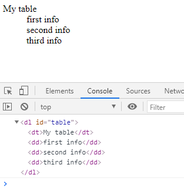

> 4. history，代表當前瀏覽器嘅歷史記錄 (只限當前正在使用的記錄，以往記錄不計)
>
>    類似於 back，forward箭咀，向前向後，但只能夠用於宜家嘅瀏覽器記錄，唔可以翻去尋日開過嘅網站

```javascript
history.back()
history.forward()
```


# 7. DOM (document object model)

> 1. **獲取 DOM node**

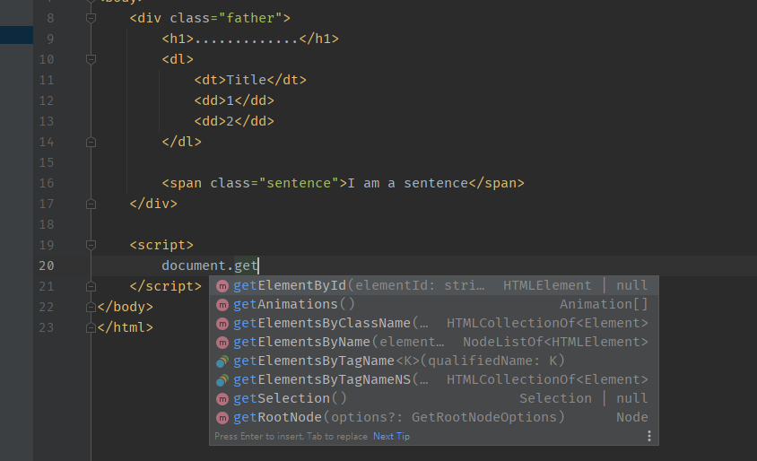

> 用 document獲取
>
> 宜家知下就ok，之後會用其他方法：jQuery獲取

> 2. **更新 DOM node**

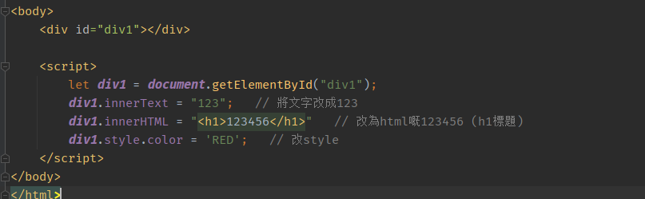

> 3. **刪除 DOM node**: 先獲取 father node，再通過father node刪除自己

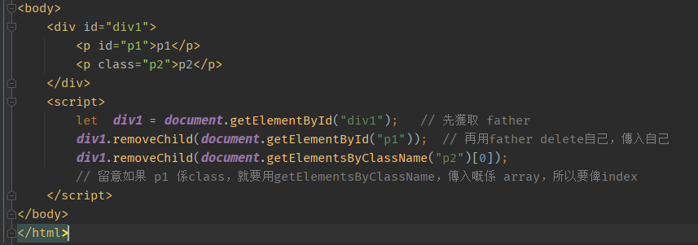

> 4. **插入 DOM node**: 

`1.	Append`

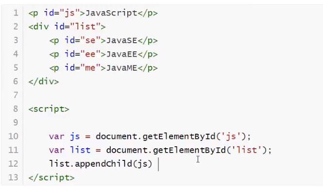

​		`效果`

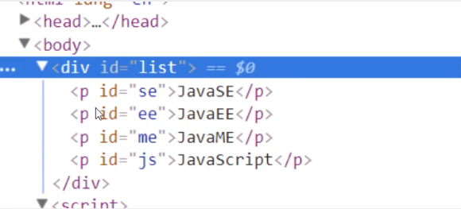

> 可以見到 div 上面嘅 p，移左去div入面 (最後)

`2. Create and append`

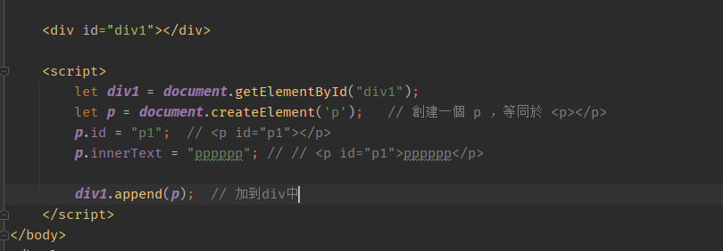

​			`效果`

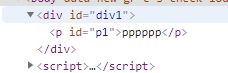


# 8. form

> form都係DOM下面一個node
>
> 元素比較多，例如有
>
> text，select，radio，checkbox，hidden，password等等

## 8.1 獲取，修改form數據

```html
<!DOCTYPE html>
<html lang="en">
<head>
    <meta charset="UTF-8">
    <title>Title</title>
</head>
<body>
    <form action="#" method="psot">
        <p>
            <label for="username">Username:</label>
            <input type="text" id="username">
        </p>
        <p>
            <span>Sex:</span>
            <input type="radio" name="sex" value="male" id="male_btn">Male
            <input type="radio" name="sex" value="female" id="female_btn">Female
        </p>

    </form>

    <script>
        let username = document.getElementById("username");
        //username.value;    得到username value
        username.value = "aasdfasdf";  // 修改username value

        let male_btn = document.getElementById("male_btn");
        let female_btn = document.getElementById("female_btn");
        //male_btn.checked;    查看結果，如果被選中顯示 true，否則false
        male_btn.checked = true; // 修改為被選中

    </script>
</body>
</html>
```


## 8.2 密碼加密

> 直接提交密碼嘅話，容易比人hack，因為表單被提交後，可以係瀏覽器上睇到所有數據，如下圖

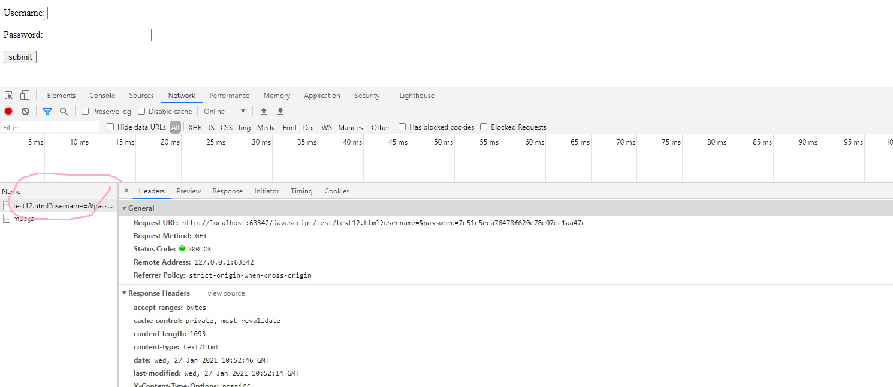

> 所以要將user input嘅密碼加密，再submit已經加密嘅密碼
>
> 常用嘅加密方法係 md5

```html
<!DOCTYPE html>
<html lang="en">
<head>
    <meta charset="UTF-8">
    <title>Title</title>
    <!-- 留意要先導入加密算法嘅url md5放係入面-->
    <script src="http://www.myersdaily.org/joseph/javascript/md5.js"></script>
</head>
<body>
    <form action="#" method="psot" onsubmit="return test()">
        <p>
            <label for="username">Username:</label>
            <input type="text" id="username" name="username">
        </p>
        <p>
            <label for="in_password">Password:</label>
            <input type="password" id="in_password">   <!-- 假pwd，俾user input-->
        </p>

        <input type="hidden" id="md5_pwd" name="password"> <!-- 真pwd，接收user pwd後加密製成-->

        <button type="submit">submit</button>
    </form>

    <script>
        function test(){
            let password = document.getElementById("in_password");
            let md5pwd = document.getElementById("md5_pwd");

            md5pwd.value = md5(password.value);  // 加密
            return true;
        }
    </script>
</body>
</html>
```


# 9. jQuery

> 用法: $("selector").action()
>
> jQuery嘅selector 同css嘅selector一樣
>
> 所有api : https://jquery.cuishifeng.cn/

```html
<!DOCTYPE html>
<html lang="en">
<head>
    <meta charset="UTF-8">
    <title>Title</title>
    <script src="https://code.jquery.com/jquery-3.5.1.min.js" integrity="sha256-9/aliU8dGd2tb6OSsuzixeV4y/faTqgFtohetphbbj0=" crossorigin="anonymous"></script>
</head>
<body>
    <a href="#" id="button">click</a>

    <script>
        let id = document.getElementById("button");
        // id.......
        // 之前嘅做法係，先獲取 node，再做operation
        // 宜家有jQuery就方便好多
        $("#button").click(function(){
            alert("hello");
        })

    </script>
</body>
</html>
```

