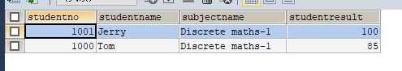
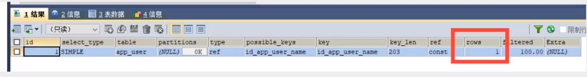
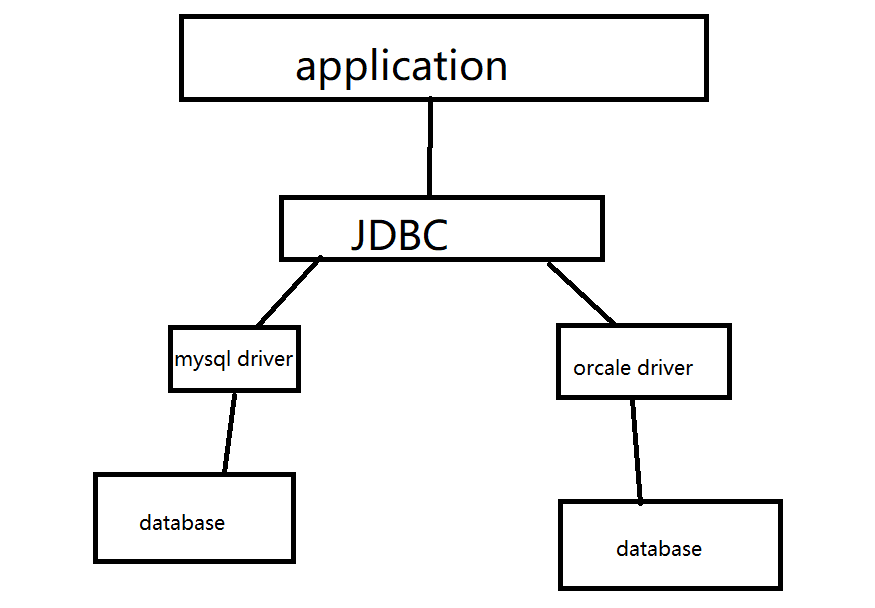
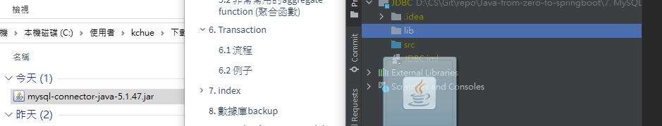
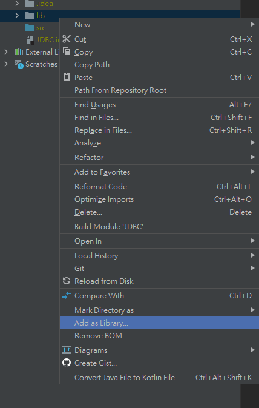
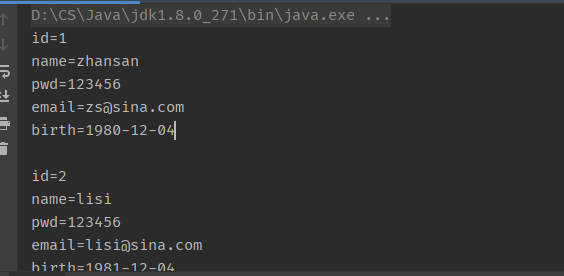
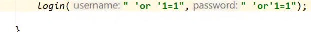

# 1. 初識Database

## 1.1 數據庫分類

**關係型數據庫 SQL：**

- MySQL，Orcale, Sql server, DB2
- 通過表之間，行列之間嘅間隙進行數據儲存


**非關係型數據庫 NoSQL (Not only SQL)：**

- Redis，MongDB
- 通過Object 自身嘅屬性嚟決定


## 1.2 SQL commands 4種分類

1. DDL – Data Definition Language
2. DQL – Data Query Language
3. DML – Data Manipulation Language
4. DCL – Data Control Language


> 主要都係用 DQL 同 DML，因為最多嘅operation就係CRUD  ==


## 1.3 SQL基本語法

開啟數據庫(密碼賬號已經預先設為 root 及 123456): 

```shell
mysql -uroot -p123456      #   -u = user    -p = password
```

> 留意SQL所有嘢都用分號 ; 結尾

SHOW, USE

```shell
show databases;   	# 顯示所有database
use xxxx;         	# 切換到 xxxx database
show tables;     	# 查看當前DB 所有tables
describe xxxx;    	# 查看當前DB中 名為xxxx 的table
create databse xxxx;# 創建名為 xxxx 的DB
-- xxxxx            # SQL 中， -- 為comment (單行)
/**/                # 多行comment
```


# 2. SQL

> **manipulate DB = manipulate table = manipulate data in the table**

## 2.1 intro

1. create DB

```sql
CREATE DATABASE IF NOT EXISTS abc        -- create DB, name = abc
```

2. delete DB

```sql
DROP DATABASE IF EXISTS abc              -- delete DB
```

3. use DB (留意：如果用嘅字係一個keyword，例如user，需要加 ==``== 號括起)

```sql
USE school;                              -- switch to databse school
```

4. show DB

```sql
SHOW DATABASES							 -- show all databases
```


## 2.2 data type 

> 數值

- tinyint		十分小的數據	1byte
- smallint     較小的數據      2bytes
- mediumint中等的數據      3bytes
- **int               標準整數        4bytes**
- bigint          較大的數據     8bytes
- float             小數                 4bytes
- double         高精度小數     8bytes
- decimal        金融計算時使用


> string

- char				0-255
- **varchar       0-65535**
- tinytext        2^8 -1
- **text              2^16-1** 


> 時間日期

- date			YYYY-MM-DD	日期格式
- time          HH:mm:ss       時間格式
- **datetime   YYYY-MM-DD    HH: mm：ss    常用格式**
- **timestamp 1970-1-1到宜家嘅毫秒數**


> null

- 未知


## 2.3 others

> zerofill

- 不足的位數用 0 填充
- 例如需要三位數，但只輸入 5，就會變 005


> auto_increment

- 自動 ++
- 可以設置自動 + 幾多，一般加一


## 2.4 table

```sql
CREATE TABLE IF NOT EXISTS `student` (
	`id`  INT(4) NOT NULL AUTO_INCREMENT COMMENT 'Student id',
	`name` VARCHAR(30) NOT NULL DEFAULT 'null' COMMENT 'Student name',
	`pwd` VARCHAR(30) NOT NULL DEFAULT '123456' COMMENT 'Student password',
	`sex` VARCHAR(10) NOT NULL DEFAULT 'Female' COMMENT 'Student sex',
	`birthday` DATETIME DEFAULT NULL COMMENT 'Student birthday',
	`address` VARCHAR(100) DEFAULT NULL COMMENT 'Student address',
	`email` VARCHAR(50) DEFAULT NULL COMMENT 'Student email',
	PRIMARY KEY(`id`)  -- main key，一個table只有一個，通常係 id

)ENGINE =INNODB DEFAULT CHARSET=utf8
```


## 2.5 common command

``` sql
SHOW CREATE DATABSE [NAME]  -- 查看已創建數據庫的 sql 語句
SHOW CREATE TABLE [NAME]    -- 同上，表
DESC [name]                 -- describe， show 結構
```


## 2.6 alter and delete

```sql
ALTER TABLE name RENAME AS name2				-- alter，修改， rename，重命名
ALTER TABLE name ADD age INT(10)        		-- 在name這個table增加 age int(10)
ALTER TABLE name MODIFY age varchar (3) 		-- 改 data type
ALTER TABLE name CHANGE age age2 varchar (3) 	-- 改名 ， change 舊名 新名 datatype

ALTER TABLE name DROP age						-- 在 name這個table 刪除 age

DROP TABLE IF EXISTS name						-- 刪除table

```


# 3. DML

## 3.1 foreign key

> 分為 創表時加入FK，及之後增加FK

1. `創表時加入FK`

```sql
CREATE TABLE IF NOT EXISTS `grade`(
	`gradeid` INT(5) NOT NULL AUTO_INCREMENT COMMENT 'Student grade id',
	`gradename` VARCHAR(50) NOT NULL COMMENT 'Student grade name',
	PRIMARY KEY(`gradeid`)
)ENGINE=INNODB DEFAULT CHARSET=utf8


-- student table嘅 `gradeid` 要引用 grade table 嘅 gradeid
-- 1. 定義 foreign key
-- 2. 加constraint `FK_XXXX` (引用)
CREATE TABLE IF NOT EXISTS `student` (
	`id`  INT(4) NOT NULL AUTO_INCREMENT COMMENT 'Student id',
	`name` VARCHAR(30) NOT NULL DEFAULT 'null' COMMENT 'Student name',
	`pwd` VARCHAR(30) NOT NULL DEFAULT '123456' COMMENT 'Student password',
	`sex` VARCHAR(10) NOT NULL DEFAULT 'Female' COMMENT 'Student sex',
	`birthday` DATETIME DEFAULT NULL COMMENT 'Student birthday',
	`address` VARCHAR(100) DEFAULT NULL COMMENT 'Student address',
	`email` VARCHAR(50) DEFAULT NULL COMMENT 'Student email',
	`gradeid` INT(5) NOT NULL COMMENT 'Student grade id',
	KEY `FK_gradeid`(`gradeid`),
	CONSTRAINT `FK_gradeid` FOREIGN KEY (`gradeid`) REFERENCES `grade` (`gradeid`),
    PRIMARY KEY(`id`)  -- main key，一個table只有一個，通常係 id

)ENGINE =INNODB DEFAULT CHARSET=utf8
```

上面例子，`student` table 需要 引用 `grade` table中的 `gradeid`

留意第 19- 21行，首先加入gradeid 呢個key，再用 KEY FK_XXX 加foreign key，最後第21行 加入reference


2. `之後增加FK`

就係用翻 alter 加

```sql
ALTER TABLE `student`
ADD CONSTRAINT `FK_gradeid` FOREIGN KEY (`gradeid`) REFERENCES `grade` (`gradeid`)
```

> 呢個方法好少用，因為
>
> 1. 唔方便
> 2. 唔可以直接刪除`grade` 呢個table，因為有其他table 引用緊
> 3. 當table多果陣，出現多個foreign key，DB會好亂
>
> **最好嘅方法係 用program去實現** 


## 3.2 DML language (重要)

> dabase manipulate language 
>
> - insert
> - update
> - delete


1. `insert`

   >INSERT INTO **table name (col)** VALUES**('data')**

   ```sql
   -- 增加一個data
   INSERT INTO `grade` (`gradename`) values ('year 4') 
   
   -- 增加多個data，留意每組data需要用括號包住，逗號隔開
   INSERT INTO `grade` (`gradename`)
   values ('year 1'), ('year 2'), ('year 3')
   
   -- 同時向多個col增加data
   -- 同樣用括號，逗號分隔
   INSERT INTO `student` (`name`,`pwd`,`sex`)
   VALUES ('Tom', 'abcdefg', 'Male'), ('Jerry', 'aaaah!', 'Male')
   ```


2. `update`

   > UPDATE **table name** SET **col = 'data'** WHERE **xx = xx**

   ```sql
   -- 修改 `student` table 下 `name` 為 'noname'，條件為 id = 2
   UPDATE `student` SET `name`='noname' WHERE id = 2
   
   -- 唔寫條件嘅話，會將所有 `name` 都改做 'noname' !!!!!   
   UPDATE `student` SET `name`='noname'
   
   -- 修改多個col，用逗號隔開
   UPDATE `student` SET `name`='noname', `email`='asdfas@aws.com' WHERE id = 1
   ```


​			**where 常用操作**

​			

| 操作            | 意義             | 例子                     |
| --------------- | ---------------- | ------------------------ |
| =               | 等於             | id = 2                   |
| <>/ !=          | 不等於           | id != 2                  |
| >               | 大於             | id > 2                   |
| <               | 小於             | id < 2                   |
| >=              |                  |                          |
| <=              |                  |                          |
| BETWEEN A AND B | A與B之間   [A,B] | WHERE id between 2 and 5 |
| AND             | 和               |                          |
| OR              | 或               |                          |


3. `delete`

   >DELETE FROM **table name** WHERE **xx = xx**

   ```sql
   -- 刪除 `student` table 中 id = 1嘅row
   DELETE FROM `student` WHERE id = 1
   ```

   

   `truncate` 

   > TRUNCATE TABLE table name

   ```sql
   -- 刪除table 並且重置primary key
   TRUNCATE TABLE `student`
   ```

   

# 4. DQL language (最重要)

> database query language
>
> - 所有查詢都用呢個
> - 最常用

`完整語法`

```sql
SELECT[ALL|DISTINCT|DISTINCTROW|TOP]
{*|talbe.*|[table.]field1[AS alias1][,[table.]field2[AS alias2][,…]]}
FROM tableexpression[,…][IN externaldatabase]
[WHERE…]
[GROUP BY…]
[HAVING…]
[ORDER BY…]
[WITH OWNERACCESS OPTION]
-- [] 可選，   {} 必選其中一個
```

> 基礎

```sql
-- 查詢student table下所有數據 (*代表全部)
SELECT * FROM student

-- 查詢student table下指定 col 的數據
SELECT `studentno`, `studentname` FROM student

-- 改名 (只限顯示)，查詢之餘顯示其他名，方便閱讀
SELECT `studentno` AS 學號, `studentname` AS 名字 FROM student 

-- function CONCAT(a,b)，將兩項連接並顯示
SELECT CONCAT('姓名: ', studentname) AS 'all name' FROM student
```

如果row name未能準確表達意思，可以用第三個，select as，改名，方便閱讀


> distinct，查詢不重複的資料

```sql
SELECT DISTINCT `studentno` FROM student
```


## 4.1 模糊查詢

| operant     | meaning           | description                                         |
| ----------- | ----------------- | --------------------------------------------------- |
| IS NULL     | A is null         |                                                     |
| IS NOT NULL | A is not null     |                                                     |
| BETWEEN     | A between B and C | A在B及C之間                                         |
| `LIKE`      | A like B          | A 與 B **相似**，例如 C++，search ‘++’ 都可以       |
| `IN`        | A in {B,C,D,E}    | A在數列其中一個都可以，一定要係**具體值，完全一樣** |

```sql
-- % 代表任意數項字符， _ 代表一個字符
-- 選擇名為劉xxx (幾多個字都得) 的同學
SELECT `studentname` FROM student 
WHERE studentname LIKE '劉%'

-- 選擇名為劉X (只有一個字) 的同學
-- 如果選擇劉XX (兩個字)，則用 '劉__'  (兩個下劃線)
SELECT `studentname` FROM student
WHERE studentname LIKE '劉_'

-- 選擇名字中間有 家 字的同學
SELECT `studentname` FROM student
WHERE studentname LIKE '%家%'

-- 查詢studentno 為 1001,1002,1003 的同學
SELECT `studentname` FROM student
WHERE `studentno` IN (1001,1002,1003)
```


## 4.2 join


| types of join | description                                                  |
| ------------- | ------------------------------------------------------------ |
| inner join    | 只要其中一個table存在該數據就ok                              |
| left join     | 以左表為主表，必定包含左表所有數據，即使右表有部分數據在左表不存在 |
| right join    | 以右表為主表，必定包含右表所有數據，即使左表有部分數據在右表不存在 |

**left join 例子，如果左表有個 student id = 2000，但係右表無，join完都會顯示student id = 2000果個人，因為係以左表為主表，right join同理**

```sql
/*
  1. 選擇所有所需嘅資料
  2. 決定用邊個join 
  3. 條件
*/

/*
  背景: 需要result table及student table嘅
  studentName, studentno, subjectno, studentresult 資料
  其中後三個result table有，而studentName得student table有
  呢兩個table入面，studentno 呢個key係一樣
  所以可以用呢個作連接
*/

-- 1. inner join (兩邊都要有)
SELECT s.`studentno`, `studentname`, `subjectno`,`studentresult`
FROM student s       -- 後面果個係reference，代表一個table
INNER JOIN result r
ON s.`studentno` = r.`studentno`

-- 2. left join (左邊為主表)
SELECT s.`studentno`, `studentname`, `subjectno`,`studentresult`
FROM student s
LEFT JOIN result r
ON s.`studentno` = r.`studentno`
```

> 三表例子

```sql
/*
  背景：需要result table，student table及subject table
  三個table中的資料
  student table: student number, student name
  result table: student number, subject number, subject result
  subject table: subject number, subject name
  需求: student number, student name, subject name, subject result
  可以見到，student table及result table可用 student number相連
  而subject table及result table可用 subject number相連
*/

SELECT s.`studentno`,`studentname`,`studentresult`,`subjectname`
FROM student s
RIGHT JOIN result r
ON s.`studentno`= r.`studentno`
LEFT JOIN `subject` sub  -- 以上面已經join好嘅表為基礎，left join
ON r.`subjectno` = sub.`subjectno`
```


## 4.3 排序及分頁

`排序 order by`

```sql
-- 排序 order by
-- ORDER BY row name ASC/DESC
SELECT s.`studentno`,`studentname`,`subjectname`,`studentresult`
FROM student s
INNER JOIN result r
ON s.`studentno` = r.`studentno`
INNER JOIN `subject` sub
ON r.`subjectno` = sub.`subjectno`
WHERE subjectname = 'Discrete maths-1'
ORDER BY studentresult DESC   -- 排序
```



`分頁 limit`

```sql
-- 分頁
-- LIMIT A,B
-- A 為跳過幾多個數據，based on primary key，B 為每頁顯示幾個數據
-- 例如 LIMIT 0,5  就係不跳過，從第一個開始，顯示 1-5，共5個數據
SELECT s.`studentno`,`studentname`,`subjectname`,`studentresult`
FROM student s
INNER JOIN result r
ON s.`studentno` = r.`studentno`
INNER JOIN `subject` sub
ON r.`subjectno` = sub.`subjectno`
WHERE subjectname = 'Discrete maths-1'
ORDER BY studentresult DESC   -- 排序
LIMIT 0,5		      -- 分頁
```


## 4.4 subqueries (子查詢)

> 簡單而言就係用條件再篩選一次

```sql
/*
   背景: 查詢 Database-1 所有分數 (studentno，subjectno，result)，descending
*/
-- 方法一: 用join方法
SELECT `studentno`,`subjectno`,`studentresult`
FROM `subject` sub
INNER JOIN result r
ON sub.`subjectno` = r.`subjectno`
WHERE `subjectname` = 'Database-1'
ORDER BY `studentresult` DESC

-- 方法二: subquery (子查詢)
SELECT `studentno`,`subjectno`,`studentresult`
FROM `result`
WHERE subjectno = (
  SELECT subjectno FROM `subject`
  WHERE subjectname = 'Database-1'
)
-- 留意會先執行括號內的sql
```

先搵出 subjectname = 'Database-1' 嘅 subjectno，再用呢個做條件


# 5. function

## 5.1 不太常用的常用function

```sql
-- maths
SELECT ABS(-10) -- absolute value
SELECT CEILING(0.4) -- = 1
SELECT FLOOR(1.6) -- = 1
SELECT RAND() -- 0~1
SELECT SIGN(10) -- 負數return -1 ， 正數return 1

-- string
SELECT CHAR_LENGTH('aaaaa') -- 5
SELECT CONCAT('a','b','c') -- abc （concatenate）
SELECT LOWER('AAA') -- aaa
SELECT UPPER('aaa') -- AAA
SELECT INSTR('abcdafg', 'a') -- return index of 'a' (第一次出現嘅index)
SELECT SUBSTR('abcdefg',1,3) -- [1,3] 截取sub string
SELECT REVERSE('abcdefg') -- gfedcba

-- date , time
SELECT CURRENT_DATE() -- 獲取當前日期
SELECT NOW() -- 獲取當前時間
SELECT SYSDATE() -- 系統時間
```


## 5.2 非常常用的aggregate function (聚合函數)

```sql
-- 查詢表中有幾多個數據
SELECT COUNT(`studentno`) FROM student  -- student總數，會忽略null
SELECT COUNT(*) FROM student -- 不會忽略null

-- 數學
SELECT SUM(`studentresult`) FROM result
SELECT AVG(`studentresult`) FROM result  -- average
SELECT MAX(`studentresult`) FROM result
SELECT MIN(`studentresult`) FROM result
```

`分組及過濾`

```sql
-- 查詢 'Database-1' 中 平均分，最高分，最低分
SELECT subjectname, AVG(studentresult),MAX(studentresult),MIN(studentresult)
FROM `result` r
INNER JOIN `subject` sub
ON r.`subjectno` = sub.`subjectno`
GROUP BY r.subjectno -- 必須，通過xx數據分組
HAVING AVG(studentresult) > 80 -- group by 嘅 條件，類似where
```

==留意用group by 就唔可以用where，而係用having==


# 6. Transaction

> `一係一齊發生，一係都唔發生`
>
> 有4個特點 (`ACID`):
>
> - atomicity 原子性 (最小嘅單位，`同一個`transaction中嘅operation一係全部一齊發生，一係全部都唔發生)
>   - 銀行轉賬例子: A轉$200俾B，咁A減錢同B加錢要同時發生，唔可以得一個
> - consistency 一致性 (transaction發生前後嘅數據`完整性`必須保持一致)
>   - A同B在轉賬前，一共有$1000，轉賬完都要係1000
> - isolation 隔離性 (多個用戶訪問DB時，DB為每一個用戶開transaction，並且每個transaction之間互相隔離，不被其他transaction干擾)
>   - 假設B原本有500，A同C想`同時`轉$250俾B，如果無隔離，A同C嘅轉賬都係建基於B有500呢個基礎，所以兩個一齊轉最尾B都係得 750，但係實際上應該係1000
> - durability 持久性 (transaction被提交後，對DB的改變係永久)
>   - 假設轉賬呢個transaction提交之前，server死左，咁重啟之後DB嘅data應該係transaction提交之前嘅數據


## 6.1 流程

```sql
-- 留意mysql 默認 開啟自動提交transaction，所以之前嘅操作都係一run就得
-- SET autocommit = 1    默認 = 1
-- 所以每個transaction，我地都要關閉佢先，完左之後再開翻

-- 1. 關閉 autocommit
SET autocommit = 0

-- 2. 開啟 transaction
START TRANSACTION

-- 3. 處理 transaction
insert xxxxx
insert xxxxx

-- 4. 提交 (成功嘅話)
COMMIT

-- 5. rollback (失敗嘅話，通常rollback翻去checkpoint，好似打機咁)
ROLLBACK

-- 6. 開啟 autocommit (如果成功)
SET autocommit = 1
```


## 6.2 例子

```sql
-- create db
CREATE DATABASE `shop` CHARACTER SET utf8 COLLATE utf8_general_ci
USE shop

-- create table
CREATE TABLE IF NOT EXISTS `account`(
  `id` INT(10) NOT NULL AUTO_INCREMENT,
  `name` VARCHAR(30) NOT NULL,
  `money` DECIMAL(9,2) NOT NULL, -- 9位整數，2位小數
  PRIMARY KEY (`id`)
)ENGINE = INNODB DEFAULT CHARSET = utf8

-- insert data into table
INSERT INTO `account` (`name`, `money`)
VALUES ('A',2000.00),('B',10000.00)

-- transaction
SET autocommit = 0;
START TRANSACTION
UPDATE account SET money = money -500 WHERE `name` = 'A' -- A 減 $500
UPDATE account SET money = money + 500 WHERE `name` = 'B' -- B 加 500

COMMIT;   -- 提交,提交後rollback無效
ROLLBACK; -- rollback默認返回transaction開啟前狀態

SET autocommit = 1;
```


# 7. index 

> 面試常問，須了解底層
>
> https://blog.codinglabs.org/articles/theory-of-mysql-index.html

- primary key
  - 唯一，不可重複
- unique key
  - 如果某個col係unique key，咁就唔可以再出現同名嘅 col
- key / index
  - 默認
- fulltext
  - 快速定位數據


例子

```sql
-- index的使用
-- 1. create table果陣加index
-- 2， 之後加

-- 顯示所有index信息
SHOW INDEX FROM student

-- 加index，最尾兩個係   `index name` (`rol name`)
ALTER TABLE school.student ADD FULLTEXT INDEX `studentname` (`studentname`)
```




> 第一幅圖為未加index前，如果要搵一個數據，會traverse the whole table，所以慢
>
> 第二幅圖為加index後，第一個就搵到，原理睇翻blog (B tree)


## 7.1 原則

- index 唔係越多越好
- table內有好多數據先需要加，一般嚟講係百萬級先加


# 8. 數據庫backup

`導出`

- 直接copy數據庫文件夾

- 在GUI 選擇手動導出

- shell script : mysqldump

  ```shell
  # -h = host, -u = user, -p = password  DB      table > directory/file
  mysqldump -hlocalhost -uroot -p123456 school student > D:/abc   # 導出單表
  
  mysqldump -hlocalhost -uroot -p123456 school student result > D:/abc   # 導出多表
  
  mysqldump -hlocalhost -uroot -p123456 school> D:/abc   # 導出整個database
  ```

  

`導入`

- 都可以copy文件夾到目錄，或者 GUI 選擇導入

- shell script: source

  ```shell
  # 首先登入mysql先
  mysql -uroot -p123456
  use school				# 轉去所需要的嘅db
  source D:/abc			# 用source 導入
  
  # 唔登入都得(其實都係登入==不過變做一行)
  mysql -uroot -p123456 school < D:/abc   # 同導出差唔多，箭咀轉左左右
  ```

  


# 9. Java database connectivity (重點)



> 需要幾個 library
>
> - java.sql
> - javax.sql
> - mysql-connector-java-版本號.jar


## 9.1 第一個JDBC program

> 1. 創建測試數據庫

```sql
CREATE DATABASE jdbcStudy CHARACTER SET utf8 COLLATE utf8_general_ci;

USE jdbcStudy;

CREATE TABLE `users`(
	id INT PRIMARY KEY,
	NAME VARCHAR(40),
	PASSWORD VARCHAR(40),
	email VARCHAR(60),
	birthday DATE
);

INSERT INTO `users`(id,NAME,PASSWORD,email,birthday)
VALUES(1,'zhansan','123456','zs@sina.com','1980-12-04'),
(2,'lisi','123456','lisi@sina.com','1981-12-04'),
(3,'wangwu','123456','wangwu@sina.com','1979-12-04')
```

> 2. 創建一個project，並且導入 jar file



`先創建一個lib file，將jar包拖入去`



`右鍵，add as library`

> 3. 寫program
>
>    `留意步驟`

```java
package com.test;

import java.sql.*;

public class JdbcFirstDemo {
    public static void main(String[] args) throws ClassNotFoundException, SQLException {
        // 1. add driver
        Class.forName("com.mysql.jdbc.Driver");  // 加載驅動

        // 2. 寫好曬user info, url
        String url = "jdbc:mysql://localhost:3306/jdbcstudy?useUnicode=true&characterEncoding=utf8&useSSL=true";
        String username = "root";
        String password = "123456";

        // 3. 用username, pwd, url 連接 database
        // 呢個return 一個 connection object，代表數據庫
        Connection connection = DriverManager.getConnection(url,username,password);

        // 4. 用connection object 攞SQL object
        // SQL object 係執行sql 嘅object，寫sql 就用呢個object
        Statement statement = connection.createStatement();

        // 5. 用SQL object (statement) 去執行sql
        String sql = "SELECT * From users";

        ResultSet resultSet = statement.executeQuery(sql); // return 所有result

        while(resultSet.next()){
            System.out.println("id=" + resultSet.getObject("id"));  // 留意 getObject()一定要對應翻 col 名，否則搵唔到
            System.out.println("name=" + resultSet.getObject("NAME"));
            System.out.println("pwd=" + resultSet.getObject("PASSWORD"));
            System.out.println("email=" + resultSet.getObject("email"));
            System.out.println("birth=" + resultSet.getObject("birthday"));
            System.out.println();
        }
    }
}

```




## 9.2 各個object解讀

> DriverManager

```java
Class.forName("com.mysql.jdbc.Driver");  // 固定寫法，加載驅動
```

> URL

```java
String url = "jdbc:mysql://localhost:3306/jdbcstudy?useUnicode=true&characterEncoding=utf8&useSSL=true";

//jdbc:mysql://地址:portno/數據庫名?參數1&參數2&參數3
```

> Connection，database嘅object

```java
// 先連接database
Connection connection = DriverManager.getConnection(url,username,password);
// 所有database操作都係呢度做，例如transaction，如下
// connection.roolback();
// connection.commit();
// connection.setAutoCommit();
```

> Statement，執行sql 嘅object

```java
statement.executeQuery(); // 查詢，return resultSet
statement.execute(); // CRUD 都可以做
statement.executeUpdate(); // 更新，插入，刪除；return受影響嘅行數
```


## 9.3 sql inject



> 我地之前寫嘅嘢有漏洞，例如呢度只要user input 'or '1=1，呢個sql send過去之後，因為 1 = 1 永遠啱，咁佢就可以login 到


呢個時候就要介紹 PreparedStatement object，同之前個 Statement object差唔多 (執行sql嘅objcet)，但係佢可以防止SQL inject

詳情上網search


# 10. db connection pool

>成個處理數據嘅流程可以簡化為以下三步：
>
>數據庫連接 -> 執行 -> 釋放

`但係從連接到釋放期間，會經常向系統/數據庫申請資源，造成損耗`

`所以有connection pool呢個概念，預先準備好資源 (連接嘅管道)，當需要時就俾你，唔用就放翻入個池度 (留意不是向系統釋放，而係放入池中等待下一次使用)`


常用connection pool：

- DBCP
- C3P0
- Druid

==用呢啲連接池就唔再需要自己寫連接數據庫嘅code==