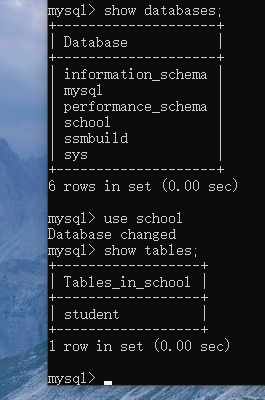
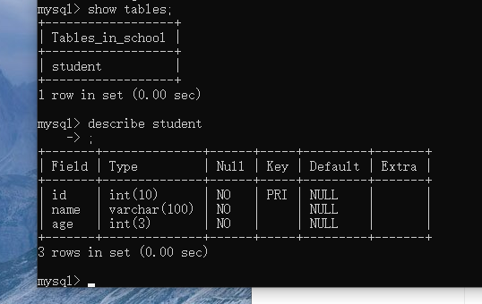
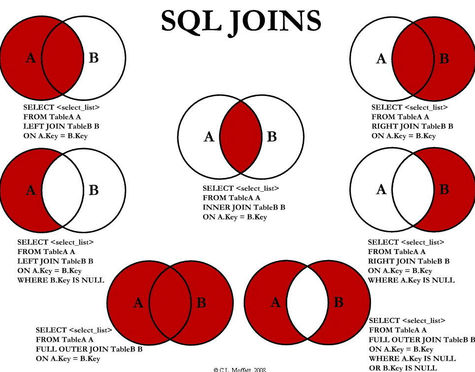
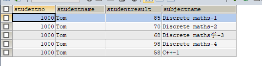

# 1. 初識Database

## 1.1 數據庫分類

**關係型數據庫 SQL：**

- MySQL，Orcale, Sql server, DB2
- 通過表之間，行列之間嘅間隙進行數據儲存


**非關係型數據庫 NoSQL (Not only SQL)：**

- Redis，MongDB
- 通過Object 自身嘅屬性嚟決定


## 1.2 SQL commands 4種分類

1. DDL – Data Definition Language
2. DQL – Data Query Language
3. DML – Data Manipulation Language
4. DCL – Data Control Language


> 主要都係用 DQL 同 DML，因為最多嘅operation就係CRUD  ==


## 1.3 SQL基本語法

開啟數據庫(密碼賬號已經預先設為 root 及 123456): 

```shell
mysql -uroot -p123456      #   -u = user    -p = password
```

> 留意SQL所有嘢都用分號 ; 結尾

SHOW, USE

```shell
show databases;   	# 顯示所有database
use xxxx;         	# 切換到 xxxx database
show tables;     	# 查看當前DB 所有tables
describe xxxx;    	# 查看當前DB中 名為xxxx 的table
create databse xxxx;# 創建名為 xxxx 的DB
-- xxxxx            # SQL 中， -- 為comment (單行)
/**/                # 多行comment
```






# 2. SQL

> **manipulate DB = manipulate table = manipulate data in the table**

## 2.1 intro

1. create DB

```sql
CREATE DATABASE IF NOT EXISTS abc        -- create DB, name = abc
```

2. delete DB

```sql
DROP DATABASE IF EXISTS abc              -- delete DB
```

3. use DB (留意：如果用嘅字係一個keyword，例如user，需要加 ==``== 號括起)

```sql
USE school;                              -- switch to databse school
```

4. show DB

```sql
SHOW DATABASES							 -- show all databases
```


## 2.2 data type 

> 數值

- tinyint		十分小的數據	1byte
- smallint     較小的數據      2bytes
- mediumint中等的數據      3bytes
- **int               標準整數        4bytes**
- bigint          較大的數據     8bytes
- float             小數                 4bytes
- double         高精度小數     8bytes
- decimal        金融計算時使用


> string

- char				0-255
- **varchar       0-65535**
- tinytext        2^8 -1
- **text              2^16-1** 


> 時間日期

- date			YYYY-MM-DD	日期格式
- time          HH:mm:ss       時間格式
- **datetime   YYYY-MM-DD    HH: mm：ss    常用格式**
- **timestamp 1970-1-1到宜家嘅毫秒數**


> null

- 未知


## 2.3 others

> zerofill

- 不足的位數用 0 填充
- 例如需要三位數，但只輸入 5，就會變 005


> auto_increment

- 自動 ++
- 可以設置自動 + 幾多，一般加一


## 2.4 table

```sql
CREATE TABLE IF NOT EXISTS `student` (
	`id`  INT(4) NOT NULL AUTO_INCREMENT COMMENT 'Student id',
	`name` VARCHAR(30) NOT NULL DEFAULT 'null' COMMENT 'Student name',
	`pwd` VARCHAR(30) NOT NULL DEFAULT '123456' COMMENT 'Student password',
	`sex` VARCHAR(10) NOT NULL DEFAULT 'Female' COMMENT 'Student sex',
	`birthday` DATETIME DEFAULT NULL COMMENT 'Student birthday',
	`address` VARCHAR(100) DEFAULT NULL COMMENT 'Student address',
	`email` VARCHAR(50) DEFAULT NULL COMMENT 'Student email',
	PRIMARY KEY(`id`)  -- main key，一個table只有一個，通常係 id

)ENGINE =INNODB DEFAULT CHARSET=utf8
```


## 2.5 common command

``` sql
SHOW CREATE DATABSE [NAME]  -- 查看已創建數據庫的 sql 語句
SHOW CREATE TABLE [NAME]    -- 同上，表
DESC [name]                 -- describe， show 結構
```


## 2.6 alter and delete

```sql
ALTER TABLE name RENAME AS name2				-- alter，修改， rename，重命名
ALTER TABLE name ADD age INT(10)        		-- 在name這個table增加 age int(10)
ALTER TABLE name MODIFY age varchar (3) 		-- 改 data type
ALTER TABLE name CHANGE age age2 varchar (3) 	-- 改名 ， change 舊名 新名 datatype

ALTER TABLE name DROP age						-- 在 name這個table 刪除 age

DROP TABLE IF EXISTS name						-- 刪除table

```


# 3. MySQL 數據管理

## 3.1 foreign key

> 分為 創表時加入FK，及之後增加FK

1. `創表時加入FK`

```sql
CREATE TABLE IF NOT EXISTS `grade`(
	`gradeid` INT(5) NOT NULL AUTO_INCREMENT COMMENT 'Student grade id',
	`gradename` VARCHAR(50) NOT NULL COMMENT 'Student grade name',
	PRIMARY KEY(`gradeid`)
)ENGINE=INNODB DEFAULT CHARSET=utf8


-- student table嘅 `gradeid` 要引用 grade table 嘅 gradeid
-- 1. 定義 foreign key
-- 2. 加constraint `FK_XXXX` (引用)
CREATE TABLE IF NOT EXISTS `student` (
	`id`  INT(4) NOT NULL AUTO_INCREMENT COMMENT 'Student id',
	`name` VARCHAR(30) NOT NULL DEFAULT 'null' COMMENT 'Student name',
	`pwd` VARCHAR(30) NOT NULL DEFAULT '123456' COMMENT 'Student password',
	`sex` VARCHAR(10) NOT NULL DEFAULT 'Female' COMMENT 'Student sex',
	`birthday` DATETIME DEFAULT NULL COMMENT 'Student birthday',
	`address` VARCHAR(100) DEFAULT NULL COMMENT 'Student address',
	`email` VARCHAR(50) DEFAULT NULL COMMENT 'Student email',
	`gradeid` INT(5) NOT NULL COMMENT 'Student grade id',
	KEY `FK_gradeid`(`gradeid`),
	CONSTRAINT `FK_gradeid` FOREIGN KEY (`gradeid`) REFERENCES `grade` (`gradeid`),
    PRIMARY KEY(`id`)  -- main key，一個table只有一個，通常係 id

)ENGINE =INNODB DEFAULT CHARSET=utf8
```

上面例子，`student` table 需要 引用 `grade` table中的 `gradeid`

留意第 19- 21行，首先加入gradeid 呢個key，再用 KEY FK_XXX 加foreign key，最後第21行 加入reference


2. `之後增加FK`

就係用翻 alter 加

```sql
ALTER TABLE `student`
ADD CONSTRAINT `FK_gradeid` FOREIGN KEY (`gradeid`) REFERENCES `grade` (`gradeid`)
```

> 呢個方法好少用，因為
>
> 1. 唔方便
> 2. 唔可以直接刪除`grade` 呢個table，因為有其他table 引用緊
> 3. 當table多果陣，出現多個foreign key，DB會好亂
>
> **最好嘅方法係 用program去實現** 


## 3.2 DML language (重要)

> dabase manipulate language 
>
> - insert
> - update
> - delete


1. `insert`

   >INSERT INTO **table name (col)** VALUES**('data')**

   ```sql
   -- 增加一個data
   INSERT INTO `grade` (`gradename`) values ('year 4') 
   
   -- 增加多個data，留意每組data需要用括號包住，逗號隔開
   INSERT INTO `grade` (`gradename`)
   values ('year 1'), ('year 2'), ('year 3')
   
   -- 同時向多個col增加data
   -- 同樣用括號，逗號分隔
   INSERT INTO `student` (`name`,`pwd`,`sex`)
   VALUES ('Tom', 'abcdefg', 'Male'), ('Jerry', 'aaaah!', 'Male')
   ```


2. `update`

   > UPDATE **table name** SET **col = 'data'** WHERE **xx = xx**

   ```sql
   -- 修改 `student` table 下 `name` 為 'noname'，條件為 id = 2
   UPDATE `student` SET `name`='noname' WHERE id = 2
   
   -- 唔寫條件嘅話，會將所有 `name` 都改做 'noname' !!!!!   
   UPDATE `student` SET `name`='noname'
   
   -- 修改多個col，用逗號隔開
   UPDATE `student` SET `name`='noname', `email`='asdfas@aws.com' WHERE id = 1
   ```


​			**where 常用操作**

​			

| 操作            | 意義             | 例子                     |
| --------------- | ---------------- | ------------------------ |
| =               | 等於             | id = 2                   |
| <>/ !=          | 不等於           | id != 2                  |
| >               | 大於             | id > 2                   |
| <               | 小於             | id < 2                   |
| >=              |                  |                          |
| <=              |                  |                          |
| BETWEEN A AND B | A與B之間   [A,B] | WHERE id between 2 and 5 |
| AND             | 和               |                          |
| OR              | 或               |                          |


3. `delete`

   >DELETE FROM **table name** WHERE **xx = xx**

   ```sql
   -- 刪除 `student` table 中 id = 1嘅row
   DELETE FROM `student` WHERE id = 1
   ```

   

   `truncate` 

   > TRUNCATE TABLE table name

   ```sql
   -- 刪除table 並且重置primary key
   TRUNCATE TABLE `student`
   ```

   

## 3.3 DQL language (最重要)

> database query language
>
> - 所有查詢都用呢個
> - 最常用

> 基礎

```sql
-- 查詢student table下所有數據 (*代表全部)
SELECT * FROM student

-- 查詢student table下指定 col 的數據
SELECT `studentno`, `studentname` FROM student

-- 改名 (只限顯示)，查詢之餘顯示其他名，方便閱讀
SELECT `studentno` AS 學號, `studentname` AS 名字 FROM student 

-- function CONCAT(a,b)，將兩項連接並顯示
SELECT CONCAT('姓名: ', studentname) AS 'all name' FROM student
```

如果row name未能準確表達意思，可以用第三個，select as，改名，方便閱讀


> distinct，查詢不重複的資料

```sql
SELECT DISTINCT `studentno` FROM student
```


### 3.3.1 模糊查詢

| operant     | meaning           | description                                         |
| ----------- | ----------------- | --------------------------------------------------- |
| IS NULL     | A is null         |                                                     |
| IS NOT NULL | A is not null     |                                                     |
| BETWEEN     | A between B and C | A在B及C之間                                         |
| `LIKE`      | A like B          | A 與 B **相似**，例如 C++，search ‘++’ 都可以       |
| `IN`        | A in {B,C,D,E}    | A在數列其中一個都可以，一定要係**具體值，完全一樣** |

```sql
-- % 代表任意數項字符， _ 代表一個字符
-- 選擇名為劉xxx (幾多個字都得) 的同學
SELECT `studentname` FROM student 
WHERE studentname LIKE '劉%'

-- 選擇名為劉X (只有一個字) 的同學
-- 如果選擇劉XX (兩個字)，則用 '劉__'  (兩個下劃線)
SELECT `studentname` FROM student
WHERE studentname LIKE '劉_'

-- 選擇名字中間有 家 字的同學
SELECT `studentname` FROM student
WHERE studentname LIKE '%家%'

-- 查詢studentno 為 1001,1002,1003 的同學
SELECT `studentname` FROM student
WHERE `studentno` IN (1001,1002,1003)
```


### 3.3.2 joins



| types of join | description                                                  |
| ------------- | ------------------------------------------------------------ |
| inner join    | 只要其中一個table存在該數據就ok                              |
| left join     | 以左表為主表，必定包含左表所有數據，即使右表有部分數據在左表不存在 |
| right join    | 以右表為主表，必定包含右表所有數據，即使左表有部分數據在右表不存在 |

**left join 例子，如果左表有個 student id = 2000，但係右表無，join完都會顯示student id = 2000果個人，因為係以左表為主表，right join同理**

```sql
/*
  1. 選擇所有所需嘅資料
  2. 決定用邊個join 
  3. 條件
*/

/*
  背景: 需要result table及student table嘅
  studentName, studentno, subjectno, studentresult 資料
  其中後三個result table有，而studentName得student table有
  呢兩個table入面，studentno 呢個key係一樣
  所以可以用呢個作連接
*/

-- 1. inner join (兩邊都要有)
SELECT s.`studentno`, `studentname`, `subjectno`,`studentresult`
FROM student s       -- 後面果個係reference，代表一個table
INNER JOIN result r
ON s.`studentno` = r.`studentno`

-- 2. left join (左邊為主表)
SELECT s.`studentno`, `studentname`, `subjectno`,`studentresult`
FROM student s
LEFT JOIN result r
ON s.`studentno` = r.`studentno`
```

> 三表例子

```sql
/*
  背景：需要result table，student table及subject table
  三個table中的資料
  student table: student number, student name
  result table: student number, subject number, subject result
  subject table: subject number, subject name
  需求: student number, student name, subject name, subject result
  可以見到，student table及result table可用 student number相連
  而subject table及result table可用 subject number相連
*/

SELECT s.`studentno`,`studentname`,`studentresult`,`subjectname`
FROM student s
RIGHT JOIN result r
ON s.`studentno`= r.`studentno`
LEFT JOIN `subject` sub  -- 以上面已經join好嘅表為基礎，left join
ON r.`subjectno` = sub.`subjectno`
```

