# 1. 基本概念

## 1.1 靜態與動態

- 靜態web:

  + html, css
  + 所有人睇到嘅網站一樣！

- 動態web:

  - 每個人睇到嘅都唔一樣，例如youtube，會根據喜好推介
  - 可以與數據區交互

  **tech stack: Servlet/JSP, ASP, PHP**

# 2. web server

## 2.1 3種languages

- ASP:
  + 頁面亂，維護成本高

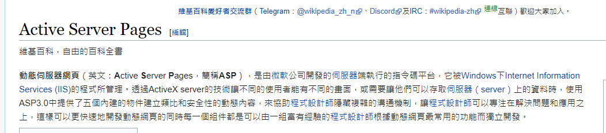

- PHP:
  - 簡單，速度快
  - 無法支撐大量訪問

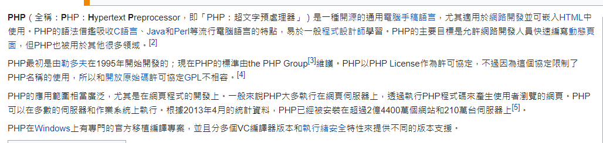

- Servlet/JSP
  + syntax ~ ASP
  + B/S 架構 (browser server)


## 2.2 server

Tomcat係技術先進，性能穩定嘅輕量級應用服務器 (主要係免費)


呢度會用Tomcat呢個server


# 3. 發佈網站

1. 自己寫web
2. 將自己寫嘅web，放係server (tomcat)指定嘅web file (webapps)下

> 網站應有嘅結構
>
> ```java
> --webapps (Tomcat server嘅web目錄)
> 	--ROOT
> 	--Yourfile 		(網站嘅目錄名)
> 		--classes	(java program)
> 		--lib		(web所依賴嘅 .jar 文件)
> 	--index.html	(default homepage)
> 	--static		(資源文件)
> 		--css
> 			--style.css
> 		--js
> 		--img
>     --....
> ```
>


# 4. 工具

- Maven
  + **Maven** is a [build automation](https://en.wikipedia.org/wiki/Build_automation) tool used primarily for [Java](https://en.wikipedia.org/wiki/Java_(programming_language)) projects. 
  + 簡單而言，由於學javaweb需要大量 . jar 文件，如果我地一個一個手動下載，導入，太慢
  + 所以需要一個工具，去幫我地自動導入.jar，就係Maven啦！
- Tomcat
  - Tomcat provides a "pure Java" [HTTP](https://en.wikipedia.org/wiki/Hypertext_Transfer_Protocol) [web server](https://en.wikipedia.org/wiki/Web_server) environment in which [Java](https://en.wikipedia.org/wiki/Java_(programming_language)) code can run.
  - 可以視作web server


# 5. Servlet

## 5.1 簡介	

- Servlet係Sun公司整出嚟嘅技術，用作開發動態web
- 如果你想整一個Servlet program，只需要兩步:
  - 寫一個class，實現Servlet interface
  - 將寫好嘅class裝落web server中

> 需要Servlet嘅深層原因如下，複製自 知乎: @柳树
>
> https://www.zhihu.com/question/21416727

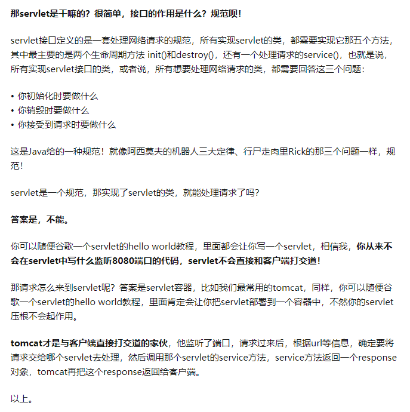

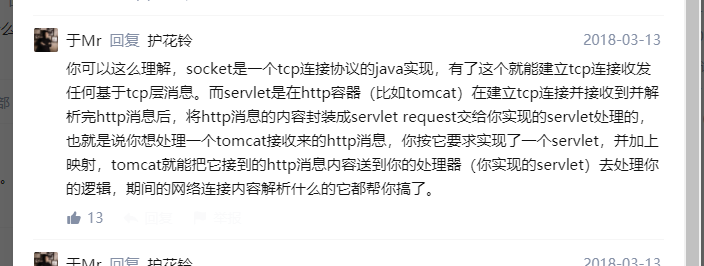

## 5.2 創建servlet項目

1. 係IDEA整一個新嘅Maven項目，del左佢嘅src (呢個空嘅pj就係Maven主pj)

2. Maven父子級pj

   父級項目中pom.xml中有

   ```xml
       <modules>
           <module>servlet-01</module>
       </modules>
   ```

   子級項目中pom.xml有

   ```xml
   <parent>
   	......
       ......
   </parent>
   ```

   子級項目可以直接用

   ```java
   son extends father
   ```

3. Maven環境優化

   1. 修改web.xml為最新版本

      ```xml
      <?xml version="1.0" encoding="UTF-8"?>
      <web-app xmlns="http://xmlns.jcp.org/xml/ns/javaee"
               xmlns:xsi="http://www.w3.org/2001/XMLSchema-instance"
               xsi:schemaLocation="http://xmlns.jcp.org/xml/ns/javaee
                            http://xmlns.jcp.org/xml/ns/javaee/web-app_4_0.xsd"
               version="4.0"
               metadata-complete="true">
      </web-app>
      ```

   2. 搭建maven結構


## 5.3 HelloServlet

### 5.3.1 開始寫Servlet

1. 寫一個class

2. 實現Servlet interface (繼承HttpServlet)

   ```java
   public class HelloServlet extends HttpServlet {
   
       // doGet doPost只係提交嘅唔同方式，而內部邏輯係好相似，所以可以互相用
       @Override
       protected void doGet(HttpServletRequest req, HttpServletResponse resp) throws ServletException, IOException {
           PrintWriter writer = resp.getWriter();
           writer.print("Hello, Servlet");
       }
   
       @Override
       protected void doPost(HttpServletRequest req, HttpServletResponse resp) throws ServletException, IOException {
           doGet(req, resp);
       }
   }
   ```

   

> 點解要繼承HttpServlet？因為我地要做request同response，而HttpServlet呢個interface，一步一步搵到頂層嘅話就會係Servlet interface，入面有service()呢個function做request同response
>
> 層級:
>
> Servlet -> GenericServlet -> HttpServlet (去到呢一步先真正實現service，前兩個得個function name)
>
> 而我地就係要寫一個class繼承HttpServlet，再重寫

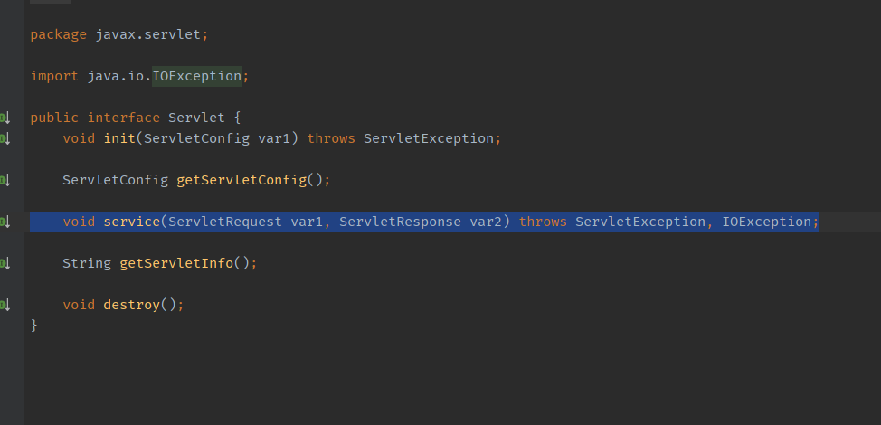

### 5.3.2 寫Servlet同瀏覽器之間嘅映射

映射: 建立關係。點解需要建立呢個關係？因為我地寫嘅係JAVA，如果需要通過瀏覽器訪問，係需要一個中間商web server(tomcat)去幫手，但係tomcat點知道你俾嘅url係駁去邊度呢？所以我地需要係web.xml 入面註冊我地寫嘅servlet

web.xml嘅作用如下：

**It instructs the servlet container(tomcat) .......**

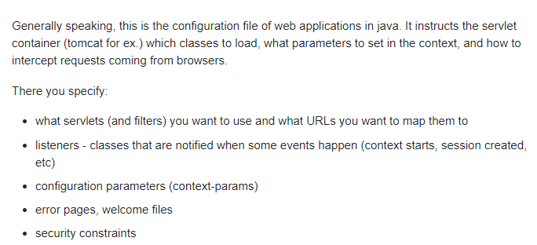

```xml
    <!--1. 註冊servlet-->
    <servlet>
        <servlet-name>hello</servlet-name>
        <servlet-class>com.test.servlet.HelloServlet</servlet-class>
    </servlet>
    <!--2. servlet的請求路徑 (server 見到呢個 /hello去邊度搵? 就係去翻com.test.servlet.HelloServlet)-->
    <servlet-mapping>
        <servlet-name>hello</servlet-name>
        <url-pattern>/hello</url-pattern>
    </servlet-mapping>
```


### 5.3.3 配置tomcat

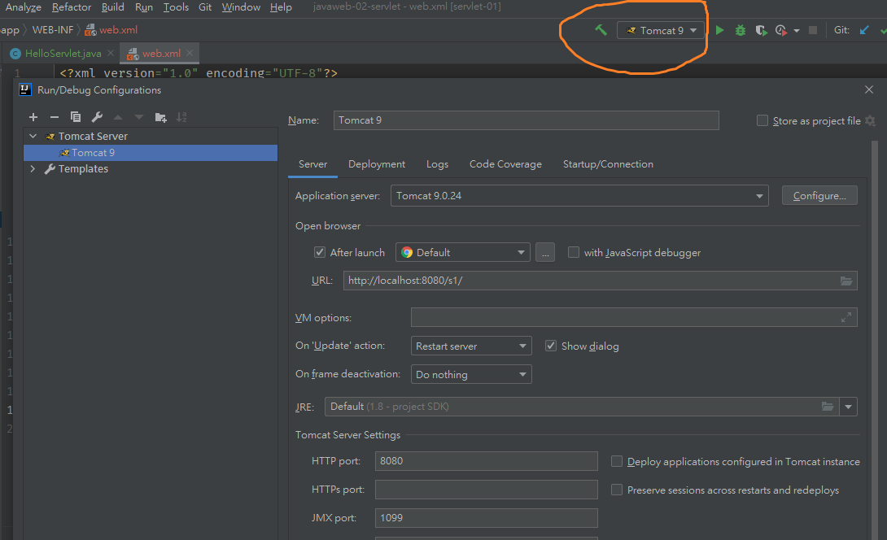

> 需要設置application server，Port，以及Deployment

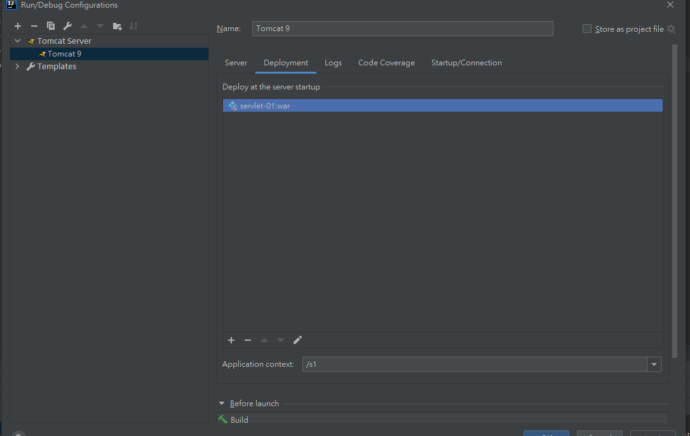

Deployment下新增一個.war，application context相當於係主頁嘅url ?

所以設置為 /s1後，主頁url = http://localhost:8080/s1/

默認情況下，主頁會顯示 Hello, world，如下

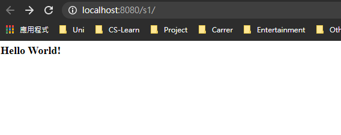

### 5.3.4 啟動！

記唔記得頭先係web.xml寫左映射關係？而寫嘅名係

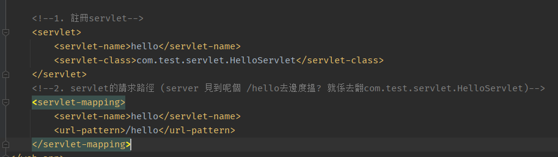

**原理**

當我地輸入http://localhost:8080/s1/hello 之後，tomcat就會去呢度搵，/hello究竟係邊個，佢先睇mapping見到 /hello 呢個url 個名係 hello，再去搵 hello連去邊個java file~

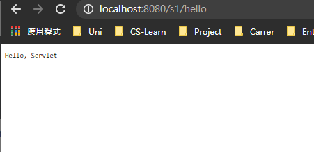

> 成功！


## 5.4 ServletContext

**web container(tomcat) 啟動嘅時候，會為成個web program整一個ServletContext object，呢個object就係當前嘅web program**

呢個object嘅作用：

### 5.4.1共享數據

例如係 1號servlet保存嘅data，可以經過ServletContext呢個objet(中間商) 送去2號servlet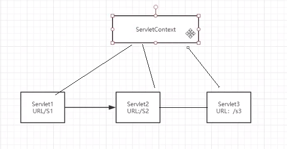


例如宜家有一個servlet係咁

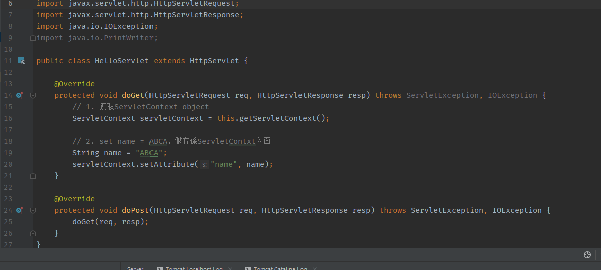

> set左個name，並且放係ServletContext object度

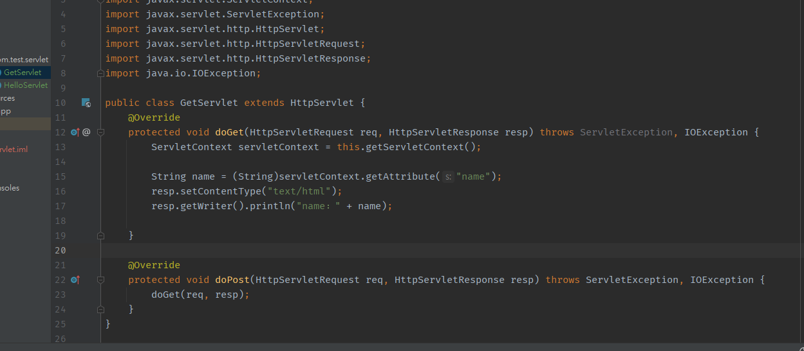

> 咁係第二個Servlet program，就可以用翻ServletContext呢個object去讀，留意要強制轉換佢嘅type
>
> 最後用翻resp writer output
>
> **留意呢個係第二個新開嘅servlet program，並且要係web.xml加翻佢嘅映射**

> 結果如下 (先去第二個servlet program)


因為我未去第一個servlet program set attribute，所以第二個servlet program讀唔到數據，顯示null

入一次Hello再入第二個，顯示如下

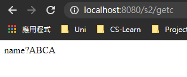

### 5.4.2 獲取web.xml configuration

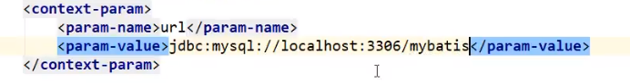

例如係web.xml入面已經set好一啲嘢，e.gg mysql，咁就可以用翻呢個object獲取

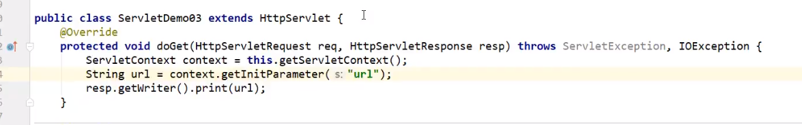


### 5.4.3 轉發請求 (dispatch)

一個Servlet收到請求後，可以轉發去其他servlet

```java
package com.test.servlet;

import javax.servlet.RequestDispatcher;
import javax.servlet.ServletContext;
import javax.servlet.ServletException;
import javax.servlet.http.HttpServlet;
import javax.servlet.http.HttpServletRequest;
import javax.servlet.http.HttpServletResponse;
import java.io.IOException;

public class Dispatch extends HttpServlet {
    @Override
    protected void doGet(HttpServletRequest req, HttpServletResponse resp) throws ServletException, IOException {
        ServletContext servletContext = this.getServletContext();

        // RequestDispatcher係專門做轉發嘅class
        // 係呢一步先攞到轉發嘅位置 (位置需要係web.xml登記)
        RequestDispatcher requestDispatcher = servletContext.getRequestDispatcher("/getc");// 轉發嘅位置
        // 藉助req 及 resp轉發
        requestDispatcher.forward(req,resp);

    }

    @Override
    protected void doPost(HttpServletRequest req, HttpServletResponse resp) throws ServletException, IOException {
        doGet(req, resp);
    }
}
```

> > **留意轉發係唔需要寫項目名，直接寫/文件位置 (係xml登記嘅位置)就得！！**
> >
> > **而redirect係要寫項目名**
>
> 轉發嘅Servlet有以下內容

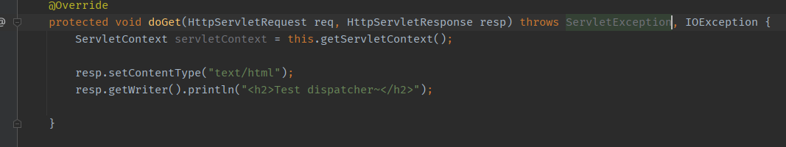

> 結果：dispatch係xml登記嘅係轉發嘅Servlet，實際上無任何內容output，但係瀏覽器輸出左呢一句
>
> 可以見到佢將請求轉發到第二個Servlet

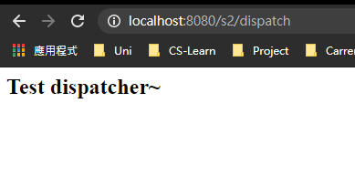

### 5.4.4 獲取resource file

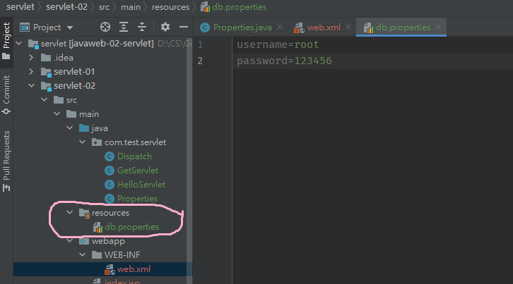

> 先係resources file入面起一個新嘅文件

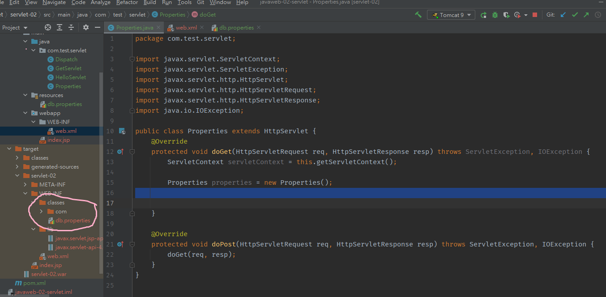

> 照計直接用properties.load()，入面寫翻resource file嘅地址就ok，但係宜家因為所有嘢都經過tomcat 呢個web server sd黎，並不能直接確定佢嘅地址
>
> **寫/src/main/resources/db.properties係無用**
>
> 所以要run一次個program，係target搵翻呢個file係邊，就係classes/com 下面
>
> **要寫/WEB-INF/classes/db.properties**
>
> **有可能無係classes下面生成呢個file，咁就要係web.xml入面加下面內容**

```xml
  <build>
        <resources>
            <resource>
                <directory>src/main/resources</directory>
                <includes>
                    <include>**/*.properties</include>
                    <include>**/*.xml</include>
                </includes>
            </resource>
            <resource>
                <directory>src/main/java</directory>
                <includes>
                    <include>**/*.properties</include>
                    <include>**/*.xml</include>
                </includes>
                <filtering>true</filtering>
            </resource>
        </resources>
    </build>
```

> 其實係resources file 放係Java下面or 放係resources 下面，生成嘅位置都會擺係classes
>
> 之後再用Properties 呢個class去攞db.properties入面嘅嘢
>
> **需要用stream幫手**

```java
package com.test.servlet;

import javax.servlet.ServletContext;
import javax.servlet.ServletException;
import javax.servlet.http.HttpServlet;
import javax.servlet.http.HttpServletRequest;
import javax.servlet.http.HttpServletResponse;
import java.io.IOException;
import java.io.InputStream;
import java.util.Properties;

public class PropertiesServlet extends HttpServlet {
    @Override
    protected void doGet(HttpServletRequest req, HttpServletResponse resp) throws ServletException, IOException {
        ServletContext servletContext = this.getServletContext();
        InputStream is = servletContext.getResourceAsStream("/WEB-INF/classes/db.properties");

        Properties prop = new Properties();
        prop.load(is);
        String username = prop.getProperty("username"); // db.properties下的資源
        String pwd      = prop.getProperty("password");
        resp.getWriter().print("Username: " + username + "\nPassword: " + pwd);
    }

    @Override
    protected void doPost(HttpServletRequest req, HttpServletResponse resp) throws ServletException, IOException {
        doGet(req, resp);
    }
}
```


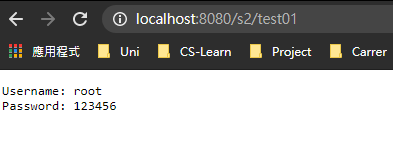

> 成功！


## 5.5 Servlet Response

### 5.5.1 下載文件

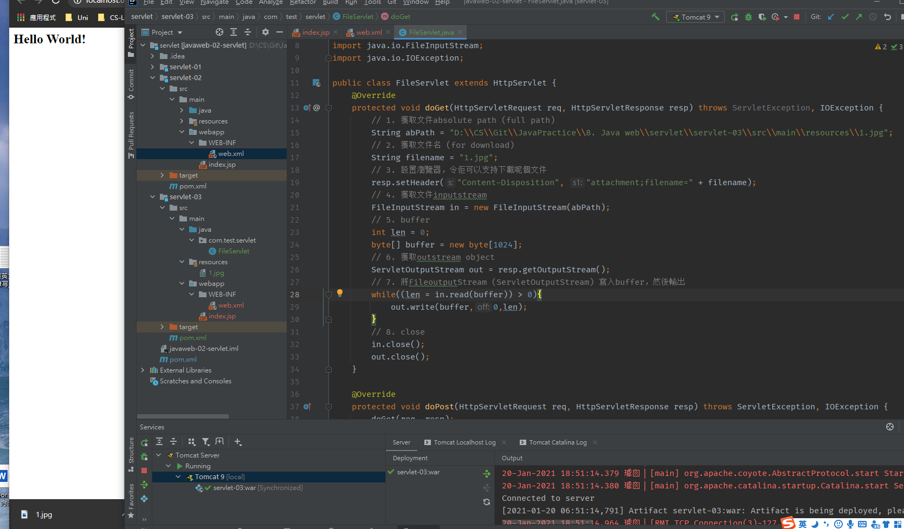

留意左下角，輸入url後直接下載果個file

```java
package com.test.servlet;

import javax.servlet.ServletException;
import javax.servlet.ServletOutputStream;
import javax.servlet.http.HttpServlet;
import javax.servlet.http.HttpServletRequest;
import javax.servlet.http.HttpServletResponse;
import java.io.FileInputStream;
import java.io.IOException;

public class FileServlet extends HttpServlet {
    @Override
    protected void doGet(HttpServletRequest req, HttpServletResponse resp) throws ServletException, IOException {
        // 1. 獲取文件absolute path (full path)
        String abPath = "D:\\CS\\Git\\JavaPractice\\8. Java web\\servlet\\servlet-03\\src\\main\\resources\\1.jpg";
        // 2. 獲取文件名 (for download)
        String filename = "1.jpg";
        // 3. 設置瀏覽器，令佢可以支持下載呢個文件
        resp.setHeader("Content-Disposition", "attachment;filename=" + filename);
        // 4. 獲取文件inputstream
        FileInputStream in = new FileInputStream(abPath);
        // 5. buffer
        int len = 0;
        byte[] buffer = new byte[1024];
        // 6. 獲取outstream object
        ServletOutputStream out = resp.getOutputStream();
        // 7. 將FileoutputStream (ServletOutputStream) 寫入buffer，然後輸出
        while((len = in.read(buffer)) > 0){
            out.write(buffer,0,len);
        }
        // 8. close
        in.close();
        out.close();
    }

    @Override
    protected void doPost(HttpServletRequest req, HttpServletResponse resp) throws ServletException, IOException {
        doGet(req, resp);
    }
}
```

### 5.5.2 redirect (重要)

> A向B 呢個server sd request，B通知A：我呢度無，你去C搵，A收到後再向C sd request
>
> 常見場景：登陸後，成功則跳轉到第二個page
>
> **留意轉發係唔需要寫項目名，直接寫/文件位置 (係xml登記嘅位置)就得！！**
>
> **而redirect係要寫項目名**

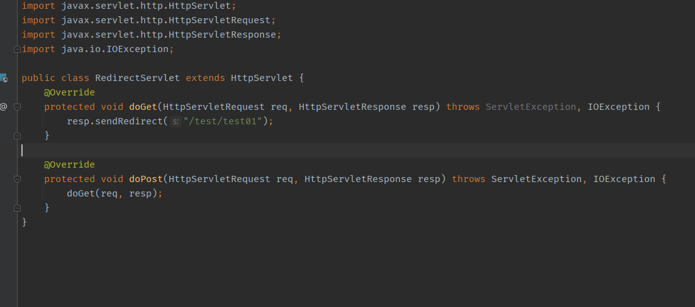

好簡單，就係直接set佢跳去邊個url: /test01 係之前嘅file，呢個file會下載一個jpg，**留意只寫/test01係唔得，要寫埋呢個project嘅base url (就係/test)，所以加埋係/test/test01**

>呢個sendRedirect()嘅底層原理有2步
>
>1. resp.setHeader("Location", "/test/test01");   //將location換做呢個
>
>2. resp.setStatus(302); // 而302 係server就係 = 文件移動
>
>   


## 5.6 Servlet Request

### 5.6.1 getParameter

> 從表單中獲取數據，表單如下

```jsp
<html>
<body>
<h2>Hello World!</h2>

<!--${pageContext.request.contextPath} 用作表示當前項目，亦姐係/test (/test就係當前項目)-->
<form action="${pageContext.request.contextPath}/login" method="post">
    Username: <input type="text" name="username"> <br>
    Password: <input type="password" name="password"> <br>
    <input type="checkbox" name="hobbies" class="hobby-1"> girls
    <input type="checkbox" name="hobbies" class="hobby-2"> code
    <input type="checkbox" name="hobbies" class="hobby-3"> movie
    <input type="checkbox" name="hobbies" class="hobby-4"> games <br>
    <input type="submit">
</form>
</body>
</html>
```

> 入面有username，pwd，幾個checkbox；Servlet如下

```java
package com.test.servlet;

import javax.servlet.ServletException;
import javax.servlet.http.HttpServlet;
import javax.servlet.http.HttpServletRequest;
import javax.servlet.http.HttpServletResponse;
import java.io.IOException;
import java.util.Arrays;

public class LoginServlet extends HttpServlet {
    @Override
    protected void doGet(HttpServletRequest req, HttpServletResponse resp) throws ServletException, IOException {
        String username = req.getParameter("username"); // 接收name="username"嘅參數
        String password = req.getParameter("password"); // 接收name="password"嘅參數
        String[] hobbies = req.getParameterValues("hobbies");  // hobbies checkbox有好多個，所以用呢個String array收

        System.out.println(username); // console output result
        System.out.println(password);
        System.out.println(Arrays.toString(hobbies));

        // dispatch，留意dispatch唔寫context name，直接寫地址，因為係內部轉發
        req.getRequestDispatcher("/ok.jsp").forward(req,resp); 
    }

    @Override
    protected void doPost(HttpServletRequest req, HttpServletResponse resp) throws ServletException, IOException {
        doGet(req, resp);
    }
}
```


# 6. Cookies and Session

**分別**

| Cookies                                                      | Session                                                    |
| ------------------------------------------------------------ | ---------------------------------------------------------- |
| 保存在客戶端                                                 | 保存在server                                               |
| 儲存量有限                                                   | 儲存量無限                                                 |
| 取決於服務器發送的cookie過期時間，可以手動設置，通常近乎於不會消失 | 在用戶關閉瀏覽器後立即刪除，不刷新頁面的話，大約半小時刪除 |
| 大小限制為4kb                                                | 沒有大小限制                                               |

## 6.1 Cookie

> 以下例子模擬發送及接受cookie，每次發送一個系統當前時間

```java
package com.test.servlet;

import javax.servlet.ServletException;
import javax.servlet.http.Cookie;
import javax.servlet.http.HttpServlet;
import javax.servlet.http.HttpServletRequest;
import javax.servlet.http.HttpServletResponse;
import java.io.IOException;
import java.io.PrintWriter;
import java.util.Date;

public class CookiesDemo01 extends HttpServlet {
    @Override
    protected void doGet(HttpServletRequest req, HttpServletResponse resp) throws ServletException, IOException {
        req.setCharacterEncoding("utf-8");
        resp.setCharacterEncoding("utf-8");

        PrintWriter out = resp.getWriter();
        Cookie[] cookies = req.getCookies(); // get cookie array
        if(cookies != null){ // 如果佢有cookies
            boolean hasCookie = false;
            for(int i = 0; i < cookies.length; i++){
                Cookie cookie = cookies[i];
                if(cookie.getName().equals("lastLoginTime")){ //而其中一個係我send嘅 (lastLoginTime)
                    hasCookie = true;
                    long lastLoginTime = Long.parseLong(cookie.getValue()); // 用long獲取
                    Date date = new Date(lastLoginTime); // 轉為日期
                    out.write("Your last login time is: " + date.toString()); // sd response
                }
            }
            if(hasCookie == false) { // 無cookies，第一次進入本站
                out.write("Nice to meet you! Hope to see u again");
            }
        }

        // 無論第一次進入本站與否，重新sd一個時間嘅cookie，用以新建/刷新上次登入時間
        Cookie cookie = new Cookie("lastLoginTime", System.currentTimeMillis() + "");
        resp.addCookie(cookie); // 發送cookie
    }

    @Override
    protected void doPost(HttpServletRequest req, HttpServletResponse resp) throws ServletException, IOException {
        doGet(req, resp);
    }
}
```

### 6.1.1 細節

- 一個cookie只能保存一個信息
- 一個domain只能保存最多20個cookies
- 一個cookie大小限制為4kb
- 整個瀏覽器cookies上限為300
- 若不設置cookie.setMaxAge() (cookie有效時間)，關閉網站後cookie自動刪除 

## 6.2 中文顯示亂碼問題

> 如果cookie value 設置為中文，係瀏覽器output時可能遇到亂碼問題
>
> 可以係send cookie時先將中文字encode，接收時再decode，如下

```java
URLEncoder.encode("我是中文字","UTF-8");
URLDecoder.decode(cookie.getvalue(),"UTF-8")
```

