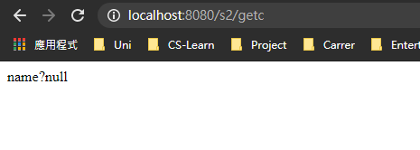

# 1. 基本概念

## 1.1 靜態與動態

- 靜態web:

  + html, css
  + 所有人睇到嘅網站一樣！

- 動態web:

  - 每個人睇到嘅都唔一樣，例如youtube，會根據喜好推介
  - 可以與數據區交互

  **stack: Servlet/JSP, ASP, PHP**

# 2. web server

## 2.1 3種languages

- ASP:
  + 頁面亂，維護成本高


- PHP:
  - 簡單，速度快
  - 無法支撐大量訪問


- Servlet/JSP
  + syntax ~ ASP
  + B/S 架構 (browser server)


## 2.2 server

Tomcat係技術先進，性能穩定嘅輕量級應用服務器 (主要係免費)


呢度會用Tomcat呢個server


# 3. 發佈網站

1. 自己寫web
2. 將自己寫嘅web，放係server (tomcat)指定嘅web file (webapps)下

> 網站應有嘅結構
>
> ```java
> --webapps (Tomcat server嘅web目錄)
> 	--ROOT
> 	--Yourfile 		(網站嘅目錄名)
> 		--classes	(java program)
> 		--lib		(web所依賴嘅 .jar 文件)
> 	--index.html	(default homepage)
> 	--static		(資源文件)
> 		--css
> 			--style.css
> 		--js
> 		--img
>     --....
> ```
>


# 4. 工具

- Maven
  + **Maven** is a [build automation](https://en.wikipedia.org/wiki/Build_automation) tool used primarily for [Java](https://en.wikipedia.org/wiki/Java_(programming_language)) projects. 
  + 簡單而言，由於學javaweb需要大量 . jar 文件，如果我地一個一個手動下載，導入，太慢
  + 所以需要一個工具，去幫我地自動導入.jar，就係Maven啦！
- Tomcat
  - Tomcat provides a "pure Java" [HTTP](https://en.wikipedia.org/wiki/Hypertext_Transfer_Protocol) [web server](https://en.wikipedia.org/wiki/Web_server) environment in which [Java](https://en.wikipedia.org/wiki/Java_(programming_language)) code can run.
  - 可以視作web server


# 5. Servlet

## 5.1 簡介	

- Servlet係Sun公司整出嚟嘅技術，用作開發動態web
- 如果你想整一個Servlet program，只需要兩步:
  - 寫一個class，implement Servlet interface (繼承佢個仔 HttpServlet就得)
  - 將寫好嘅class裝落web server中

> 需要Servlet嘅深層原因如下，複製自 知乎: @柳树
>
> https://www.zhihu.com/question/21416727


## 5.2 創建servlet項目

1. 係IDEA整一個新嘅Maven項目，del左佢嘅src (呢個空嘅pj就係Maven主pj)

2. Maven父子級pj

   父級項目中pom.xml中有

   ```xml
       <modules>
           <module>servlet-01</module>
       </modules>
   ```

   子級項目中pom.xml有

   ```xml
   <parent>
   	......
       ......
   </parent>
   ```

   子級項目可以直接用

   ```java
   son extends father
   ```

3. Maven環境優化

   1. 修改web.xml為最新版本

      ```xml
      <?xml version="1.0" encoding="UTF-8"?>
      <web-app xmlns="http://xmlns.jcp.org/xml/ns/javaee"
               xmlns:xsi="http://www.w3.org/2001/XMLSchema-instance"
               xsi:schemaLocation="http://xmlns.jcp.org/xml/ns/javaee
                            http://xmlns.jcp.org/xml/ns/javaee/web-app_4_0.xsd"
               version="4.0"
               metadata-complete="true">
      </web-app>
      ```

   2. 搭建maven結構


## 5.3 HelloServlet

### 5.3.1 開始寫Servlet

1. 寫一個class

2. 實現Servlet interface (繼承HttpServlet)

   ```java
   public class HelloServlet extends HttpServlet {
   
       // doGet doPost只係提交嘅唔同方式，而內部邏輯係好相似，所以可以互相用
       @Override
       protected void doGet(HttpServletRequest req, HttpServletResponse resp) throws ServletException, IOException {
           PrintWriter writer = resp.getWriter();
           writer.print("Hello, Servlet");
       }
   
       @Override
       protected void doPost(HttpServletRequest req, HttpServletResponse resp) throws ServletException, IOException {
           doGet(req, resp);
       }
   }
   ```

   

> 點解要繼承HttpServlet？因為我地要做request同response，而HttpServlet呢個interface，一步一步搵到頂層嘅話就會係Servlet interface，入面有service()呢個function做request同response
>
> 層級:
>
> **Servlet -> GenericServlet -> HttpServlet (去到呢一步先真正實現service，前兩個得個function name)**
>
> 而我地就係要寫一個class繼承HttpServlet，再重寫


### 5.3.2 寫Servlet同瀏覽器之間嘅映射

映射: 建立關係。點解需要建立呢個關係？因為我地寫嘅係JAVA，如果需要通過瀏覽器訪問，係需要一個中間商(container) web server(tomcat)去幫手，但係tomcat點知道你俾嘅url係駁去邊度呢？所以我地需要係web.xml 入面註冊我地寫嘅servlet

web.xml嘅作用如下：

**It instructs the servlet container(tomcat) .......**


```xml
    <!--1. 註冊servlet-->
    <servlet>
        <servlet-name>hello</servlet-name>     <!-- 3 -->
        <servlet-class>com.test.servlet.HelloServlet</servlet-class>  <!-- 4 -->
    </servlet>
    <!--2. servlet的請求路徑 (server 見到呢個 /hello去邊度搵? 就係去翻com.test.servlet.HelloServlet)-->
    <servlet-mapping>
        <servlet-name>hello</servlet-name>     <!-- 2 -->
        <url-pattern>/hello</url-pattern>      <!-- 1 -->
    </servlet-mapping>
```


### 5.3.3 配置tomcat


> 需要設置application server，Port，以及Deployment


Deployment下新增一個.war，application context相當於係主頁嘅url ?

所以設置為 /s1後，主頁url = http://localhost:8080/s1/

默認情況下，主頁會顯示 Hello, world，如下


### 5.3.4 啟動！

記唔記得頭先係web.xml寫左映射關係？而寫嘅名係


**原理**

當我地輸入http://localhost:8080/s1/hello 之後，tomcat就會去呢度搵，/hello究竟係邊個，佢先睇mapping見到 /hello 呢個url 個名係 hello，再去搵 hello連去邊個java file~


> 成功！


## 5.4 ServletContext

**web container(tomcat) 啟動嘅時候，會為成個web program整一個ServletContext object，呢個object就係當前嘅web program**

呢個object嘅作用：

### 5.4.1共享數據

例如係 1號servlet保存嘅data，可以經過ServletContext呢個objet(媒介) 送去2號servlet


例如宜家有一個servlet係咁


> set左個name，並且放係ServletContext object度


> 咁係第二個Servlet program，就可以用翻ServletContext呢個object去讀，留意要強制轉換佢嘅type
>
> 最後用翻resp writer output
>
> **留意呢個係第二個新開嘅servlet program，要用browser開嘅話要係web.xml加翻佢嘅映射**

> 結果如下 (先去第二個servlet program)



因為未去第一個servlet program set `name` 呢個attribute，所以第二個servlet program讀唔到數據，顯示null

入一次Hello再入第二個，顯示如下


成功從ServletContext獲取數據


### 5.4.2 獲取web.xml configuration


例如係web.xml入面已經set好一啲嘢，e.g mysql，咁就可以用翻呢個object獲取


### 5.4.3 轉發請求 (dispatch)

一個Servlet收到請求後，可以轉發去其他servlet

```java
package com.test.servlet;

import javax.servlet.RequestDispatcher;
import javax.servlet.ServletContext;
import javax.servlet.ServletException;
import javax.servlet.http.HttpServlet;
import javax.servlet.http.HttpServletRequest;
import javax.servlet.http.HttpServletResponse;
import java.io.IOException;

public class Dispatch extends HttpServlet {
    @Override
    protected void doGet(HttpServletRequest req, HttpServletResponse resp) throws ServletException, IOException {
        ServletContext servletContext = this.getServletContext();

        // RequestDispatcher係專門做轉發嘅class
        // 1. 先攞到轉發嘅位置 (位置需要係web.xml登記)
        RequestDispatcher requestDispatcher = servletContext.getRequestDispatcher("/getc");// 轉發嘅位置
        // 2. 藉助req 及 resp轉發
        requestDispatcher.forward(req,resp);

    }

    @Override
    protected void doPost(HttpServletRequest req, HttpServletResponse resp) throws ServletException, IOException {
        doGet(req, resp);
    }
}
```

> > **留意轉發係唔需要寫項目名，直接寫/文件位置 (係xml登記嘅位置)就得！！**
> >
> > **而redirect係要寫項目名**
>
> 轉發嘅Servlet有以下內容


> 結果：dispatch呢個Servlet係無output，但係瀏覽器輸出左呢一句
>
> 可以見到佢將請求轉發到第二個Servlet (就係上圖果個)


## 5.5 Servlet Response

### 5.5.1 下載文件


留意左下角，輸入url後直接下載果個file

```java
package com.test.servlet;

import javax.servlet.ServletException;
import javax.servlet.ServletOutputStream;
import javax.servlet.http.HttpServlet;
import javax.servlet.http.HttpServletRequest;
import javax.servlet.http.HttpServletResponse;
import java.io.FileInputStream;
import java.io.IOException;

public class FileServlet extends HttpServlet {
    @Override
    protected void doGet(HttpServletRequest req, HttpServletResponse resp) throws ServletException, IOException {
        // 1. 獲取文件absolute path (full path)
        String abPath = "D:\\CS\\Git\\JavaPractice\\8. Java web\\servlet\\servlet-03\\src\\main\\resources\\1.jpg";
        // 2. 設置下載時顯示嘅文件名
        String filename = "1.jpg";
        // 3. 設置瀏覽器，令佢可以支持下載呢個文件
        resp.setHeader("Content-Disposition", "attachment;filename=" + filename);
        // 4. 獲取文件inputstream
        FileInputStream in = new FileInputStream(abPath);
        // 5. buffer
        int len = 0;
        byte[] buffer = new byte[1024];
        // 6. 獲取outstream object
        ServletOutputStream out = resp.getOutputStream();
        // 7. 將FileoutputStream (ServletOutputStream) 寫入buffer，然後輸出
        while((len = in.read(buffer)) > 0){
            out.write(buffer,0,len);
        }
        // 8. close
        in.close();
        out.close();
    }

    @Override
    protected void doPost(HttpServletRequest req, HttpServletResponse resp) throws ServletException, IOException {
        doGet(req, resp);
    }
}
```


### 5.5.2 redirect (重要)

> A (client)向B (server) send request，B通知A：我呢度無，你去C搵，A收到後再向C sd request
>
> 常見場景：登陸後，成功則跳轉到第二個page
>
> **留意dispatch係唔需要寫項目名，因為轉發係發生係server`內部`，直接寫/文件位置 (係xml登記嘅位置)就得！！**
>
> **而redirect係要寫項目名，因為要俾一個其他server嘅address佢，發生係`外部`**


好簡單，就係直接set佢跳去邊個url: /test01 係之前寫嘅file，呢個file會下載一個jpg，**留意只寫/test01係唔得，要寫埋呢個project嘅base url (就係/test)，所以加埋係/test/test01**

>呢個sendRedirect()嘅底層原理有2步
>
>1. resp.setHeader("Location", "/test/test01");   //將location換做新address
>
>2. resp.setStatus(302); // 而302 係server就係 = 文件移動
>
>   


## 5.6 Servlet Request

### 5.6.1 getParameter

> 從表單中獲取數據，表單如下

```jsp
<html>
<body>
<h2>Hello World!</h2>

<!--${pageContext.request.contextPath} 用作表示當前項目，亦姐係/test (我set左/test做當前項目)-->
<form action="${pageContext.request.contextPath}/login" method="post">
    Username: <input type="text" name="username"> <br>
    Password: <input type="password" name="password"> <br>
    <input type="checkbox" name="hobbies" class="hobby-1"> girls
    <input type="checkbox" name="hobbies" class="hobby-2"> code
    <input type="checkbox" name="hobbies" class="hobby-3"> movie
    <input type="checkbox" name="hobbies" class="hobby-4"> games <br>
    <input type="submit">
</form>
</body>
</html>
```

> 入面有username，pwd，幾個checkbox；Servlet如下

```java
package com.test.servlet;

import javax.servlet.ServletException;
import javax.servlet.http.HttpServlet;
import javax.servlet.http.HttpServletRequest;
import javax.servlet.http.HttpServletResponse;
import java.io.IOException;
import java.util.Arrays;

public class LoginServlet extends HttpServlet {
    @Override
    protected void doGet(HttpServletRequest req, HttpServletResponse resp) throws ServletException, IOException {
        String username = req.getParameter("username"); // 接收name="username"嘅參數
        String password = req.getParameter("password"); // 接收name="password"嘅參數
        String[] hobbies = req.getParameterValues("hobbies");  // hobbies checkbox有好多個，所以用呢個String array收

        System.out.println(username); // console output result
        System.out.println(password);
        System.out.println(Arrays.toString(hobbies));

        // dispatch，留意dispatch唔寫context name，直接寫地址，因為係內部轉發
        req.getRequestDispatcher("/ok.jsp").forward(req,resp); 
    }

    @Override
    protected void doPost(HttpServletRequest req, HttpServletResponse resp) throws ServletException, IOException {
        doGet(req, resp);
    }
}
```


# 6. Cookies and Session

**分別**

| Cookies                                                      | Session                                                    |
| ------------------------------------------------------------ | ---------------------------------------------------------- |
| 保存在客戶端                                                 | 保存在server                                               |
| 儲存量有限                                                   | 儲存量無限 (相對而言)                                      |
| 取決於服務器發送的cookie過期時間，可以手動設置，通常近乎於不會消失 | 在用戶關閉瀏覽器後立即刪除，不刷新頁面的話，大約半小時刪除 |
| 大小限制為4kb                                                | 沒有大小限制                                               |

## 6.1 Cookie

> 以下例子模擬發送及接受cookie，每次發送一個系統當前時間

```java
package com.test.servlet;

import javax.servlet.ServletException;
import javax.servlet.http.Cookie;
import javax.servlet.http.HttpServlet;
import javax.servlet.http.HttpServletRequest;
import javax.servlet.http.HttpServletResponse;
import java.io.IOException;
import java.io.PrintWriter;
import java.util.Date;

public class CookiesDemo01 extends HttpServlet {
    @Override
    protected void doGet(HttpServletRequest req, HttpServletResponse resp) throws ServletException, IOException {
        req.setCharacterEncoding("utf-8");
        resp.setCharacterEncoding("utf-8");

        PrintWriter out = resp.getWriter();
        Cookie[] cookies = req.getCookies(); // get cookie array
        if(cookies != null){ // 如果佢有cookies
            boolean hasCookie = false;
            for(int i = 0; i < cookies.length; i++){
                Cookie cookie = cookies[i];
                if(cookie.getName().equals("lastLoginTime")){ //而其中一個係我send嘅 (lastLoginTime)
                    hasCookie = true;
                    long lastLoginTime = Long.parseLong(cookie.getValue()); // 用long獲取
                    Date date = new Date(lastLoginTime); // 轉為日期
                    out.write("Your last login time is: " + date.toString()); // sd response
                }
            }
            if(hasCookie == false) { // 無cookies，第一次進入本站
                out.write("Nice to meet you! Hope to see u again");
            }
        }

        // 無論第一次進入本站與否，重新sd一個時間嘅cookie，用以新建/刷新上次登入時間
        Cookie cookie = new Cookie("lastLoginTime", System.currentTimeMillis() + "");
        resp.addCookie(cookie); // 發送cookie
    }

    @Override
    protected void doPost(HttpServletRequest req, HttpServletResponse resp) throws ServletException, IOException {
        doGet(req, resp);
    }
}
```

### 6.1.1 細節

- 一個cookie只能保存一個信息
- 一個domain只能保存最多20個cookies
- 一個cookie大小限制為4kb
- 整個瀏覽器cookies上限為300
- 若不設置cookie.setMaxAge() (cookie有效時間)，關閉網站後cookie自動刪除 

## 6.2 中文顯示亂碼問題

> 如果cookie value 設置為中文，係瀏覽器output時可能遇到亂碼問題
>
> 可以係send cookie時先將中文字encode，接收時再decode，如下

```java
URLEncoder.encode("我是中文字","UTF-8");
URLDecoder.decode(cookie.getvalue(),"UTF-8")
   
```


## 6.3 Session

咩係Session?

- Server會為每一個client (瀏覽器) 創建一個Session object，入面保存重要信息，並擁有一個sessionID
- sessionID會放係cookie，順便send埋俾client (session仍然保存係server，cookie保存係client)

> 創建session

```java
package com.test.servlet;

import javax.servlet.ServletException;
import javax.servlet.http.HttpServlet;
import javax.servlet.http.HttpServletRequest;
import javax.servlet.http.HttpServletResponse;
import javax.servlet.http.HttpSession;
import java.io.IOException;

public class SessionDemo01 extends HttpServlet {
    @Override
    protected void doGet(HttpServletRequest req, HttpServletResponse resp) throws ServletException, IOException {
        req.setCharacterEncoding("utf-8");
        resp.setCharacterEncoding("utf-8");
        resp.setContentType("text/html;charset=utf-8");

        // 1. get session object
        HttpSession session = req.getSession();

        // 2. add something to session
        session.setAttribute("name","Tom");

        // 3. get session ID
        String sessionId = session.getId();

        if(session.isNew()){
            resp.getWriter().write("<h2>This is a new session, id = </h2>" + sessionId);
        } else {
            resp.getWriter().write("<h2>This is NOT a new session, id = </h2>" + sessionId);
        }
    }

    @Override
    protected void doPost(HttpServletRequest req, HttpServletResponse resp) throws ServletException, IOException {
        doGet(req, resp);
    }
}
```

> 刪除session，有兩種方法

```java
// 1. 手動刪除
    @Override
    protected void doGet(HttpServletRequest req, HttpServletResponse resp) throws ServletException, IOException {
        HttpSession session = req.getSession();
        session.removeAttribute("name"); // remove session嘅資料
        session.invalidate(); // 取消session
    }
```

```xml
<!--2. 自動刪除 (係xml文件設置) (單位為分鐘，以下例子為10分鐘自動刪除)-->
<session-config>
	<session-timeout>10</session-timeout>
</session-config>
```


# 7. JSP

## 7.1 什麼是JSP

> JSP = java server pages 
>
> 特點:
>
> - 寫JSP 基本上就係寫html

## 7.1 本質

> JSP本質上就係一個Servlet，瀏覽器 (client) 向伺服器 (server (tomcat)) send request時，就係訪問緊Servlet
>
> **所有JSP，最後都會被轉換成servlet**
>
> 下圖左邊係jsp.java，就係右邊果個 jsp file最終被換成servlet嘅樣


可以見到其實佢都係一個servlet，用write嚟寫翻html上去browser

> 每次client請求一個jsp，例如 當 run個program果陣，請求緊嘅係 index.jsp
>
> 但係不能直接係瀏覽器輸出 jsp，要將佢轉為 java先
>
> 而呢個java file入面會寫個class extends HttpServlet
>
> 所以 jsp本質上都係一個Servlet


## 7.2 dependencies

```xml
<?xml version="1.0" encoding="UTF-8"?>
<project xmlns="http://maven.apache.org/POM/4.0.0"
         xmlns:xsi="http://www.w3.org/2001/XMLSchema-instance"
         xsi:schemaLocation="http://maven.apache.org/POM/4.0.0 http://maven.apache.org/xsd/maven-4.0.0.xsd">
    <modelVersion>4.0.0</modelVersion>

    <groupId>com.test</groupId>
    <artifactId>jsp</artifactId>
    <version>1.0-SNAPSHOT</version>

    <properties>
        <maven.compiler.source>8</maven.compiler.source>
        <maven.compiler.target>8</maven.compiler.target>
    </properties>

    <dependencies>
        <!--Servlet dependency-->
        <dependency>
            <groupId>javax.servlet</groupId>
            <artifactId>servlet-api</artifactId>
            <version>2.5</version>
        </dependency>
        <!--JSP dependency-->
        <dependency>
            <groupId>javax.servlet.jsp</groupId>
            <artifactId>javax.servlet.jsp-api</artifactId>
            <version>2.3.3</version>
        </dependency>
        <!--JSTL expression dependency-->
        <dependency>
            <groupId>javax.servlet.jsp.jstl</groupId>
            <artifactId>jstl-api</artifactId>
            <version>1.2</version>
        </dependency>
        <!--standard標籤庫-->
        <dependency>
            <groupId>taglibs</groupId>
            <artifactId>standard</artifactId>
            <version>1.1.2</version>
        </dependency>
    </dependencies>

</project>
```


## 7.3 JSP基礎

`expression`

```jsp
<%--jsp表達式，用嚟output去client (browser)
    <%variable 或者 expression%>
--%>
<%="aaaaaaaa!"%>  <%--留意%之後有等號，直接output--%>
<%= 1==1%>
```

`script`

```jsp
<%--jsp script--%>
<%                <%--留意%之後無等號--%>
int sum = 0;
for (int i = 0; i <= 100; i++) {
    sum += i;
}
out.println("<h1>"+ sum +"</h1>");  // 會自動轉為servlet，並且set好曬content等等嘅配置，然後用response嚟output
%>
```

`兩個script之間入面加html tag`

```jsp
<%--jsp script入面加入html tag--%>
<%
for (int i = 0; i < 5; i++) {

%>
	<h2>hello world! <%=i%></h2>  <!--2個script 之間加入html，及jsp expression-->
<%
	}    // 留意呢度先完for loop
%>
```

佢最尾都會轉做servlet，係_jspService()入面寫翻曬呢堆嘢出嚟，如下圖


`jsp聲明`

```jsp
<%--jsp 聲明
    所有寫係入面嘅嘢，jsp生成java果陣會擺係最出面，相當於一個global variable，
    而script，expression等等嘅寫法就放係_jspService()入面
--%>
<%!    // 留意 ，感歎號
  int globalVar = 0;
%>
```


## 7.4  9大內置object

- PageContext  
  - 可以存放資料，保存嘅數據係一個page入面有效
- Request
  - 可以存放資料，保存嘅數據係一次request入面有效
- Response
- Session
  - 可以存放資料，保存嘅數據係一個session入面有效，從開瀏覽器到關瀏覽器
- Application [ServletContext]
  - 可以存放資料，保存嘅數據係同一個server入面有效，從開啟server到關閉server
- config [ServletConfig]
- out
- page
- exception

 

> 如果要攞資料，係當前scope搵唔到嘅話，會一層一層搵上去，如果最後都無就return null
>
> page -> request -> session -> application (ServletContext)


## 7.5 JSP tag、JSTL tag、EL expression

> jstl需要嘅 library

```xml
<!--JSTL expression dependency-->
<dependency>
    <groupId>javax.servlet.jsp.jstl</groupId>
    <artifactId>jstl-api</artifactId>
    <version>1.2</version>
</dependency>
<!--standard標籤庫-->
<dependency>
    <groupId>taglibs</groupId>
    <artifactId>standard</artifactId>
    <version>1.1.2</version>
</dependency>
```


`JSP tag`

- 儲存信息
- forward 


`JSTL tag`

係一個JSP tag嘅集合，封裝左JSP嘅核心功能。佢嘅出現就係彌補HTML tag嘅不足

- **核心標籤**

  

- 格式化標籤

- SQL標籤

- XML 標籤


**使用步驟**

1. 引入taglib

   

2. 用佢定義嘅method


`EL expression`

> ${xxxxxx}

- 獲取數據
- 運算
- 獲取常用object


