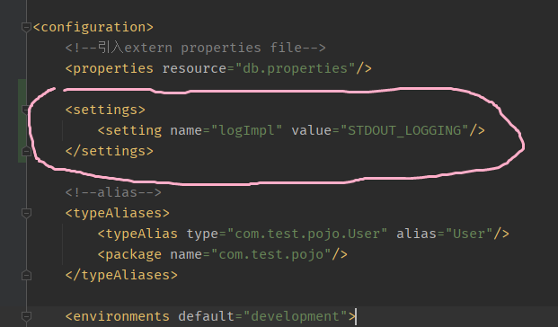
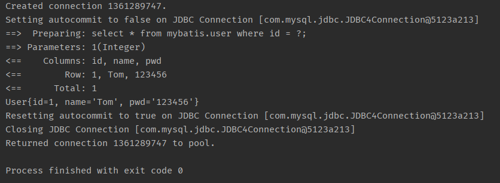
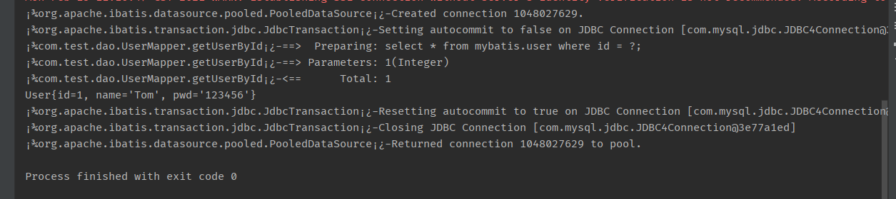
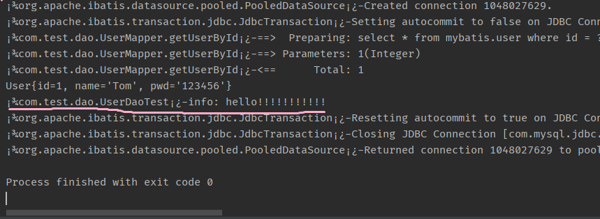
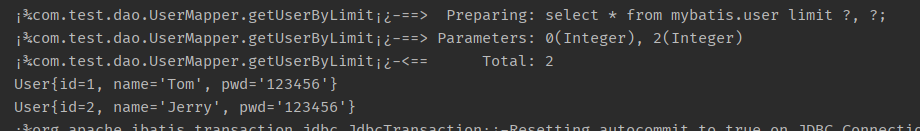
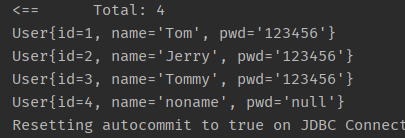
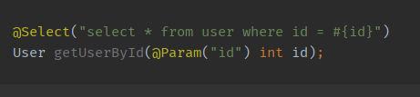
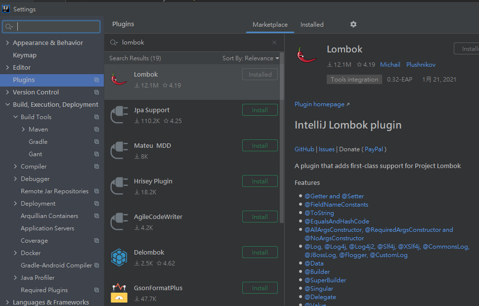
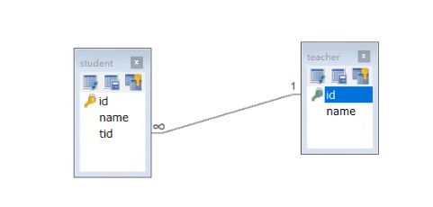
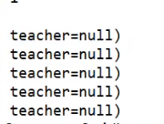

# 1. Introduction

## 1.1 what is MyBatis?


> MyBatis is a first class persistence framework with support for custom SQL, stored procedures and advanced mappings. MyBatis eliminates almost all of the JDBC code and manual setting of parameters and retrieval of results. MyBatis can use simple XML or Annotations for configuration and map primitives, Map interfaces and Java POJOs (Plain Old Java Objects) to database records.
>
> - MyBatis 是一款優秀的`持久層`框架
> - 它支持自定義 SQL、存儲過程以及高級映射。
> -  MyBatis 免除了幾乎所有的 JDBC 代碼以及設置參數和獲取結果集的工作。 MyBatis 可以通過簡單的 XML 或註解來配置和映射原始類型、接口和 Java POJO 為數據庫中的記錄。


`官方網站：https://mybatis.org/mybatis-3/index.html`

## 1.2 dependency

```xml
<!-- https://mvnrepository.com/artifact/org.mybatis/mybatis -->
<dependency>
    <groupId>org.mybatis</groupId>
    <artifactId>mybatis</artifactId>
    <version>3.5.2</version>
</dependency>
```


## 1.3 持久化及持久層

持久化 = 將短時間存在嘅data/ object 持久化 (放入database或者 I/O)

持久層 = 做持久化嘅layer


## 1.4 點解需要Mybatis？

- 方便
- 將數據存入Database中
- 傳統嘅 JDBC 太複雜，MyBatis將佢簡化


# 2. 第一個MyBatis program

> 1. 整好database
> 2. 整好IDEA嘅environment
> 3. 寫
> 4. 用


## 2.1 database

`database`

```sql
CREATE DATABASE IF NOT EXISTS `mybatis`;

USE `mybatis`;

CREATE TABLE `user`(
	`id` INT(20) NOT NULL,
	`name` VARCHAR(30) DEFAULT NULL,
	`pwd`	VARCHAR(30) DEFAULT NULL,
	PRIMARY KEY(`id`)
)ENGINE=INNODB DEFAULT CHARSET=utf8;

INSERT INTO `user` VALUES 
(1,'Tom', '123456'),
(2,'Jerry', '123456'),
(3,'Tommy', '123456')
```


`create project in IDEA`

整個maven project (empty)


## 2.2 environment

### 2.2.1 導入dependencies

> 需要3個dependencies
>
> - mysql
> - mybatis
> - junit (測試用)

```xml
<dependencies>
    <!--mysql-->
    <dependency>
        <groupId>mysql</groupId>
        <artifactId>mysql-connector-java</artifactId>
        <version>5.1.47</version>
    </dependency>
    <!--mybatis-->
    <dependency>
        <groupId>org.mybatis</groupId>
        <artifactId>mybatis</artifactId>
        <version>3.5.2</version>
    </dependency>
    <!--junit-->
    <dependency>
        <groupId>junit</groupId>
        <artifactId>junit</artifactId>
        <version>4.12</version>
    </dependency>
</dependencies>
```


### 2.2.2 整一個 sqlSession object

>sqlSession入面提供執行SQL命令嘅method，而Mybatis就係專門處理database，所以需要呢個object
>
>sqlSession object係用 sqlSessionFactory產生，而sqlSessionFactory係需要一個專門嘅xml configuration file產生
>
>因此步驟有三：
>
>1. 新增configuration file (從官網複製)
>2. get sqlSessionFactory
>3. 用sqlSessionFactory 整一個sqlSession
>
>因為2,3 呢兩個步驟千篇一律，最好將佢封裝成為一個utility，方便使用
>
>官網：https://mybatis.org/mybatis-3/zh/getting-started.html

`1. 新增一個mybatis-config.xml 去配置mybatis`

官網介紹為下：

每個基於MyBatis 的應用都是以一個SqlSessionFactory 的實例為核心的。SqlSessionFactory 的實例可以通過SqlSessionFactoryBuilder 獲得。而SqlSessionFactoryBuilder 則可以從XML 配置文件或一個預先配置的Configuration 實例來構建出SqlSessionFactory 實例。

從XML 文件中構建SqlSessionFactory 的實例非常簡單，建議使用類路徑下的資源文件進行配置。但也可以使用任意的輸入流（InputStream）實例，比如用文件路徑字符串或file:// URL 構造的輸入流。MyBatis 包含一個名叫Resources 的工具類，它包含一些實用方法，使得從類路徑或其它位置加載資源文件更加容易。

```java
String resource = "org/mybatis/example/mybatis-config.xml";
InputStream inputStream = Resources.getResourceAsStream(resource);
SqlSessionFactory sqlSessionFactory = new SqlSessionFactoryBuilder().build(inputStream);
```


**XML 配置文件中包含了對MyBatis 系統的核心設置，包括獲取數據庫連接實例的數據源（DataSource）以及決定事務作用域和控制方式的事務管理器（TransactionManager）。後面會再探討XML 配置文件的詳細內容，這裡先給出一個簡單的示例：**

```xml
<?xml version="1.0" encoding="UTF-8" ?>
<!DOCTYPE configuration
  PUBLIC "-//mybatis.org//DTD Config 3.0//EN"
  "http://mybatis.org/dtd/mybatis-3-config.dtd">
<configuration>
  <environments default="development">
    <environment id="development">
      <transactionManager type="JDBC"/>
      <dataSource type="POOLED">
        <property name="driver" value="${driver}"/>
        <property name="url" value="${url}"/>
        <property name="username" value="${username}"/>
        <property name="password" value="${password}"/>
      </dataSource>
    </environment>
  </environments>
    <!--mapper-->
  <mappers>
    <mapper resource="org/mybatis/example/BlogMapper.xml"/>
  </mappers>
</configuration>
```

> 入面有幾個field要填，填完後如下

 ```xml
<?xml version="1.0" encoding="UTF-8" ?>
<!DOCTYPE configuration
        PUBLIC "-//mybatis.org//DTD Config 3.0//EN"
        "http://mybatis.org/dtd/mybatis-3-config.dtd">
<configuration>
    <environments default="development">
        <environment id="development">
            <transactionManager type="JDBC"/>
            <dataSource type="POOLED">
                <property name="driver" value="com.mysql.jdbc.Driver"/>
                <property name="url" value="jdbc:mysql://localhost:3306/mybatis?userSSL=false&amp;useUnicode=true&amp;characterEncoding=UTF-8"/>
                <property name="username" value="root"/>
                <property name="password" value="123456"/>
            </dataSource>
        </environment>
    </environments>
    
    <!--mapper 填住呢個先，後面會知點解-->
    <mappers>
        <mapper resource="com/test/dao/UserMapper.xml"/>
    </mappers>
</configuration>
 ```


`2. sqlSessionFactory 及 sqlSession`

```java
package com.test.utils;

import org.apache.ibatis.io.Resources;
import org.apache.ibatis.session.SqlSession;
import org.apache.ibatis.session.SqlSessionFactory;
import org.apache.ibatis.session.SqlSessionFactoryBuilder;

import java.io.IOException;
import java.io.InputStream;

// sqlSessionFactory -> sqlSession (用作執行sql，入面有執行SQL嘅method)
public class MybatisUtils {
    private static SqlSessionFactory sqlSessionFactory;

    static{
        // 獲取 sqlSessionFactory object
        try {
            String resource = "mybatis-config.xml";
            InputStream inputStream = Resources.getResourceAsStream(resource);
            sqlSessionFactory = new SqlSessionFactoryBuilder().build(inputStream);
        } catch (IOException e) {
            e.printStackTrace();
        }
    }
    
    // 提供方法return一個 sqlSession
    // 呢個sqlSession就係用sqlSessionFactory 產出
    public static SqlSession getSession(){
        return sqlSessionFactory.openSession();
    }
}
```

> 留意最好寫成utility，方便使用


## 2.3 開始寫code

> 我地需要一個pojo 去對應 database入面每一個table，然後係dao (mapper) layer控制呢個pojo，因此步驟如下
>
> 1. 根據database入面嘅table寫對應嘅 plain ordinary java object，提供 getter setter constructor 等等
> 2. 整一個mapper (其實就係dao，data access object，不過係mybatis改名為mapper) layer
> 3. 用xml file / annotation 寫SQL

`1. 整pojo`


`2. mapper`


`3. 用xml或者annotation寫SQL`

> 官網：https://mybatis.org/mybatis-3/zh/getting-started.html 
>
> 入面有詳細解釋 xml / annotation嘅寫法及分別

`呢度用xml寫，類似於override UserDao (mapper) 入面嘅 method`

```xml
<?xml version="1.0" encoding="UTF-8" ?>
<!DOCTYPE mapper
        PUBLIC "-//mybatis.org//DTD Mapper 3.0//EN"
        "http://mybatis.org/dtd/mybatis-3-mapper.dtd">

<!--namespace用作綁定一個對應嘅dao/mapper-->
<mapper namespace="com.test.dao.UserDao">
    <!--id綁定UserDao interface嘅method-->
    <select id="getUserList" resultType="com.test.pojo.User">
        select * from mybatis.user;
    </select>
</mapper>
```


`4. 係mybatis-config.xml入面加翻mapper`

> `留意每個mapper都要寫一個映射`
>
> ```xml
> <mappers>
>  <mapper resource="com/test/dao/UserMapper.xml"/>
> </mappers>
> ```


## 2.4 test

`junit test:`

```java
public class UserDaoTest {
    @Test
    public void test(){
        // 獲取sqlSession object
        SqlSession sqlSession = MybatisUtils.getSession();

        UserDao mapper = sqlSession.getMapper(UserDao.class);
        List<User> userList = mapper.getUserList();

        for(User user : userList){
            System.out.println(user);
        }
        sqlSession.close();
    }
}
```


## 2.5 總結

> 1. 連database
> 2. dependencies
> 3. configuration file (mybatis-config.xml)
> 4. utility (sqlSessionFactoryBuilder -> sqlSessionFactory -> sqlSession)
> 5. pojo
> 6. mapper
>    - 自己寫mapper，並且要係mybatis-config.xml 加一個mapper映射
> 7. mapper method implementation (xml or annotation)
> 8. test


# 3. CRUD

> 做完上述步驟後，再加SQL嘅話只需要係Mapper入面加method，再係 xml 度寫具體實現方法，就可以test

## 3.1 query


**首先係UserMapper加一個function**


**再係UserMapper.xml ~override getUserById()。呢度嘅 id = method name; paramterType有參數先要寫; resultType = return type**


**測試**


## 3.2 create/update/delete

### 3.2.1 create

`UserMapper.java`

```java
int addUser(User user);
```

`UserMapper.xml`

```xml
<insert id="addUser" parameterType="com.test.pojo.User">
    insert into mybatis.user (id, name, pwd) values (#{id},#{name},#{pwd});
</insert>
```

`UserDaoTest.java`

```java
@Test
public void test3(){
    SqlSession sqlSession = MybatisUtils.getSession();
    UserMapper mapper = sqlSession.getMapper(UserMapper.class);

    int result = mapper.addUser(new User(5, "Noname", "23154564"));
    if(result > 0){
        System.out.println("OK!");
    }

    sqlSession.commit(); // 記得commit
    sqlSession.close();
}
```

**留意呢度，如果無提交transaction (commit)，係唔會生效，所以記得commit，提交完結果如下**

`mybatis會自動set autocommit = false，所以我地唔需要寫`


### 3.2.2 update and delete

> 同上面類似，所以連埋一齊做

`UserMapper.java`

```java
int updateUser(User user);
int deleteUser(int id);
```

`UserMapper.xml`

```xml
<update id="updateUser" parameterType="com.test.pojo.User">
    update mybatis.user set name=#{name}, pwd=#{pwd} where id=#{id};
</update>

<delete id="deleteUser" parameterType="int">
    delete from mybatis.user where id = #{id};
</delete>
```

`UserDaoTest.java`

```java
@Test
public void test4(){
    SqlSession sqlSession = MybatisUtils.getSession();

    UserMapper mapper = sqlSession.getMapper(UserMapper.class);
    mapper.updateUser(new User(5,"new name","asdasdzx123"));

    sqlSession.commit();
    sqlSession.close();
}

@Test
public void test5(){
    SqlSession sqlSession = MybatisUtils.getSession();

    UserMapper mapper = sqlSession.getMapper(UserMapper.class);
    mapper.deleteUser(5);

    sqlSession.commit();
    sqlSession.close();
}
```


# 4. map

> 之前mapper嘅parameter type都係用User class，例如：
>
> ```xml
> <insert id="addUser" parameterType="com.test.pojo.User">
>     insert into mybatis.user (id, name, pwd) values (#{id},#{name},#{pwd});
> </insert>
> ```
>
> 呢個做法比較生硬，因為每次用呢個type都要填曬User入面所有field (name,pwd,id)
>
> 如果想靈活少少，例如只insert id同name就可以用map！

`UserMapper.java`

```java
int insertUserByMap(Map<String,Object> map);
```

`UserMapper.xml `

```xml
<insert id="insertUserByMap" parameterType="map">
    insert into mybatis.user (id, name) values (#{id},#{name});
</insert>
```

`UserDaoTest.java`

```java
@Test
public void test6(){
    SqlSession sqlSession = MybatisUtils.getSession();

    UserMapper mapper = sqlSession.getMapper(UserMapper.class);
	
    // 傳入一個map
    Map<String, Object> map = new HashMap<>();
    map.put("id", 4);
    map.put("name", "noname");
    mapper.insertUserByMap(map);

    sqlSession.commit();
    sqlSession.close();
}
```

結果如下：


# 5. mybatis-cofig.xml

> 配置詳解，呢個file可以寫好多config，官網介紹如下
>
> https://mybatis.org/mybatis-3/zh/configuration.html#settings
>
> 
>
> 其中紅色框上面已經寫過，粉紅色跟住會學埋


## 5.1 transactionManager

**事務管理器（transactionManager）**

在MyBatis 中有兩種類型的事務管理器（也就是type="[JDBC|MANAGED]"）：

- JDBC – 這個配置直接使用了JDBC 的提交和回滾設施，它依賴從數據源獲得的連接來管理事務作用域。
- MANAGED – 這個配置幾乎沒做什麼。它從不提交或回滾一個連接，而是讓容器來管理事務的整個生命週期（比如JEE 應用服務器的上下文）。默認情況下它會關閉連接。然而一些容器並不希望連接被關閉，因此需要將closeConnection 屬性設置為false 來阻止默認的關閉行為。

> default = JDBC


## 5.2 dataSource 


> default = POOLED


## 5.3 properties

> 之前嘅properties係直接係xml 入面寫，例如

```xml
<configuration> 
    <environments default="development">
        <environment id="development">
            <transactionManager type="JDBC"/>
            <dataSource type="POOLED">
                <!--呢度開始： properties係自己寫-->
                <property name="driver" value="com.mysql.jdbc.Driver"/>
                <property name="url" value="jdbc:mysql://localhost:3306/mybatis?userSSL=true&amp;useUnicode=true&amp;characterEncoding=UTF8"/>
                <property name="username" value="root"/>
                <property name="password" value="123456"/>
                <!--完-->
            </dataSource>
        </environment>
    </environments>

    <mappers>
        <mapper resource="com/test/dao/UserMapper.xml"/>
    </mappers>
</configuration>
```

> 第二種方法就係導入external properties，然後引用佢，改完如下

1. 整個 db.properties

   

2. 引用到mybatis-config.xml 並使用

```xml
<configuration>
    <!-- 1. 引入extern properties file-->
    <properties resource="db.properties"/>

    <environments default="development">
        <environment id="development">
            <transactionManager type="JDBC"/>
            <dataSource type="POOLED">
                <!-- 2. 直接引用翻db.properties嘅嘢，留意名要一一對應-->
                <property name="driver" value="${driver}"/>
                <property name="url" value="${url}"/>
                <property name="username" value="${username}"/>
                <property name="password" value="${password}"/>
            </dataSource>
        </environment>
    </environments>

    <mappers>
        <mapper resource="com/test/dao/UserMapper.xml"/>
    </mappers>
</configuration>
```


## 5.4 typeAliases

> 之前係UserMapper.xml入面，如果要寫paraType/ resultType要寫曬全名，例如


> 係configuration file 入面設置alias之後就可以直接寫alias 
>
> 有兩種方式：
>
> 1. 直接寫pojo嘅位置
>
> 2. 寫一個package name，會自動搜索呢個package下面所有javabean (pojo)
>
>    如果用呢個方法，resultType直接寫翻pojo嘅class name就可以，唔需要綁定
>
>    例如呢度直接寫 user/ User  (大小寫均可) 就得

```xml
<!--alias-->
<typeAliases>
    <typeAlias type="com.test.pojo.User" alias="User"/>   <!--方式1-->
    <package name="com.test.pojo"/>	<!--方式二-->
</typeAliases>
```


## 5.5 settings


> 常用嘅就呢幾個


## 5.6 mappers

> 有三種常用方式寫mapper

`1. resource (映射xml file)`

```xml
<mappers>
  <mapper resource="org/mybatis/builder/AuthorMapper.xml"/>
  <mapper resource="org/mybatis/builder/BlogMapper.xml"/>
  <mapper resource="org/mybatis/builder/PostMapper.xml"/>
</mappers>
```

`2. class (映射java file : interface等等)`

```xml
<mappers>
  <mapper class="org.mybatis.builder.AuthorMapper"/>
  <mapper class="org.mybatis.builder.BlogMapper"/>
  <mapper class="org.mybatis.builder.PostMapper"/>
</mappers>
```

`3. package (自動搜尋package下所有文件)`

```xml
<mappers>
  <package name="org.mybatis.builder"/>
</mappers>
```

> 留意第二種，第三種有要求：java file, xml file嘅名必須一樣，例如 有個java file叫UserMapper，咁佢嘅configuration file一定要叫UserMapper.xml


# 6. resultmap

> 之前寫嘅pojo入面所有field name 都同database入面嘅field name一樣，如下圖


因為如果兩邊嘅field name唔一樣，係database 入面就搵唔到相應嘅column

例如將 User.java 入面 private String pwd; 改成 private String password; pwd (database col) 呢個output果陣就會出現null嘅情況

**解決方法：係UserMapper.xml寫一個resultmap 描述兩者之間嘅關係，令佢可以知道 User. java入面嘅 password = database user table嘅 pwd**

```xml
<resultMap id="UserMap" type="User">
	<!--id，name 兩邊一樣，不需要映射-->
    <result column="pwd" property="password"/>
</resultMap>

<select id="getUserById" resultMap="UserMap">
	select * from mybatis.user where id=#{id};
</select>
```

> 留意：係將 database table column 映射至 java field
>
> 官網介紹：https://mybatis.org/mybatis-3/zh/sqlmap-xml.html#Result_Maps


# 7. log

## 7.1 intro

> mybatis configuration file提供左好多唔同類型嘅log，大部分需要先導入jar file

logImpl:

- SLF4J 
- LOG4J 
- LOG4J2 
- JDK_LOGGING 
- COMMONS_LOGGING 
- STDOUT_LOGGING 
- NO_LOGGING

只需要係mybatis-config.xml入面加入呢個setting就可以用



**output如下**




## 7.2 log4j

咩係log4j？

- Apache's open source project，通過log4j，可以控制 log 嘅output位置，例如console，file，GUI等等
- 可以控制output format
- 可以自定義每條log嘅級別，例如優先output error等等
- 可以通過 configuration file 設置屬性，無需改佢嘅code


`1. 導入log4j jar file`

```xml
<!-- https://mvnrepository.com/artifact/log4j/log4j -->
<dependency>
    <groupId>log4j</groupId>
    <artifactId>log4j</artifactId>
    <version>1.2.17</version>
</dependency>
```


`2. 整一個log4j.properties做configuration`

Guide: https://blog.csdn.net/eagleuniversityeye/article/details/80582140

所有配置都可以上網搵，邊個有用就寫邊個，例如

```properties
#將等級為DEBUG的日誌信息輸出到console和file這兩個目的地，console和file的定義在下面
log4j.rootLogger=DEBUG,console,file

#控制台輸出的相關設置
log4j.appender.console = org.apache.log4j.ConsoleAppender
log4j.appender.console.Target = System.out
log4j.appender.console.Threshold=DEBUG
log4j.appender.console.layout = org.apache.log4j.PatternLayout
log4j.appender.console.layout.ConversionPattern=【%c】-%m%n

#文件輸出的相關設置
log4j.appender.file = org.apache.log4j.RollingFileAppender
log4j.appender.file.File=./log/test.log
log4j.appender.file.MaxFileSize=10mb
log4j.appender.file.Threshold=DEBUG
log4j.appender.file.layout=org.apache.log4j.PatternLayout
log4j.appender.file.layout.ConversionPattern=【%p】【%d{yy-MM-dd}】【%c】%m%n

#日誌輸出級別
log4j.logger.org.mybatis=DEBUG
log4j.logger.java.sql=DEBUG
log4j.logger.java.sql.Statement=DEBUG
log4j.logger.java.sql.ResultSet=DEBUG
log4j.logger.java.sql.PreparedStatement=DEBUG
```


`3. 係mybatis configuration file加setting`

```xml
<settings>
    <setting name="logImpl" value="LOG4J"/>
</settings>
```


`4. test`




`5.簡單實用 `

可以係java file用logger output msg到 log，留意需要先import org.apache.log4j.Logger;

```java
package com.test.dao;

import com.test.pojo.User;
import com.test.utils.MybatisUtils;
import org.apache.ibatis.session.SqlSession;
import org.apache.log4j.Logger;  // 需要 import呢個
import org.junit.Test;


public class UserDaoTest {
	// 先get logger
    static Logger logger = Logger.getLogger(UserDaoTest.class);

    @Test
    public void test(){
        // 獲取sqlSession object
        SqlSession sqlSession = MybatisUtils.getSession();

        UserMapper mapper = sqlSession.getMapper(UserMapper.class);
        User user = mapper.getUserById(1);
        System.out.println(user);
		
        // 可以用logger output唔同msg
        logger.info("info: hello!!!!!!!!!!!");

        sqlSession.close();
    }
}
```




# 8. limit

> 之前係sql學過，分頁係用limit， syntax為
>
> ```sql
> select * from xxx limit start_index page_size
> ```
>
> 宜家係java 寫一次

`UserMapper.java`

```java
List<User> getUserByLimit(Map<String, Integer> map);
```

`UserMapper.xml`

```xml
<select id="getUserByLimit" parameterType="map" resultType="com.test.pojo.User">
    select * from mybatis.user limit #{startIndex}, #{pageSize};
</select>
```

`UserDaoTest.java`

```java
@Test
public void test2(){
    SqlSession sqlSession = MybatisUtils.getSession();
    UserMapper mapper = sqlSession.getMapper(UserMapper.class);

    Map<String, Integer> map = new HashMap<>();
    map.put("startIndex",0);
    map.put("pageSize", 2);
    List<User> users = mapper.getUserByLimit(map);
    for (User user : users) {
        System.out.println(user);
    }

    sqlSession.close();
}
```

> 從index 0開始，每頁2個，所以會攞到頭兩個users，並且output




# 9. annotation

## 9.1 intro

> ch2 第一個Mybatis program入面提到，寫SQL可以用xml 或者 annotaion，但係我地之前都係用xml，宜家學埋annotation
>
> `留意annotation只適用於相對簡單嘅SQL，如果要寫複雜嘅SQL，需要用xml`

`mybatis-config.xml 改mapper位置`

之前係綁定UserMapper.xml ，宜家改為UserMapper，因為annotation係係同一個file入面寫

```xml
<mappers>
    <mapper class="com.test.dao.UserMapper"/>
</mappers>
```

`UserMapper.java`

```java
public interface UserMapper {
    @Select("select * from user")    // annotation寫法，直接係function上面寫
    List<User> getUsers();
}
```

**唔需要再用到UserMapper.xml**

`UserDaoTest.java`

```java
@Test
public void test01(){
    SqlSession sqlSession = MybatisUtils.getSession();
    UserMapper mapper = sqlSession.getMapper(UserMapper.class); // reflection

    List<User> users = mapper.getUsers();
    for (User user : users) {
        System.out.println(user);
    }

    sqlSession.close();
}
```




## 9.2 CRUD

> 留意如果argument係primitive type (int, double...)`以及String`，要係前面加一個@Param innotation
>
> 意義：幫傳入嘅argument(s) 起個名，令SQL annotation #{} 入面嘅argument可以一一對應

例如



`由於test同上面大同小異，呢度只寫mapper`

`UserMapper.java`

```java
public interface UserMapper {
    @Select("select * from user")
    List<User> getUsers();

    @Select("select * from user where id = #{id}")
    User getUserById(@Param("id") int id);

    @Insert("insert into user(id,name,pwd) values (#{id},#{name},#{pwd})")
    int addUser(User user);

    @Update("update user set name = #{name}, pwd = #{pwd} where id = #{id}")
    int updataUser(User user);

    @Delete("delete from user where id = #{id}")
    int deleteUser(@Param("id") int id);
}
```


# 10 Lombok

> Project Lombok is a java library that automatically plugs into your editor and build tools, spicing up your java.
> `Never write another getter or equals method again`, with `one annotation` your class has a fully featured builder, Automate your logging variables, and much more.

之前pojo需要寫一大堆getter setter，有lombok就可以唔洗寫 (直接寫lombok提供嘅annotation就可以)

@Getter and @Setter
@FieldNameConstants
@ToString
@EqualsAndHashCode
@AllArgsConstructor, @RequiredArgsConstructor and @NoArgsConstructor
@Log, @Log4j, @Log4j2, @Slf4j, @XSlf4j, @CommonsLog, @JBossLog, @Flogger, @CustomLog
@Data
@Builder
@SuperBuilder
@Singular
@Delegate
@Value
@Accessors
@Wither
@With
@SneakyThrows
@val
@var
experimental @var
@UtilityClass


> 使用步驟

`1. import dependency`

```xml
<!-- https://mvnrepository.com/artifact/org.projectlombok/lombok -->
<dependency>
    <groupId>org.projectlombok</groupId>
    <artifactId>lombok</artifactId>
    <version>1.18.18</version>
    <scope>provided</scope>
</dependency>
```

`2. 下載lombok plugin`



`3. 使用`


圖中係 User pojo，將一大堆getter setter刪除後，加入 @Data annotation，Lombok就會自動生成一堆getter setter，雖然我地無寫，但係仍然有


# 11. 多對一及一對多

## 11.1 多對一

> 之前寫嘅mapper，xml，annotation都係做緊一個database table
>
> 如果要關聯至兩個table又點？例如有呢個sql: 

```sql
CREATE TABLE `teacher` (
  `id` INT(10) NOT NULL,
  `name` VARCHAR(30) DEFAULT NULL,
  PRIMARY KEY (`id`)
) ENGINE=INNODB DEFAULT CHARSET=utf8

INSERT INTO teacher(`id`, `name`) VALUES (1, 'Teacher 1'); 

CREATE TABLE `student` (
  `id` INT(10) NOT NULL,
  `name` VARCHAR(30) DEFAULT NULL,
  `tid` INT(10) DEFAULT NULL,
  PRIMARY KEY (`id`),
  KEY `fktid` (`tid`),
  CONSTRAINT `fktid` FOREIGN KEY (`tid`) REFERENCES `teacher` (`id`)
) ENGINE=INNODB DEFAULT CHARSET=utf8

INSERT INTO `student` (`id`, `name`, `tid`) VALUES ('1', 'Student 1', '1'); 
INSERT INTO `student` (`id`, `name`, `tid`) VALUES ('2', 'Student 2', '1'); 
INSERT INTO `student` (`id`, `name`, `tid`) VALUES ('3', 'Student 3', '1'); 
INSERT INTO `student` (`id`, `name`, `tid`) VALUES ('4', 'Student 4', '1'); 
INSERT INTO `student` (`id`, `name`, `tid`) VALUES ('5', 'Student 5', '1');
```

關係如下圖



`每個student 有id，name，tid；teacher有id，name； student入面嘅tid 係 teacher嘅foreign key`

> 多個student對應一個teacher

用SQL查嘅話就係寫

```sql
select * from student s, teacher t where s.tid = t.id;
```

但係我地用java寫xml嘅話 (student table)，由於一個select只能夠對應一個table，因此只能夠獲取 id，name嘅資料，tid係無法獲取，會顯示null



因此需要令兩個table 有關係 (係 mapper.xml入面)

> 加關係嘅方法就係resultMap
>
> resultMap之前都講過，當property (pojo嘅property)同 column (database嘅column) 嘅名唔一樣果陣，可以用resultMap加關係，咁mybatis就會自動關聯呢兩個名
>
> 同時，resultMap亦提供 `association及collection`呢兩個方法，將兩個table加上關係，寫法如下
>
> `留意：pojo (有Student及Teacher)，mapper及test省略，只提供xml`

`StudentMapper.xml`

```xml
<!--1. -->
<select id="getStudent" resultMap="StudentTeacher">
	select * from student;
</select>
<!--2. -->
<resultMap id="StudentTeacher" type="Student">
	<result property="id" column="id"/>
    <result property="name" column="name"/>
    <association property="teacher" column="tid" select="getTeacher" javaType="Teacher"/>
</resultMap>
<!--3. -->
<select id="getTeacher" resultType="Teacher">
	select * from teacher where id = #{id};
</select>
```

> 重點：
>
> ```xml
> <association property="teacher" column="tid" select="getTeacher" javaType="Teacher"/>
> ```
>
> property = Student pojo入面需要加關係嘅property
>
> column = Student table入面嘅column name
>
> select = 跟住要執行邊個
>
> javaType = 跟住要執行果個SQL嘅 resultType
>
> 
>
> 步驟：
>
> 先搵出student table嘅所有資料，由於resultMap="StudentTeacher"，佢會根據呢個map搵出 id 及name
>
> 至於 teacher 呢個屬性，佢根據 column="tid"知道 teacher = database入面嘅 tid column
>
> 再根據 select="getTeacher" 知道下一步要執行 id="getTeacher"嘅SQL，所以佢會搵出teacher table入面所有teacher where id = tid (經association傳入)，再綁定至 student嘅output


## 11.2 一對多


