 

# 1. Intro

**Spring框架**是 Java平台的一個開源的全棧（Full-stack）應用程式框架和控制反轉容器實現，一般被直接稱為 Spring。該框架的一些核心功能理論上可用於任何 Java 應用，但 Spring 還為基於Java企業版（Java EE)平台構建的 Web 應用提供了大量的擴充支援。Spring 沒有直接實現任何的編程模型，但它已經在 Java 社群中廣為流行，基本上完全代替了企業級JavaBeansEJB）模型。

> document: https://docs.spring.io/spring-framework/docs/current/reference/html/core.html


`核心功能模組`

- 基於 JavaBeans 的採用控制反轉（Inversion of Control，IoC）原則的組態管理，使得應用程式的組建更加簡易快捷。
- 資料庫事務的一般化抽象層，允許聲明式（Declarative）事務管理器，簡化事務的劃分使之與底層無關。
- JDBC 抽象層提供了有針對性的異常等級（不再從 SQL 異常中提取原始代碼），簡化了錯誤處理，大大減少了程式設計師的編碼量。再次利用 JDBC 時，你無需再寫出另一個'終止'（finally）模組。並且面向 JDBC 的異常與 Spring 通用資料存取物件（Data Access Object）異常等級相一致。
- 以資源容器，DAO 實現和事務策略等形式與 Hibernate，JDO 和 MyBatis 、SQL Maps 整合。利用控制反轉機制全面解決了許多典型的 Hibernate 整合問題。所有這些全部遵從 Spring 通用事務處理和通用資料存取物件異常等級規範。


`重點`

- Spirng 免費，open source
- IOC (inversion of control)、AOP (aspect-oriented programming)


## 1.2 maven dependency

```xml
<!-- https://mvnrepository.com/artifact/org.springframework/spring-webmvc -->
<dependency>
    <groupId>org.springframework</groupId>
    <artifactId>spring-webmvc</artifactId>
    <version>5.2.0.RELEASE</version>
</dependency>
<!--需要與mybatis做整合，所以要呢個↓-->
<dependency>
    <groupId>org.springframework</groupId>
    <artifactId>spring-jdbc</artifactId>
    <version>5.2.0.RELEASE</version>
</dependency>
```


## 1.3 組成


# 2. IOC

## 2.1 intro

> 之前寫一個應用，要寫以下幾個file
>
> - UserDao
> - UserDaoImplementation
> - UserService
> - UserServiceImplementation
>
> 當user發出請求，由 service layer call dao layer，完成操作

咁 Dao 點同 Service產生關係呢？就係係 service layer加一個 dao object

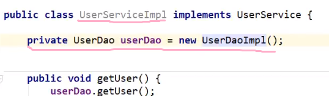

> 當user發出請求，就 new 一個 service object，等 service layer call dao layer
>
> 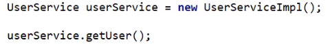

咁樣嘅話有一個問題：每次 user發出新請求，姐係request一個新嘅 dao object，我地 (programmer) 需要改 service layer嘅code

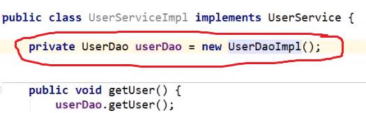

就係改呢個 service implementation， new 另外一個 dao implementation

`但係咁做係program控制呢個dao object，太麻煩，我地應該改變諗法，令user控制呢個object`

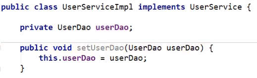

> 就係唔寫死呢個 UserDao object，而係`提供一個setter`，當user改變需求，直接用setter new一個對應嘅dao object就得

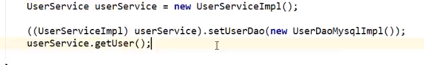 


## 2.2 總結

>之前係program 主動創建 object，控制權係programmer手上
>
>用setter之後，會根據user需求創建，控制權係 user手上

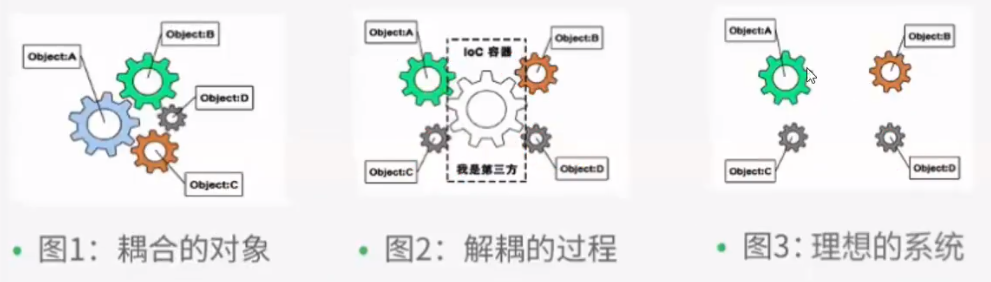

- IOC（Inverse Of Control）控制反轉，即把建立物件的權利交給框架，也就是指將物件的建立、物件的儲存、物件的管理交給了spring容器

- spring容器是spring中的一個核心模組，用於管理物件，底層可以理解為是一個map集合
- `IOC: 獲得object嘅方式反轉`
- `Spring實現IOC嘅係 IOC container，其實現方法是 Dependency Injection (DI)`

> 而用spring嘅話，spring IoC container就會幫我地控制 object 嘅創建以及管理，programmer唔需要再new object，set property； 稱為IoC


# 3. Hello Spring

`1. pojo`

```java
package com.test.pojo;

public class Hello {
    private String str;

    public String getStr() {
        return str;
    }

    public void setStr(String str) {
        this.str = str;
    }

    @Override
    public String toString() {
        return "Hello{" +
                "str='" + str + '\'' +
                '}';
    }
}
```

`2. 寫bean`

> bean簡介：In Spring, the objects that form the backbone of your application and that are managed by the Spring IoC container are called beans. A bean is an object that is instantiated, assembled, and otherwise managed by a Spring IoC container.
>
> 重點：
>
> - `bean係object`
> - bean被Spring IoC container 管理 (由呢個container  instantiated, assembled)
> - 一個program由多個bean構成
>
> 官網：https://docs.spring.io/spring-framework/docs/current/reference/html/core.html

​		`beans.xml`

```xml
<?xml version="1.0" encoding="UTF-8"?>
<beans xmlns="http://www.springframework.org/schema/beans"
       xmlns:xsi="http://www.w3.org/2001/XMLSchema-instance"
       xsi:schemaLocation="http://www.springframework.org/schema/beans
        https://www.springframework.org/schema/beans/spring-beans.xsd">
	<!--id自己set，class綁定pojo-->
    <!--property係pojo嘅property，可以用value set佢嘅value-->
    <bean id="hello" class="com.test.pojo.Hello">
        <property name="str" value="Hello Spring!"/>
    </bean>

</beans>
```

`3. test`

```java
public class Test {
    public static void main(String[] args) {
        // 1. 必定要寫，獲取Spring container 
        ApplicationContext context = new ClassPathXmlApplicationContext("beans.xml");
        // 2. 用applicationContext獲取bean
        Hello hello = (Hello)context.getBean("hello");
        System.out.println(hello.toString());

    }
}
```

output如下

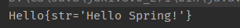


> 反思：
>
> 1. Hello 呢個object由邊個創建？
>    - 由Spring創建
> 2. Hello object入面 str呢個property由邊個設置？
>    - 由Spring container設置

> 總結：
>
> 以前我地需要 set好曬 pojo入面嘅property，又要 new；
>
> 宜家將控制權交俾 IoC container，由佢負責 new object及set property，我地只需要寫好bean，需要用果陣去container攞！
>
> `唔再需要改source code，要實現唔同操作，只需要更改xml 文件`


# 4. How IoC create object

> 下面嘅例子基於`User pojo`

`User pojo`

```java
package com.test.pojo;

public class User {
    private String name;

    public User(){
        
    }

//  public User(String name) {  有參構造
//      this.name = name;
//  }

    public String getName() {
        return name;
    }

    public void setName(String name) {
        this.name = name;
    }
}
```

```java
public class Test {
    public static void main(String[] args) {
        // 1. 必定要寫，獲取Spring container 
        ApplicationContext context = new ClassPathXmlApplicationContext("beans.xml");
        // 2. 用applicationContext獲取bean
        User user = (User)context.getBean("user");
        System.out.println(hello.toString());
    }
}
```

- `當我地用 context.getBean() method，就會用default constructor create object`
- `留意：getBean時會創建該xml下所有bean object`

- 如果要用有參數嘅constructor:

  1. index賦值 (contructor argument index)

     ```xml
     <bean id="user" class="com.test.pojo.user">
     	<constructor-arg index="0" value="Tom"/>
     </bean>
     ```

     為 index = 0 嘅argument賦值為Tom

  2. 參數名

     ```xml
     <bean id="user" class="com.test.pojo.user">
     	<constructor-arg name="name" value="Tom"/>
     </bean>
     ```

     

     

# 5. Spring configuration

spring xml file提供嘅配置並不多，有以下幾個：

- beans
- bean
- alias
- import
- description


## 5.1 bean

> bean tag 下有好多property，當中 id，class，name比較重要

```xml
<bean id="hello" class="com.test.pojo.Hello" name="myHello,myHelloBean">
    <property name="str" value="Hello Spring!"/>
</bean>
```

- id = bean object name
- class = 呢個bean object綁定嘅 pojo
- name = alias，可以設置多個，用逗號分隔

## 5.2 alias

> 為 bean object起一個別名 (留意唔係pojo object)

```xml
<bean id="hello" class="com.test.pojo.Hello">
    <property name="str" value="Hello Spring!"/>
</bean>

<alias name="hello" alias="myHello"/>
```


## 5.3 import

> 導入其他 spring configuration file

`applicationContext.xml`

```xml
<import resource="bean1.xml"/>
<import resource="bean2.xml"/>
<import resource="bean3.xml"/>
```


# 6. Dependency injection

> `Dpendency: bean object creation depends on container`
>
> `Injection: bean object's properties injected by container`
>
> Dependency injection分為三種：
>
> - constructor injection 
> - setter injection
> - other
>
> document: https://docs.spring.io/spring-framework/docs/current/reference/html/core.html#beans-dependencies

`呢節會用到嘅pojo有兩個`

`Address.java`

```java
public class Address {
    private String address;
    
    public String getAddress() {
        return address;
    }

    public void setAddress(String address) {
        this.address = address;
    }
    
    @Override
    public String toString() {
        return "Address{" +
                "address='" + address + '\'' +
                '}';
    }
}
```

`Student.java (省略getter setter constructor)`

```java
public class Student {
    private String name;
    private Address address;
    private String[] books;
    private List<String> hobbies;
    private Map<String,String> card;
    private Set<String> games;
}
```

## 6.1 constructor injection

#4 已經提過，呢度只寫出常用嘅寫法

`參數名`


```xml
<bean id="user" class="com.test.pojo.Student">
	<constructor-arg name="name" value="Tom"/>
</bean>
```

`reference`


```xml
<bean id="address" class="com.test.pojo.Address">
    <property name="address" value="HK"/>
</bean>

<bean id="student" class="com.test.pojo.Student">
    <constructor-arg name="name" value="Tom"/>

    <property name="address" ref="address"/>
</bean>
```

留意ref 係reference bean object，需要預先寫一個bean先


## 6.2 setter injection

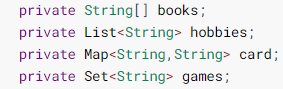

```xml
<bean id="student" class="com.test.pojo.Student">
    <property name="books">
        <array>
            <value>english</value>
            <value>maths</value>
            <value>whatever</value>
        </array>
    </property>

    <property name="hobbies">
        <list>
            <value>coding</value>
            <value>guitar</value>
            <value>movie</value>
        </list>
    </property>

    <property name="card">
        <map>
            <entry key="octopus" value="1235412"/>
        </map>
    </property>

    <property name="games">
        <set>
            <value>LOL</value>
            <value>AOA</value>
            <value>BOB</value>
        </set>
    </property>
</bean>
```


`Test.java`

```java
public class Test {
    public static void main(String[] args) {
        ApplicationContext context = new ClassPathXmlApplicationContext("applicationContext.xml");
        Student student = (Student) context.getBean("student");
        System.out.println(student.toString());

//        Output:
//        Student{name='Tom',
//                address=Address{address='HK'},
//                books=[english, maths, whatever],
//                hobbies=[coding, guitar, movie],
//                card={octopus=1235412},
//                games=[LOL, AOA, BOB]}
    }
}
```


## 6.3 other

> - p namespace : 
>
>   對應setter，與setter類似
>
>   需要 xmlns:p="http://www.springframework.org/schema/p"
>
> - c namespace :
>
>   對應constructor，與constructor類似
>
>   需要 xmlns:c="http://www.springframework.org/schema/c" 
>
> document: https://docs.spring.io/spring-framework/docs/current/reference/html/core.html#beans-p-namespace

`p namespace`

```xml
<beans xmlns="http://www.springframework.org/schema/beans"
    xmlns:xsi="http://www.w3.org/2001/XMLSchema-instance"
    xmlns:p="http://www.springframework.org/schema/p" <!--留意用之前需要import-->
    xsi:schemaLocation="http://www.springframework.org/schema/beans
        https://www.springframework.org/schema/beans/spring-beans.xsd">

    <bean name="classic" class="com.example.ExampleBean">
        <property name="email" value="someone@somewhere.com"/>
    </bean>

    <bean name="p-namespace" class="com.example.ExampleBean"
        p:email="someone@somewhere.com"/>
</beans>
```

兩個bean都係一樣，上面用setter，下面用 p:property name = "value" ，十分方便！

`c namespace`

```xml
<beans xmlns="http://www.springframework.org/schema/beans"
    xmlns:xsi="http://www.w3.org/2001/XMLSchema-instance"
    xmlns:c="http://www.springframework.org/schema/c"
    xsi:schemaLocation="http://www.springframework.org/schema/beans
        https://www.springframework.org/schema/beans/spring-beans.xsd">

    <bean id="beanTwo" class="x.y.ThingTwo"/>
    <bean id="beanThree" class="x.y.ThingThree"/>

    <!-- traditional declaration with optional argument names -->
    <bean id="beanOne" class="x.y.ThingOne">
        <constructor-arg name="thingTwo" ref="beanTwo"/>
        <constructor-arg name="thingThree" ref="beanThree"/>
        <constructor-arg name="email" value="something@somewhere.com"/>
    </bean>

    <!-- c-namespace declaration with argument names -->
    <bean id="beanOne" class="x.y.ThingOne" c:thingTwo-ref="beanTwo"
        c:thingThree-ref="beanThree" c:email="something@somewhere.com"/>

</beans>
```

> 留意使用c namespace嘅話，pojo需要有參構造及無參構造


## 6.4 bean scope

bean 有不同作用域，官網介紹如下，呢度只講singleton及prototype

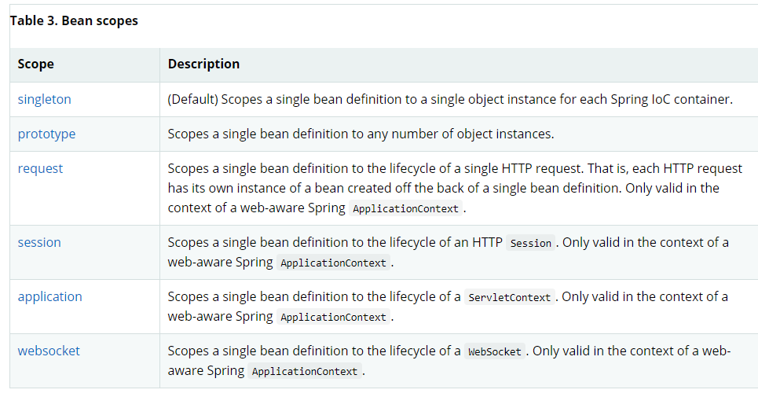

`singleton (default)`

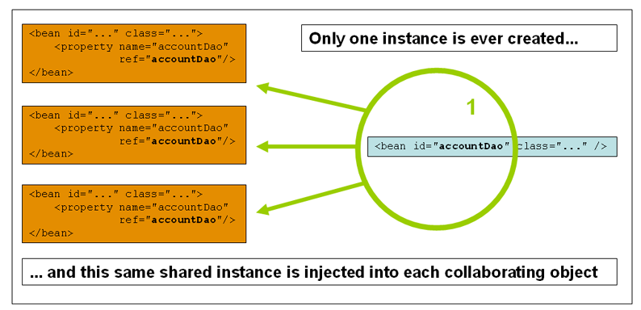

`prototype`

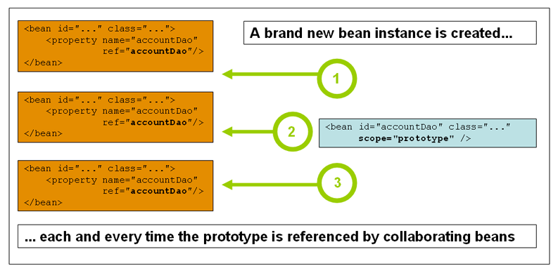


# 7. Autowired

> 之前寫嘅spring xml 都要手動寫bean property
>
> Spring提供一種自動寫bean property嘅方法：autowired，主要有兩種方法
>
> - byName
> - byType
>
> 下面嘅例子會寫一個新嘅pojo

`Cat.java`

```java
public class Cat {
    public String shout(){
        return "meow";
    }
}
```

`Dog.java`

```java
public class Dog {
    public String shout(){
        return "wangwang";
    }
}
```

`People.java (省略getter setter toString)`

```java
public class People {
    private String name;
    private Cat cat;
    private Dog dog;
}
```

> 準備工作完成，下面寫 xml


## 7.1 byName

`applicationContext.xml`

```xml
<?xml version="1.0" encoding="UTF-8"?>
<beans xmlns="http://www.springframework.org/schema/beans"
       xmlns:xsi="http://www.w3.org/2001/XMLSchema-instance"
       xsi:schemaLocation="http://www.springframework.org/schema/beans
        https://www.springframework.org/schema/beans/spring-beans.xsd">

    <bean id="cat" class="com.test.pojo.Cat"/>
    <bean id="dog" class="com.test.pojo.Dog"/>

<!--    <bean id="people" class="com.test.pojo.People">-->
<!--        <property name="name" value="Tom"/>-->
<!--        <property name="cat" ref="cat"/>-->
<!--        <property name="dog" ref="dog"/>-->
<!--    </bean>-->

    <bean id="people" class="com.test.pojo.People" autowire="byName">
        <property name="name" value="Tom"/>

    </bean>

</beans>
```

> comment左嘅位置係原本嘅寫法，手動set property
>
> 而下面嘅bean寫左 autowire="byName"，佢會根據 name 為 bean object set property，因為 people 呢個pojo有Cat cat， Dog dog。 cat/dog 呢兩個名同上面 bean object嘅id一樣，佢就會自動reference，用對應嘅setter set properties
>
> `留意名必須一樣`

`test.java`

```java
public class test {
    public static void main(String[] args) {
        ApplicationContext Context = new ClassPathXmlApplicationContext("applicationContext.xml");
        People people = Context.getBean("people", People.class);
        System.out.println(people);
        
//        Output
//        People{name='Tom', cat:meow, dog:wangwang}
    }
}
```


## 7.2 byType

`applicationContext.xml`

```xml
<?xml version="1.0" encoding="UTF-8"?>
<beans xmlns="http://www.springframework.org/schema/beans"
       xmlns:xsi="http://www.w3.org/2001/XMLSchema-instance"
       xsi:schemaLocation="http://www.springframework.org/schema/beans
        https://www.springframework.org/schema/beans/spring-beans.xsd">

    <bean id="cat" class="com.test.pojo.Cat"/>
    <bean id="dog" class="com.test.pojo.Dog"/>

    <bean id="people" class="com.test.pojo.People" autowire="byType">
        <property name="name" value="Tom"/>

    </bean>

</beans>
```

> byType同上面類似，不過唔係根據 name，而係根據 pojo嘅 type (class type)
>
> 因為 People入面 Cat cat/ Dog dog 呢兩個property嘅 type已經生成為bean 
>
> 所以佢可以autowired


## 7.3 annotation (@Autowired)

> autowired除左係applicationContext.xml 入面寫，都可以用annotation實現，步驟如下

`1. 導入文件及寫bean`

xmlns:context="http://www.springframework.org/schema/context"

**開啟annotation: conext: annotation-config/>**

```xml
<?xml version="1.0" encoding="UTF-8"?>
<beans xmlns="http://www.springframework.org/schema/beans"
    xmlns:xsi="http://www.w3.org/2001/XMLSchema-instance"
    xmlns:context="http://www.springframework.org/schema/context" <!--導入呢個-->
    xsi:schemaLocation="http://www.springframework.org/schema/beans
        https://www.springframework.org/schema/beans/spring-beans.xsd
        http://www.springframework.org/schema/context  <!--並且加入支持-->
        https://www.springframework.org/schema/context/spring-context.xsd"> <!--並且加入支持-->
	<!--開啟annotation-->
    <context:annotation-config/>

	<bean id="cat" class="com.test.pojo.Cat"/>
    <bean id="dog" class="com.test.pojo.Dog"/>
    <bean id="people" class="com.test.pojo.People"/>


</beans>
```

`2. 使用 (用翻上面People, Dog ,Cat嘅例子)`

`People.java (省略getter setter toString)`

```java
public class People {
    private String name;
    @Autowired                 // 使用annotation
    private Cat cat;
    @Autowired				   // 使用annotation
    private Dog dog;
}
```

> 留意：@Autowired 係智能識別，當ioc container入面只有`一個`  Cat type/ Dog type就會用byType
>
> 有`多個` ，就用byName
>
> 亦可以用qualifier手動設置byName，例如
>
> ```java
> @Autowired
> @Qualifier(value="dog123")
> private Dog dog
> ```
>
> 佢就會自動注入 id="dog123"嘅bean


# 8. Annotation

> document：https://docs.spring.io/spring-framework/docs/current/reference/html/core.html#beans-annotation-config

需要嘅bean definition:

`applicationContext.xml`

```xml
<?xml version="1.0" encoding="UTF-8"?>
<beans xmlns="http://www.springframework.org/schema/beans"
    xmlns:xsi="http://www.w3.org/2001/XMLSchema-instance"
    xmlns:context="http://www.springframework.org/schema/context"
    xsi:schemaLocation="http://www.springframework.org/schema/beans
        https://www.springframework.org/schema/beans/spring-beans.xsd
        http://www.springframework.org/schema/context
        https://www.springframework.org/schema/context/spring-context.xsd">

    <context:annotation-config/>

</beans>
```

寫完呢個就可以寫pojo

`User.java`

```java
public class User {
    private String name = "Tom";
}
```


## 8.1 @Component

寫完pojo之後，本來應該就去寫翻對應嘅bean，例如

```xml
<bean id="user" class="com.test.pojo.User"/>
```

但係我地可以用Annotation寫 -> ==@Component==，呢一句就等同於上面果行code

`User.java`

```java
@Component  //留意呢行
public class User {
    private String name = "Tom";
}
```

> 留意：必須先在 `applicationContext.xml`開啟要掃描Annotation嘅package，例如呢個User pojo係pojo package下，所以要咁寫：
>
> ```xml
> <!--enable scanning-->
> <context:component-scan base-package="com.test.pojo"/>
> <context:annotation-config/>
> ```
>
> bean name就係 class name嘅小寫，所以係 user

@Component有幾個衍生嘅annotation，分別對應於每一層layer

- controller layer (@Controller)
- service layer (@Service)

- dao/mapper layer (@Repository)

呢四個annotation功能係一樣：將某個Class -> bean

重溫：view -> controller -> service -> mapper -> pojo -> database


## 8.2 @Value

`User.java`

```java
@Component  
public class User {
  	@Value("Tom")  //留意呢行
    private String name;
}
```

> 至於set property，之前寫bean就可以用constructor, setter, namespace等等嘅方法寫
>
> 用annotation嘅話就係用@Value，上面兩個 annotation加埋等價於
>
> ```xml
> <bean id="user" class="com.test.pojo.User">
>     <property name="name" value="Tom"/>
> </bean>
> ```


## 8.3 @Scope

`User.java`

```java
@Component
@Scope("singleton") //留意呢行
public class User {
  	@Value("Tom")
    private String name;
}
```

> 等同於 set bean scope


## 8.4 conclusion

xml VS annotation

- xml更萬能，適用於任何場合，並且維護方便，只需要改xml文件
- annotation簡單，方便使用，但係維護相對複雜，因為要改嘅話要一個一個pojo咁改

通常 bean 會寫係 `applicationContext.xml`入面，而annotation只做 property injection

> 其他常用annotation請參閱官網：https://docs.spring.io/spring-framework/docs/current/reference/html/core.html#beans-annotation-config


# 9. AOP

> AOP (aspect oriented programming)!

首先用講proxy


## 9.1 Proxy

> 點解要學proxy (代理)？因為 proxy就係Spring AOP嘅底層，分為
>
> - static proxy (靜態代理)
> - dynamic proxy (動態代理)

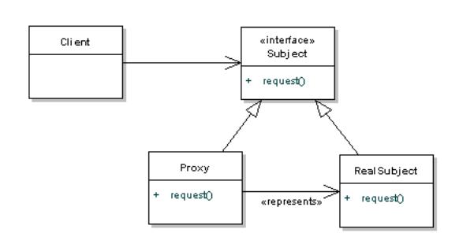

代理有四個角色：

- subject (一般係interface / abstract class)
  - 只提供 method (可以理解為`行為`，被代理嘅角色 && 中介要做嘅行為)
- real subject (被代理人)
  - 自己會 implement abstract subject入面嘅method，因為佢本身就係想做呢件事
  - 被中介代理
- proxy (中介)
  - 代理 real subject
  - implement abstract subject入面嘅method，因為既然佢要幫real subject做某件事，佢自然要有能力完成果件事
  - `實現 real subject嘅行為之餘，中介可以有其他行為`
- client (客戶)
  - 想訪問 real subject嘅人，但係宜家比中介攔住，所有嘢都要經過中介進行

> 租樓例子：subject = 租呢個行為；real subject = 包租婆； proxy = 地產經紀； client = 你
>
> 背景：包租婆以及地產經紀implement subject (佢地都擁有放租呢個method)
>
> 你想租樓，但係無辦法直接搵到包租婆同佢傾，咁唯有經過地產經紀 (proxy)。地產經紀除左`幫包租婆(real subject)租樓 (實際要做嘅嘢)俾你之外，亦可能帶你睇樓、收中介費、加鹽加醋等等 (額外要做嘅嘢)`。
>
> 而呢個過程，就叫 Proxy 代理


## 9.2 aop概念

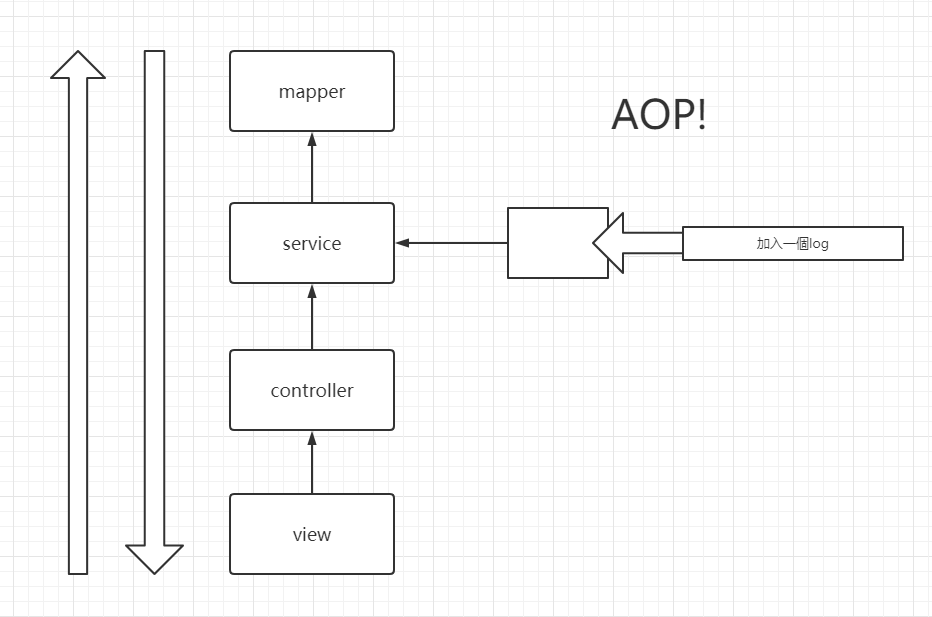

宜家有 add(), search(), delete(), change() 四個methods，你老闆要求你每call 一個function就output一個 log msg。

你有兩個方法：

1. 去翻 add(), search(), etc 方法內部增加 log msg output
2. 加一層 log (中介)，去做翻 add(), search()等等嘅methods，並且`加入額外行為 (output log msg)`

> 揀方法一嘅話並不可取，因為會改變source code，增加好多工作量 (寫bug)
>
> 而方法二就係最好，寫多一層中介去output，`橫切入去(aspect oriented)`完成要求
>
> 呢個就係 A O P !


## 9.3 add log例子

### 9.3.1 dependency

> 所有aop都需要先導入jar

```xml
<dependencies>
    <dependency>
        <groupId>org.aspectj</groupId>
        <artifactId>aspectjweaver</artifactId>
        <version>1.9.4</version>
    </dependency>
</dependencies>
```


### 9.3.2 準備工作

> 呢個例子將會係原有嘅service implementation之上，增加一個 log output

`UserService (interface)`

```java
public interface UserService {
    public void add();
    public void delete();
    public void update();
    public void query();
}
```

只有四個簡單 methods

`UserServiceImpl`

```java
public class UserServiceImpl implements UserService{
    @Override
    public void add() {
        System.out.println("add a user");
    }

    @Override
    public void delete() {
        System.out.println("delete a user");
    }

    @Override
    public void update() {
        System.out.println("update a user");
    }

    @Override
    public void query() {
        System.out.println("query a user");
    }
}
```

> 目標：用aop係呢四個methods執行前/後增加一個log output

==實現目標==

> 有三種方式實現aop：
>
> 1. 用Spring提供嘅aop interface 
> 2. DIY一個class，然後寫aop
> 3. 用annotation


### 9.3.3 第一種方式

用Spring提供嘅aop interface 完成，首先寫翻 log 同 afterLog做 log output

`Log (method運行前用)`

```java
public class Log implements MethodBeforeAdvice {
    @Override
    public void before(Method method, Object[] args, Object target) throws Throwable {
        System.out.println(target.getClass().getName() + "'s " + method.getName() + " is running!");
    }
}
```

> MethodBeforeAdvice係 Java aop入面一個interface
>
> advice可以理解為行為，而呢度就係 `進入real method之前做啲咩`
>
> 參數詳解：
>
> method = 實際上要run嘅method，例如要call add() method，咁呢度就係 add()
>
> args = 傳入嘅參數
>
> target = 目標object，例如call add() 就係 UserServiceImpl呢個object

`AfterLog (method運行後用)`

```java
public class AfterLog implements AfterReturningAdvice {
    @Override
    public void afterReturning(Object returnValue, Method method, Object[] args, Object target) throws Throwable {
        System.out.println("Finish " + method.getName() + ". Return value is " + returnValue);
    }
}
```

> implements AfterReturningAdvice，`行完real method之後要做啲咩`
>
> 呢度嘅arguments加多左嘅 returnValue
>
> 除左以上寫嘅兩個，aop有大量interface可以寫，如下圖

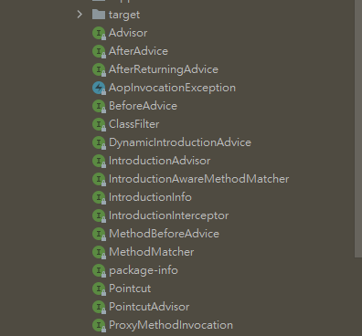

> 寫完曬 real method同 log之後當然要寫bean

`applicationContext.xml`

```xml
<?xml version="1.0" encoding="UTF-8"?>
<beans xmlns="http://www.springframework.org/schema/beans"
       xmlns:xsi="http://www.w3.org/2001/XMLSchema-instance"
       xmlns:aop="http://www.springframework.org/schema/aop"
       xsi:schemaLocation="http://www.springframework.org/schema/beans
        https://www.springframework.org/schema/beans/spring-beans.xsd
        http://www.springframework.org/schema/aop
        https://www.springframework.org/schema/aop/spring-aop.xsd">

    <!--註冊bean-->
    <bean id="userService" class="com.test.service.UserServiceImpl"/>
    <bean id="log" class="com.test.log.Log"/>
    <bean id="afterLog" class="com.test.log.AfterLog"/>

    <!--aop-->
    <aop:config>
        <!--1. 設置切入點:即係邊度執行-->
        <!--execution(return type, 要執行嘅位置)-->
        <!--第一個* 代表任何類型return type，位置.* 代表該位置下所有methods， 位置.*(..)代表該method傳入嘅參數不限-->
        <aop:pointcut id="pointcut" expression="execution(* com.test.service.UserServiceImpl.*(..))"/>

        <!--2. 用advisor，將 要執行嘅嘢，同切入點綁定-->
        <aop:advisor advice-ref="log" pointcut-ref="pointcut"/>
        <aop:advisor advice-ref="afterLog" pointcut-ref="pointcut"/>
    </aop:config>

</beans>
```

> 留意需要先寫 aop definition
>
> xmlns:aop="http://www.springframework.org/schema/aop"
>
> xsi:schemaLocation="http://www.springframework.org/schema/aop
>         https://www.springframework.org/schema/aop/spring-aop.xsd"

1. 註冊bean

   寫法同之前一樣，留意除左要註冊 real subject，log (額外嘅行為) 都要註冊

2. 設置aop切入點

3. 寫advisor

跟住就可以用

`MyTest.java`

```java
public class MyTest {
    @Test
    public void test01(){
        ApplicationContext context = new ClassPathXmlApplicationContext("applicationContext.xml");

        // 留意dynamic proxy代理嘅係 interface，唔係實際嘅interface implementation，所以傳入 interface嘅class object
        UserService userService = context.getBean("userService", UserService.class);

        userService.add();
    }
}
```

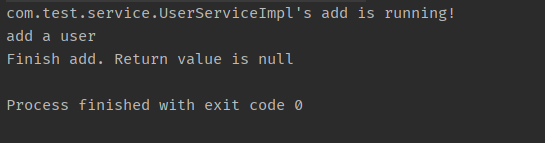

> 本身call UserService嘅add()，應該只會output "add a user"呢一句
>
> 但係用aop後，為呢個method增加額外嘅行為，所以output多兩個log!


### 9.3.4 第二種方式

> 直接DIY 一個java class去做output，然後係applicationContext.xml做翻aop

`DIYLog`

```java
public class DIYLog {
    public void before(){
        System.out.println("========before========");
    }
    public void after(){
        System.out.println("========after========");
    }
}
```

留意呢個class 並無implement aop所提供嘅interface，只係做簡單output

`applicationContext.xml`

```xml
<?xml version="1.0" encoding="UTF-8"?>
<beans xmlns="http://www.springframework.org/schema/beans"
       xmlns:xsi="http://www.w3.org/2001/XMLSchema-instance"
       xmlns:aop="http://www.springframework.org/schema/aop"
       xsi:schemaLocation="http://www.springframework.org/schema/beans
        https://www.springframework.org/schema/beans/spring-beans.xsd
        http://www.springframework.org/schema/aop
        https://www.springframework.org/schema/aop/spring-aop.xsd">

    <!--註冊bean-->
    <bean id="userService" class="com.test.service.UserServiceImpl"/>
    <bean id="diyLog" class="com.test.log.DIYLog"/>
	
    <!--aop-->
    <aop:config>
        <aop:aspect ref="diyLog">
            <!--設置切入點-->
            <aop:pointcut id="pointcut" expression="execution(* com.test.service.UserServiceImpl.*(..))"/>
            <!--加入aop-->
            <aop:before method="before" pointcut-ref="pointcut"/>
            <aop:after method="after" pointcut-ref="pointcut"/>
        </aop:aspect>
    </aop:config>
</beans>
```

> 直接寫bean，寫pointcut，然後切入

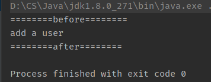


### 9.3.5 第三種方式

> 用annotation實現aop，直接係 log上面寫
>
> 呢度用翻`DIYLog`做例子

`DIYLog`

```java
@Aspect // 將呢個class標記為aspcet
public class DIYLog {
    // 加入aop
    @Before("execution(* com.test.service.UserServiceImpl.*(..))")
    public void before(){
        System.out.println("========before========");
    }
    //加入aop
    @After("execution(* com.test.service.UserServiceImpl.*(..))")
    public void after(){
        System.out.println("========after========");
    }
}
```

`applicationContext.xml`

```xml
<?xml version="1.0" encoding="UTF-8"?>
<beans xmlns="http://www.springframework.org/schema/beans"
       xmlns:xsi="http://www.w3.org/2001/XMLSchema-instance"
       xmlns:aop="http://www.springframework.org/schema/aop"
       xsi:schemaLocation="http://www.springframework.org/schema/beans
        https://www.springframework.org/schema/beans/spring-beans.xsd
        http://www.springframework.org/schema/aop
        https://www.springframework.org/schema/aop/spring-aop.xsd">

    <!--註冊bean-->
    <bean id="userService" class="com.test.service.UserServiceImpl"/>
    <bean id="diyLog" class="com.test.log.DIYLog"/>
	
    <!--最尾就開翻 aop annotation-->
    <aop:aspectj-autoproxy/>
	
</beans>
```


比較implement interface及 DIY class:

- implement interface嘅話可以傳入多個參數，比較靈活；而DIY class只能做簡單操作


