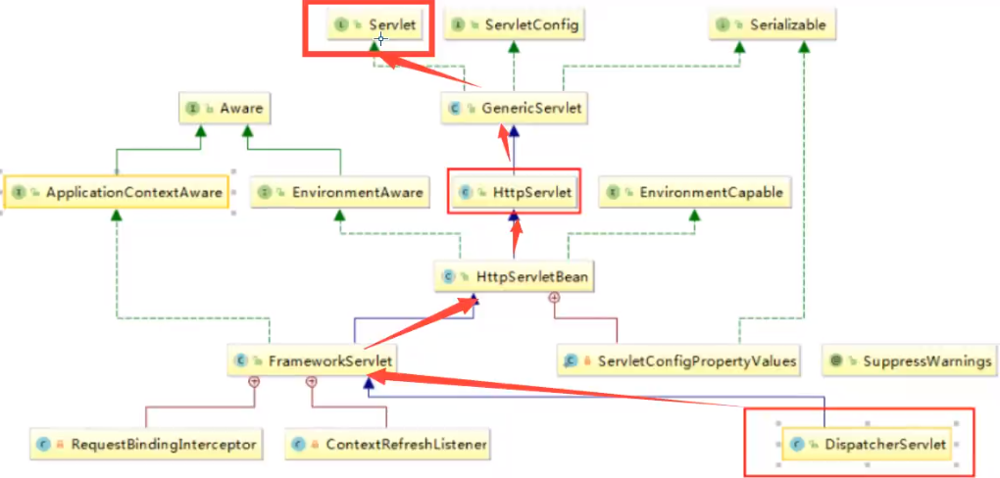
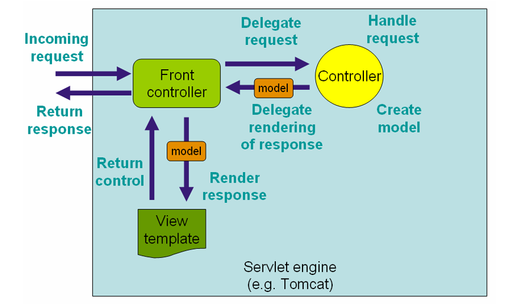
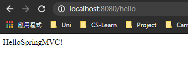
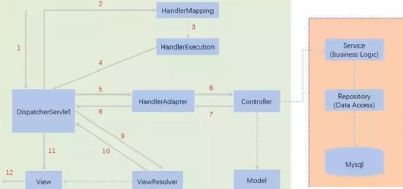

> document：https://docs.spring.io/spring-framework/docs/current/reference/html/web.html
>
> document2: https://docs.spring.io/spring-framework/docs/4.3.24.RELEASE/spring-framework-reference/html/

# 1. intro

## 1.1 回顧MVC

**MVC模式**（Model–view–controller）是軟件工程中的一種架構模式，分為三個基本部分：模型（Model）、視圖（View）和控制器（Controller）。

- M : model (mapper, service)
  - program實際嘅功能，以及database交互等等
- V : view (jsp)
  - 俾 user睇
- C : controller (servlet)
  - 接收請求，獲取數據，轉發請求


## 1.2 springMVC

點解要學SpringMVC？

- 簡單易學，搞笑
- 與Spring兼容好
- 功能強大：RESTful，數據驗證等等
- 多人用！  =.=


## 1.3 Dispatcher Servlet

SpringMVC入面有一個 dispatcherServlet ，作用係控制全局 (可以理解為控制中心)，當user發出請求，佢會負責攔截並接受請求，然後分俾唔同handler去處理呢個request

佢本質上都係一個servlet，具體如下圖







# 2. HelloMVC

`1. 在resources目錄下增加springmvc-servlet.xml`

需要註冊兩個bean，並加入resource view resolver

```xml
<?xml version="1.0" encoding="UTF-8"?>
<beans xmlns="http://www.springframework.org/schema/beans"
       xmlns:xsi="http://www.w3.org/2001/XMLSchema-instance"
       xsi:schemaLocation="http://www.springframework.org/schema/beans
        https://www.springframework.org/schema/beans/spring-beans.xsd">
    <!--Handler mapping                <------------   -->
    <bean class="org.springframework.web.servlet.handler.BeanNameUrlHandlerMapping"/>
    <!--Handler adapter                <------------   -->
    <bean class="org.springframework.web.servlet.mvc.SimpleControllerHandlerAdapter"/>
    <!--Resource View resolve          <------------   -->
    <bean class="org.springframework.web.servlet.view.InternalResourceViewResolver" id="InternalResourceViewResolver">
        <property name="prefix" value="/WEB-INF/jsp/"/>
        <property name="suffix" value=".jsp"/>
    </bean>
    
</beans>
```

`2. 在web.xml加入dispatcherServlet`

```xml
<?xml version="1.0" encoding="UTF-8"?>
<web-app xmlns="http://xmlns.jcp.org/xml/ns/javaee"
         xmlns:xsi="http://www.w3.org/2001/XMLSchema-instance"
         xsi:schemaLocation="http://xmlns.jcp.org/xml/ns/javaee http://xmlns.jcp.org/xml/ns/javaee/web-app_4_0.xsd"
         version="4.0">
	<!--加入以下servlet及servlet mapping-->
    <servlet>
        <servlet-name>springmvc</servlet-name>
        <servlet-class>org.springframework.web.servlet.DispatcherServlet</servlet-class>
		<!--DispatcherServlet需要綁定spring configuration file-->
        <init-param>
            <param-name>contextConfigLocation</param-name>
            <param-value>classpath:springmvc-servlet.xml</param-value>
        </init-param>
        <load-on-startup>1</load-on-startup>
    </servlet>
	<!--url-pattern: / ，代表所有request都要經過springmvc嘅dispathcherServlet-->
    <servlet-mapping>
        <servlet-name>springmvc</servlet-name>
        <url-pattern>/</url-pattern>
    </servlet-mapping>
</web-app>
```

之前寫javaweb，servlet嘅class係需要自己寫，然後加入映射。宜家寫spring mvc就係用佢提供嘅 dispatcherServlet，直接導入就ok

`3. 寫一個controller-HelloController.java`

```java
public class HelloController implements Controller{
    @Override
    public ModelAndView handleRequest(HttpServletRequest request, HttpServletResponse response) throws Exception {
        ModelAndView mv = new ModelAndView();

        /*加object，放入 modelAndView中*/
        mv.addObject("msg","HelloSpringMVC!");
        /*設置要轉發嘅view， hello 。由於已經係springmvc-servlet.xml配好resolver，會自動加prefix，suffix*/
        mv.setViewName("hello"); // return 俾resolver之後，佢會將呢個名變成/WEB-INF/jsp/hello.jsp
        return mv;
    }
}
```

`4. 在springmvc-servlet.xml加入/hello handler`

```xml
<?xml version="1.0" encoding="UTF-8"?>
<beans xmlns="http://www.springframework.org/schema/beans"
       xmlns:xsi="http://www.w3.org/2001/XMLSchema-instance"
       xsi:schemaLocation="http://www.springframework.org/schema/beans
        https://www.springframework.org/schema/beans/spring-beans.xsd">

    <!--Handler mapping-->
    <bean class="org.springframework.web.servlet.handler.BeanNameUrlHandlerMapping"/>
    <!--Handler adapter-->
    <bean class="org.springframework.web.servlet.mvc.SimpleControllerHandlerAdapter"/>
    <!--Resource View resolve-->
    <bean class="org.springframework.web.servlet.view.InternalResourceViewResolver" id="InternalResourceViewResolver">
        <property name="prefix" value="/WEB-INF/jsp/"/>
        <property name="suffix" value=".jsp"/>
    </bean>

    <!-- 加入handler          <------------   -->
    <bean id="/hello" class="com.test.controller.HelloController"/>
</beans>
```

我地仲需要一個jsp嚟顯示呢個view，所以加一個 hello.jsp

`hello.jsp`

```jsp
<%@ page contentType="text/html;charset=UTF-8" language="java" %>
<html>
<head>
    <title>Title</title>
</head>
<body>
${msg}  <%--直接攞ModelAndView 入面存放嘅msg--%>
</body>
</html>
```

然後就可以set tomcat，run！輸入 /hello後顯示如下




## 2.1 原理

1. user send request
2. dispatcherServlet 接收並攔截request
3. dispatcherServlet將url send俾handlerMapping
4. handlerMapping根據url搵出對應嘅handler，并return handler俾dispatcherServlet，例如上面嘅例子就會搵出 hello呢個handler
5. dispatcherServlet將handler信息send俾handlerAdapter (負責處理controller)
6. handlerAdapter處理controller
7. controller 將具體嘅資料，例如modelAndView，return俾handlerAdapter，然後再return俾dispatcherServlet
8. dispatcherServlet將modelAndView send俾ViewResolver resolve
9. ViewResolver return一個解析好嘅view name (加入prefix, suffix等) 俾dispatcherServlet
10. dispatcherServlet搵出view嘅具體位置
11. 俾user睇！

